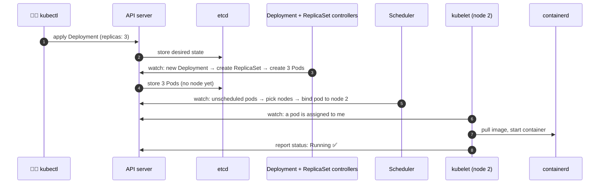
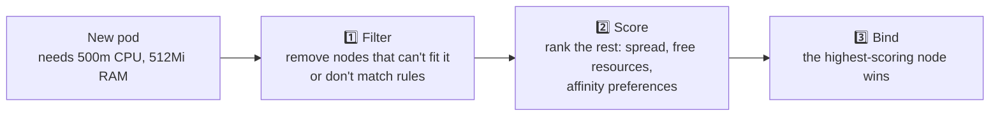
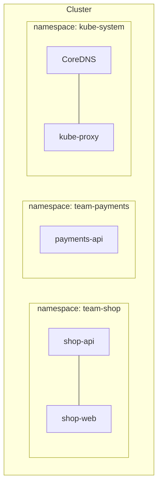

## The big idea

A **restaurant chain**:

- **Head office** (the **control plane**) decides what should happen: menus, how many cooks each branch needs, where new staff go. It keeps the official records.
- **Branches** (the **worker nodes**) do the actual cooking. Each branch has a **manager** (the **kubelet**) who takes instructions from head office and makes sure the kitchen follows them.


## The control plane (the brain)

| Component | Role | Analogy |
| --- | --- | --- |
| **kube-apiserver** | The front door. Every command (`kubectl`, controllers, nodes) goes through its REST API. Validates and stores objects | Head office reception |
| **etcd** | A distributed key-value database holding the **entire cluster state** | The official records vault |
| **kube-scheduler** | Picks **which node** each new pod should run on | HR deciding which branch gets a new cook |
| **kube-controller-manager** | Runs **control loops** (Deployment, ReplicaSet, Node, Job controllers…) that push actual state toward desired state | Managers checking "do we have enough staff?" |
| **cloud-controller-manager** | Talks to the cloud provider: load balancers, disks, node lifecycle | Facilities team dealing with landlords |

> ⚠️ **etcd is the heart.** Lose etcd without a backup and you've lost the cluster's entire configuration. Managed Kubernetes services back it up for you.

## Worker nodes (the muscle)

| Component | Role |
| --- | --- |
| **kubelet** | The node agent. Watches the API server for pods assigned to its node, starts them via the container runtime, and reports their health |
| **Container runtime** | Actually runs containers: **containerd** or CRI-O (Docker images work fine; Docker itself isn't required) |
| **kube-proxy** | Programs networking rules so traffic to a **Service** reaches the right pods |
| **CNI plugin** | Gives every pod its own IP and connects pods across nodes (Calico, Cilium, Flannel, cloud CNIs) |

## What happens on `kubectl apply`? ⭐



Notice: **nobody talks to anybody directly except through the API server**, and every component **watches** for changes and reacts. That's what makes Kubernetes so extensible and resilient.

## How the scheduler chooses a node



Things that influence scheduling:

- **Resource requests** (CPU/memory the pod asks for).
- **nodeSelector / node affinity:** "run only on nodes with a GPU".
- **Pod affinity / anti-affinity:** "keep replicas of this app on different nodes".
- **Taints and tolerations:** "this node is reserved for databases, unless a pod tolerates it".

## Talking to a cluster: kubectl

```bash
kubectl config get-contexts         # which clusters can I talk to?
kubectl config use-context prod-eu  # switch cluster
kubectl get nodes -o wide           # list worker nodes
kubectl cluster-info                # API server address
kubectl api-resources               # every object type the cluster understands
```

`kubectl` reads the cluster address and your credentials from `~/.kube/config`.

## Namespaces: virtual clusters

A namespace is a **folder** inside the cluster that groups resources and scopes names, permissions and quotas.



```bash
kubectl create namespace team-shop
kubectl get pods -n team-shop
kubectl get pods --all-namespaces
```

Common uses: one namespace per team or per environment (`dev`, `staging`), with **ResourceQuotas** and **RBAC** permissions per namespace.

## Managed vs self-hosted

| | Managed (EKS, GKE, AKS) | Self-hosted (kubeadm, bare metal) |
| --- | --- | --- |
| Control plane | Run, patched and backed up by the cloud | You run it all |
| Upgrades | A button or a command | Careful manual process |
| Cost | A small fee + nodes | "Free" + a lot of your time |
| Best for | Almost everyone ✅ | Special compliance or on-prem needs |

For learning on your laptop: **kind**, **minikube**, **k3d**, or Docker Desktop's built-in Kubernetes.

## Key takeaways

- The **control plane** (API server, etcd, scheduler, controllers) decides and records; **worker nodes** (kubelet, runtime, kube-proxy) run the pods.
- Everything goes through the **API server**; components **watch** and react through control loops.
- **etcd** stores the whole cluster state. Back it up.
- The scheduler filters and scores nodes using resource requests, affinity and taints.
- **Namespaces** group resources for teams and environments.
