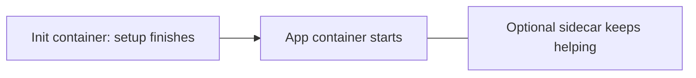

## Start with one sentence

A **pod** is the smallest unit Kubernetes places on a server. It usually contains **one container**: your app.


Do not think “one pod equals one server.” Many pods can run on the same node.

## Pod versus container

| Thing | Meaning |
| --- | --- |
| **Container** | Your packaged program, such as an Nginx or Node.js process |
| **Pod** | The Kubernetes wrapper that runs one or more containers together |
| **Node** | The server that hosts pods |

Most application pods have one container. A pod can have helper containers when they truly need to share the same network and lifetime.

## A small pod example

```yaml
apiVersion: v1
kind: Pod
metadata:
  name: hello
  labels:
    app: hello
spec:
  containers:
    - name: web
      image: nginx:1.27
      ports:
        - containerPort: 80
```

```bash
kubectl apply -f pod.yaml
kubectl get pods
kubectl port-forward pod/hello 8080:80
```

Now `http://localhost:8080` reaches Nginx. This is useful for learning, but do not use a bare pod for a real app. If it dies, nothing recreates it. A **Deployment** does that in the next lesson.

## What containers in one pod share

Containers in the same pod share:

- **One network address**: they can call each other through `localhost`.
- **Optional shared files**: a volume can be mounted into both containers.
- **One placement and lifetime**: Kubernetes puts them on the same node and stops them together.

Use a second container only when it is closely tied to the main app. A log helper is a common example. Two unrelated services should normally be separate Deployments.

## Two helper patterns

**Sidecar:** a helper that runs beside the app for its whole life. Example: a log collector reading shared log files.

**Init container:** a short setup task that must finish before the app starts. Example: waiting for a required service or copying a configuration file.



## Pod statuses you will actually see

| Status | Usually means | First action |
| --- | --- | --- |
| `Pending` | Waiting for a node, storage, or enough resources | `kubectl describe pod <name>` |
| `ContainerCreating` | Downloading image or attaching storage | Wait briefly; then check events |
| `Running` | Container is running | Check readiness if traffic still fails |
| `CrashLoopBackOff` | App starts, crashes, and Kubernetes retries it | Read previous logs |
| `ImagePullBackOff` | Image name, tag, or registry permission is wrong | Check image and registry access |
| `OOMKilled` | The app used more memory than allowed | Investigate usage; adjust limit if justified |

The exact reason is usually near the bottom of `kubectl describe` under **Events**.

## CPU and memory: requests and limits

Give Kubernetes an honest estimate of what your container needs.

```yaml
resources:
  requests:
    cpu: "250m"       # a quarter of one CPU core for scheduling
    memory: "256Mi"
  limits:
    memory: "512Mi"   # do not use more than this memory
```

| Setting | Why it matters |
| --- | --- |
| **Request** | Helps Kubernetes choose a node with enough capacity |
| **Memory limit** | Protects the node; exceeding it kills and restarts the container |
| **CPU limit** | Caps CPU use, but can slow an app when reached |

Start with measured values where possible. A random large request wastes capacity; no request makes scheduling and autoscaling less reliable.

## Four debugging commands to learn first

```bash
kubectl get pods -o wide
kubectl describe pod <pod-name>
kubectl logs <pod-name> --previous
kubectl get events --sort-by=.lastTimestamp
```

Read them in that order: status, explanation/events, application error, then recent cluster events.

## Remember this

- A pod usually runs one app container.
- A pod is not durable: use a Deployment to recreate it.
- Containers in a pod share network and can share files.
- `describe` and logs explain most pod failures.
- Requests help placement; memory limits protect the node.
