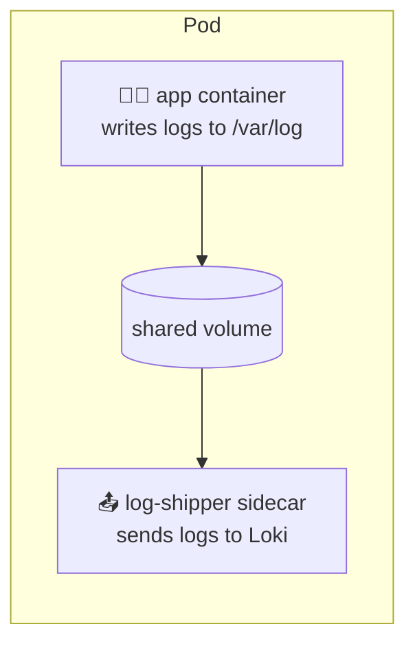
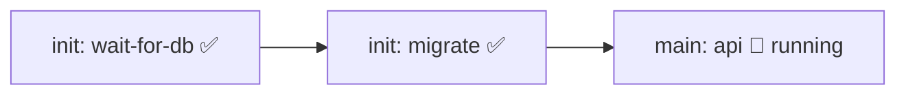
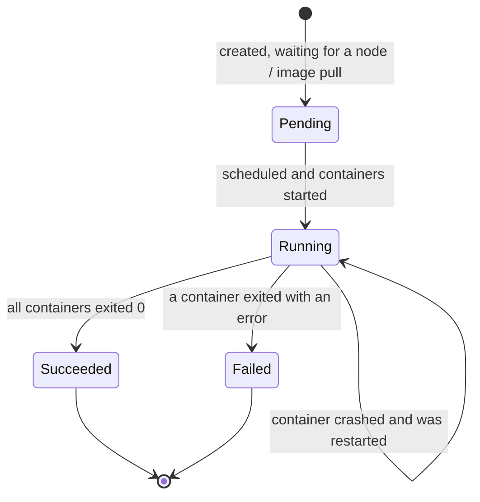
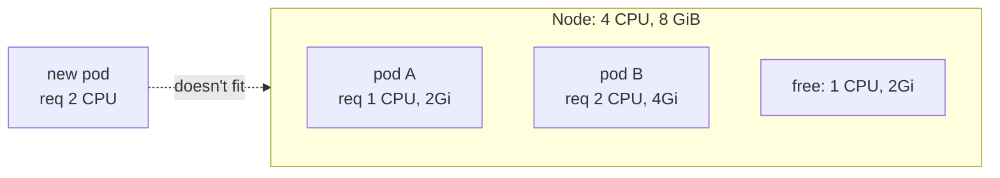
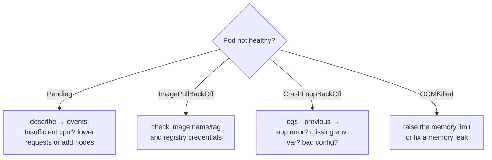

## The big idea

Think of a **pod** as a **shared apartment**. The roommates (containers) share the same address (IP), the same front door (network ports), and can share a storage cupboard (volumes). They move in and out **together**.

Most pods have **one** main container. Sometimes a helper lives with it, like a roommate who handles the mail.


## Your first pod

```yaml
# pod.yaml
apiVersion: v1
kind: Pod
metadata:
  name: hello
  labels:
    app: hello
spec:
  containers:
    - name: web
      image: nginx:1.27
      ports:
        - containerPort: 80
```

```bash
kubectl apply -f pod.yaml
kubectl get pods                    # NAME   READY   STATUS    RESTARTS   AGE
                                    # hello  1/1     Running   0          10s
kubectl port-forward pod/hello 8080:80   # open http://localhost:8080
kubectl delete pod hello
```

> ⚠️ **You rarely create pods directly.** A bare pod that dies stays dead. In practice you create a **Deployment** (next lesson), which creates and replaces pods for you.

## What containers in a pod share

| Shared | Meaning |
| --- | --- |
| **Network** | One IP address per pod; containers talk via `localhost` |
| **Volumes** | Mounted storage both containers can read and write |
| **Lifecycle** | Scheduled on the same node, started and stopped together |

Each pod gets its **own IP**, and every pod can reach every other pod's IP across the cluster (the flat pod network, provided by the CNI plugin).

## Multi-container patterns

### Sidecar

A helper container that **extends** the main one without changing it.



Common sidecars: log shippers, service-mesh proxies (Envoy in Istio), config reloaders, metrics exporters.

### Init containers

Run **before** the main containers start, to completion, one after another. Great for setup work.

```yaml
spec:
  initContainers:
    - name: wait-for-db
      image: busybox:1.36
      command: ["sh", "-c", "until nc -z postgres 5432; do echo waiting for db; sleep 2; done"]
    - name: migrate
      image: registry.example.com/shop-api:1.8.0
      command: ["npm", "run", "migrate"]
  containers:
    - name: api
      image: registry.example.com/shop-api:1.8.0
```



## The pod lifecycle



| Status you'll see | What it usually means |
| --- | --- |
| `Pending` | No node has enough resources, or the image is still downloading |
| `ContainerCreating` | Pulling the image, mounting volumes |
| `Running` | At least one container is running |
| `CrashLoopBackOff` | The container keeps crashing; Kubernetes waits longer and longer between restarts |
| `ImagePullBackOff` / `ErrImagePull` | Wrong image name or tag, or no permission to pull it |
| `OOMKilled` | The container used more memory than its limit |
| `Completed` | The container finished successfully (typical for Jobs) |

## Resource requests and limits ⭐

Tell Kubernetes how much CPU and memory each container needs:

```yaml
containers:
  - name: api
    image: registry.example.com/shop-api:1.8.0
    resources:
      requests:          # guaranteed minimum, used for SCHEDULING
        cpu: "250m"      # 0.25 of a CPU core
        memory: "256Mi"
      limits:            # maximum allowed
        cpu: "1"
        memory: "512Mi"
```

| | Requests | Limits |
| --- | --- | --- |
| Purpose | The scheduler places the pod on a node that has this much free | A hard cap at runtime |
| Exceed CPU | – | The container is **throttled** (slowed down) |
| Exceed memory | – | The container is **killed** (`OOMKilled`) and restarted |



> 💡 **Always set requests** (otherwise scheduling is guesswork), and always set a **memory limit**. Many teams skip CPU limits to avoid throttling, but keep CPU requests accurate.

## Debugging pods: the essential commands

```bash
kubectl get pods -o wide                   # status, node, IP
kubectl describe pod shop-api-7d9f-xk2p    # events at the bottom explain most problems!
kubectl logs shop-api-7d9f-xk2p            # container logs
kubectl logs shop-api-7d9f-xk2p --previous # logs from the crashed previous run
kubectl logs shop-api-7d9f-xk2p -c sidecar # a specific container
kubectl exec -it shop-api-7d9f-xk2p -- sh  # shell inside the container
kubectl get events --sort-by=.lastTimestamp
```



## Key takeaways

- A **pod** is one or more containers sharing an IP, ports and volumes; it's the smallest unit Kubernetes schedules.
- Don't create bare pods for apps; use Deployments, which replace pods automatically.
- **Sidecars** extend the main container; **init containers** do setup before it starts.
- Set **requests** (for scheduling) and **limits** (caps); exceeding memory → `OOMKilled`.
- `kubectl describe` and `kubectl logs --previous` solve most pod mysteries.
