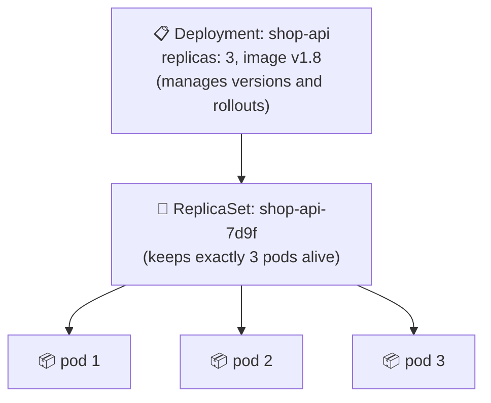
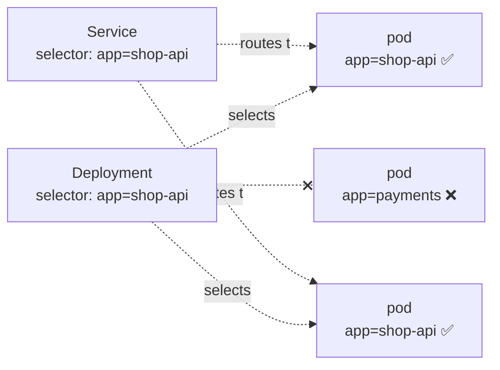
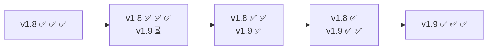
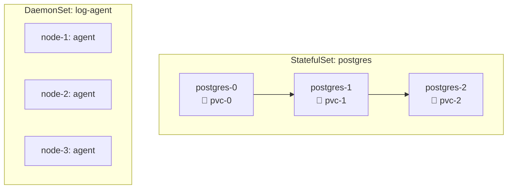

## The big idea

A **shift manager** at a call centre is told: "Always have 5 agents on the phones." If an agent goes home sick, the manager calls in a replacement. When a new script is introduced, the manager retrains agents **one at a time**, so the phones are never unanswered.

A **Deployment** is that shift manager for your pods.


## Deployment → ReplicaSet → Pods



- A **ReplicaSet** ensures a fixed number of identical pods exist. A pod dies → it creates a new one.
- A **Deployment** manages ReplicaSets: each new version gets a new ReplicaSet, and the Deployment shifts pods from old to new.
- You work with **Deployments**; ReplicaSets are created for you.

## A complete Deployment

```yaml
apiVersion: apps/v1
kind: Deployment
metadata:
  name: shop-api
  labels: { app: shop-api }
spec:
  replicas: 3
  revisionHistoryLimit: 5          # keep 5 old ReplicaSets for rollbacks
  selector:
    matchLabels: { app: shop-api } # which pods belong to this Deployment
  strategy:
    type: RollingUpdate
    rollingUpdate:
      maxSurge: 1                  # at most 1 extra pod during an update
      maxUnavailable: 0            # never go below 3 ready pods
  template:                        # the pod template
    metadata:
      labels: { app: shop-api, version: "1.8.0" }
    spec:
      containers:
        - name: api
          image: registry.example.com/shop-api:1.8.0
          ports: [{ containerPort: 3000 }]
          resources:
            requests: { cpu: 250m, memory: 256Mi }
            limits: { memory: 512Mi }
          readinessProbe:
            httpGet: { path: /health/ready, port: 3000 }
```

## Labels and selectors: how objects find each other

**Labels** are key/value tags on objects. **Selectors** pick objects by label. This loose matching is how Deployments find their pods and Services find their endpoints.



```bash
kubectl get pods -l app=shop-api
kubectl get pods -l 'app=shop-api,version!=1.7.0'
```

## Rolling updates: zero-downtime deploys ⭐

Change the image, and the Deployment gradually replaces old pods with new ones:

```bash
kubectl set image deployment/shop-api api=registry.example.com/shop-api:1.9.0
# or edit the YAML and: kubectl apply -f deployment.yaml
kubectl rollout status deployment/shop-api
```



With `maxSurge: 1, maxUnavailable: 0`, Kubernetes starts a new pod, waits until it's **ready** (its readiness probe passes), then removes an old one, and repeats. Capacity never drops.

> ⚠️ Without a **readiness probe**, Kubernetes sends traffic to new pods the moment their container starts, possibly before the app can handle requests. Always add one (see *Scaling & Health Probes*).

## Rollbacks

```bash
kubectl rollout history deployment/shop-api
kubectl rollout undo deployment/shop-api                 # back to the previous version
kubectl rollout undo deployment/shop-api --to-revision=3
kubectl rollout pause deployment/shop-api                # pause a rollout mid-way
kubectl rollout resume deployment/shop-api
```

Because old ReplicaSets are kept (scaled to 0), rolling back is just scaling the old ReplicaSet up again. It takes seconds.

## Scaling manually

```bash
kubectl scale deployment/shop-api --replicas=10
```

(For automatic scaling based on load, see the **HorizontalPodAutoscaler** in *Scaling & Health Probes*.)

## Other workload types

Deployments are for **stateless** apps where pods are interchangeable. Other controllers handle other shapes of work:

| Workload | Use for | Key behaviour |
| --- | --- | --- |
| **Deployment** | Stateless apps: APIs, web frontends | Interchangeable pods, rolling updates |
| **StatefulSet** | Databases, Kafka, ZooKeeper, Elasticsearch | Stable names (`db-0`, `db-1`), stable storage per pod, ordered start/stop |
| **DaemonSet** | One pod on **every node**: log collectors, monitoring agents, CNI | Adds a pod when a node joins |
| **Job** | Run to completion once: migrations, batch processing | Retries until it succeeds |
| **CronJob** | Scheduled jobs: nightly reports, cleanups | Creates Jobs on a cron schedule |



```yaml
apiVersion: batch/v1
kind: CronJob
metadata:
  name: nightly-report
spec:
  schedule: "0 2 * * *"            # every day at 02:00
  jobTemplate:
    spec:
      backoffLimit: 3
      template:
        spec:
          restartPolicy: OnFailure
          containers:
            - name: report
              image: registry.example.com/reports:2.1.0
              args: ["generate", "--date=yesterday"]
```

> 💡 Running databases on Kubernetes (StatefulSets) is possible, but managed databases (RDS, Cloud SQL) are often simpler and safer. Decide deliberately.

## Key takeaways

- A **Deployment** manages **ReplicaSets**, which keep a fixed number of identical **pods** running.
- **Labels and selectors** connect Deployments and Services to their pods.
- **Rolling updates** replace pods gradually; with readiness probes and `maxUnavailable: 0` there's zero downtime.
- `kubectl rollout undo` rolls back in seconds.
- Use **StatefulSets** for stateful apps, **DaemonSets** for per-node agents, **Jobs/CronJobs** for batch work.
