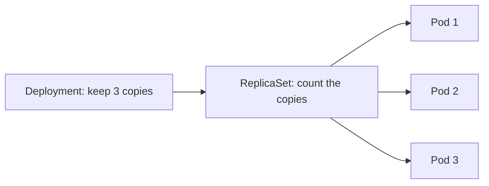

## Why you need a Deployment

A pod is temporary. If its process crashes, a bare pod stays broken. A **Deployment** is the manager that says: “I need this many healthy copies of my app.”




You create and update the Deployment. Kubernetes creates the ReplicaSet and pods for you.

## A useful first Deployment

```yaml
apiVersion: apps/v1
kind: Deployment
metadata:
  name: shop-api
spec:
  replicas: 3
  selector:
    matchLabels:
      app: shop-api
  template:
    metadata:
      labels:
        app: shop-api
    spec:
      containers:
        - name: api
          image: registry.example.com/shop-api:1.8.0
          ports:
            - containerPort: 3000
          readinessProbe:
            httpGet:
              path: /health/ready
              port: 3000
```

The label `app: shop-api` appears twice on purpose:

- The **selector** says which pods the Deployment manages.
- The **template label** puts that label on every new pod.

If they do not match, Kubernetes rejects the Deployment or cannot manage the intended pods.

## Release a new version without stopping the app

When you change the image from `1.8.0` to `1.9.0`, the Deployment normally performs a **rolling update**:

1. Start a new `1.9.0` pod.
2. Wait until it is ready to receive traffic.
3. Remove one old `1.8.0` pod.
4. Repeat.

```bash
kubectl set image deployment/shop-api api=registry.example.com/shop-api:1.9.0
kubectl rollout status deployment/shop-api
```

The readiness check matters. It prevents a new pod from receiving traffic before the app is ready.

## If the new version is bad

```bash
kubectl rollout history deployment/shop-api
kubectl rollout undo deployment/shop-api
```

That returns to the previous stored version. Watch the rollout status before calling a release successful.

## Scale by hand

```bash
kubectl scale deployment/shop-api --replicas=5
```

This changes the desired number from three to five. Later you can let an autoscaler do this from load.

## Which workload should I use?

| Use this | When |
| --- | --- |
| **Deployment** | Normal stateless web apps and APIs |
| **StatefulSet** | Each copy needs its own stable name and disk, such as a database |
| **DaemonSet** | One copy on every node, such as a log agent |
| **Job** | Work that should finish once, such as a migration |
| **CronJob** | A Job on a schedule, such as a nightly report |

For a beginner web API, choose a Deployment.

## Remember this

- A Deployment keeps the requested number of app pods alive.
- Labels connect the Deployment to its pods.
- A rolling update replaces old pods one at a time.
- Readiness decides when a new pod may receive traffic.
- `kubectl rollout undo` is your first rollback command.
