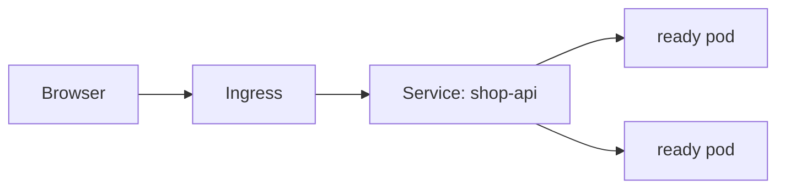

## The problem

Pods are replaceable. A replacement pod gets a new IP address. Other apps should not need to discover that new address every time.

A **Service** gives a group of pods one stable name. An **Ingress** routes HTTP/HTTPS traffic from outside the cluster to a Service.




## Service: the stable internal address

```yaml
apiVersion: v1
kind: Service
metadata:
  name: shop-api
spec:
  selector:
    app: shop-api
  ports:
    - port: 80
      targetPort: 3000
```

Read this as: “When someone calls `shop-api` on port 80, send the request to port 3000 of ready pods labelled `app: shop-api`.”

Inside the same namespace, another app can call:

```text
http://shop-api
```

Kubernetes DNS turns that name into the right destination. Do not put pod IP addresses in application configuration.

## Service types: pick the simple one first

| Type | What it means | Typical use |
| --- | --- | --- |
| **ClusterIP** | Reachable only inside the cluster | Default; app-to-app traffic |
| **LoadBalancer** | Cloud creates a public load balancer | Directly expose one service |
| **NodePort** | Opens a port on each node | Learning or special setups |

Start with `ClusterIP` for internal services. Use Ingress for most public web traffic.

## Ingress: one public front door

An Ingress can route different domains and paths to different Services.

```yaml
apiVersion: networking.k8s.io/v1
kind: Ingress
metadata:
  name: shop
spec:
  ingressClassName: nginx
  rules:
    - host: api.shop.example.com
      http:
        paths:
          - path: /
            pathType: Prefix
            backend:
              service:
                name: shop-api
                port:
                  number: 80
```

Important: an Ingress YAML file alone does nothing. Your cluster also needs an **Ingress controller** (for example NGINX, Traefik, or a cloud controller) that reads these rules and handles the incoming connections.

HTTPS certificates are often added with `cert-manager`, which can request and renew certificates automatically.

## When traffic does not arrive

Check in this order:

```bash
kubectl get pods -l app=shop-api
kubectl get svc shop-api
kubectl get endpointslices
kubectl describe svc shop-api
```

The most common cause is a label mismatch: the Service selects `app: shop-api`, but the pods have a different label. The second common cause is that pods are not ready, so Kubernetes correctly removes them from the Service.

## Remember this

- Pods change; Services provide a stable name.
- A Service sends traffic only to ready pods whose labels match its selector.
- Use Service DNS names, not pod IPs.
- Ingress is the web-routing rule; an Ingress controller is the software that enforces it.
