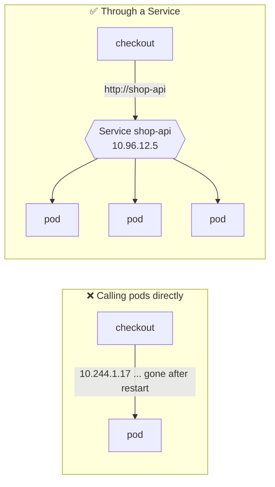
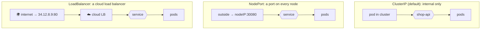
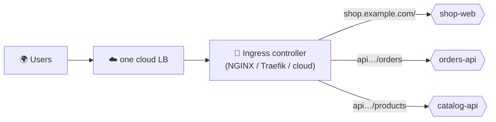

## The big idea

Pods are like **temporary staff** at a busy help desk: they come and go, and each has a different desk number (IP) every day. Customers can't be expected to track that. So the help desk has **one permanent phone number** that rings whichever staff member is free.

A **Service** is that permanent number: a stable name and IP that load-balances across a changing set of pods. An **Ingress** is the building's **reception desk**, which routes visitors from the street to the right department.


## Why Services exist



- Pod IPs **change** every time a pod is recreated.
- A Service gets a **stable virtual IP and DNS name**, and forwards traffic to all **ready** pods matching its selector.

```yaml
apiVersion: v1
kind: Service
metadata:
  name: shop-api
spec:
  selector:
    app: shop-api        # send traffic to pods with this label…
  ports:
    - port: 80           # …when someone calls shop-api:80
      targetPort: 3000   # …forward to the container's port 3000
```

Kubernetes keeps an up-to-date list of matching, **ready** pod IPs (the **EndpointSlices**). A pod failing its readiness probe is removed from the list automatically.

## Service DNS

Every Service gets a DNS name from CoreDNS:

```text
<service>.<namespace>.svc.cluster.local
shop-api.team-shop.svc.cluster.local
```

From a pod in the **same namespace**, just use `http://shop-api`. From another namespace: `http://shop-api.team-shop`.

```js
// Inside another pod: no IPs anywhere
const res = await fetch("http://shop-api/products");
```

## Service types



| Type | Reachable from | Use for |
| --- | --- | --- |
| **ClusterIP** | Inside the cluster only | Service-to-service traffic ✅ (the default) |
| **NodePort** | `<any node IP>:30000-32767` | Development, bare-metal setups |
| **LoadBalancer** | The internet, via a cloud load balancer | Exposing one service directly (costs one LB each) |
| **ExternalName** | A DNS alias to an outside host | Pointing to an external database by a cluster name |
| **Headless** (`clusterIP: None`) | DNS returns individual pod IPs | StatefulSets, where clients need specific pods |

## Ingress: HTTP routing into the cluster

One cloud load balancer per service gets expensive and messy. An **Ingress** lets **one entry point** route HTTP(S) traffic by **host** and **path** to many services, and terminate TLS.

```yaml
apiVersion: networking.k8s.io/v1
kind: Ingress
metadata:
  name: shop
  annotations:
    cert-manager.io/cluster-issuer: letsencrypt   # automatic HTTPS certificates
spec:
  ingressClassName: nginx
  tls:
    - hosts: [shop.example.com, api.shop.example.com]
      secretName: shop-tls
  rules:
    - host: shop.example.com
      http:
        paths:
          - path: /
            pathType: Prefix
            backend: { service: { name: shop-web, port: { number: 80 } } }
    - host: api.shop.example.com
      http:
        paths:
          - path: /orders
            pathType: Prefix
            backend: { service: { name: orders-api, port: { number: 80 } } }
          - path: /products
            pathType: Prefix
            backend: { service: { name: catalog-api, port: { number: 80 } } }
```



> ⚠️ An Ingress resource does nothing by itself. You need an **Ingress controller** running in the cluster (ingress-nginx, Traefik, HAProxy, or your cloud's controller) to act on it.

**cert-manager** automatically gets and renews free TLS certificates from Let's Encrypt for your Ingress hosts.

## The Gateway API: Ingress, evolved

The newer **Gateway API** splits responsibilities between roles and supports more features (header matching, traffic splitting for canaries, TCP/gRPC routes) in a standard way.

```yaml
apiVersion: gateway.networking.k8s.io/v1
kind: HTTPRoute
metadata:
  name: orders
spec:
  parentRefs: [{ name: public-gateway }]
  hostnames: ["api.shop.example.com"]
  rules:
    - matches: [{ path: { type: PathPrefix, value: /orders } }]
      backendRefs:
        - { name: orders-api-v1, port: 80, weight: 90 }
        - { name: orders-api-v2, port: 80, weight: 10 }   # 10% canary
```

## NetworkPolicies: a firewall between pods

By default, **every pod can talk to every other pod**. NetworkPolicies restrict that (your CNI plugin must support them, e.g. Calico or Cilium).

```yaml
apiVersion: networking.k8s.io/v1
kind: NetworkPolicy
metadata:
  name: payments-db-only-from-payments
spec:
  podSelector: { matchLabels: { app: payments-db } }
  policyTypes: [Ingress]
  ingress:
    - from:
        - podSelector: { matchLabels: { app: payments-api } }
      ports: [{ port: 5432 }]
```

## Debugging connectivity

```bash
kubectl get svc,endpointslices -n team-shop            # does the service have endpoints?
kubectl describe svc shop-api                          # selector matches pod labels?
kubectl run tmp --rm -it --image=busybox:1.36 -- sh    # a throwaway pod…
wget -qO- http://shop-api/health                       # …to test from inside the cluster
kubectl port-forward svc/shop-api 8080:80              # reach it from your laptop
```

Most "service doesn't work" issues are **label mismatches** (the selector doesn't match the pod labels, so there are no endpoints) or pods that aren't **ready**.

## Key takeaways

- A **Service** gives a changing set of pods one stable IP and DNS name, and load-balances across **ready** pods.
- **ClusterIP** for internal traffic, **LoadBalancer** to expose directly, **NodePort** for simple setups.
- Call services by DNS name: `http://shop-api` (same namespace).
- **Ingress** (plus an Ingress controller) routes HTTP by host and path and terminates TLS; the **Gateway API** is its successor.
- Restrict pod-to-pod traffic with **NetworkPolicies**; debug by checking endpoints and labels.
