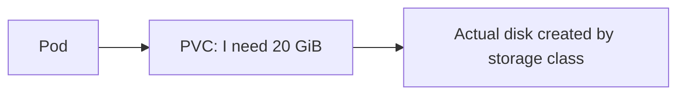

## One app image, different settings

Build the app image once. Do not build separate images containing “development database” or “production database.” Put environment-specific settings outside the image.


## ConfigMap: ordinary settings

A **ConfigMap** holds settings that are not secret.

```yaml
apiVersion: v1
kind: ConfigMap
metadata:
  name: shop-api-config
data:
  LOG_LEVEL: "info"
  PAYMENTS_URL: "http://payments-api"
```

Use it as environment variables in a pod:

```yaml
envFrom:
  - configMapRef:
      name: shop-api-config
```

Changing an environment variable ConfigMap does **not** change a running pod. Restart or roll out the Deployment after changing it.

## Secret: sensitive settings

A **Secret** is for passwords, tokens, and API keys.

```yaml
apiVersion: v1
kind: Secret
metadata:
  name: shop-api-secrets
type: Opaque
stringData:
  DATABASE_URL: "replace-with-real-value"
```

```yaml
envFrom:
  - secretRef:
      name: shop-api-secrets
```

Base64 encoding is **not encryption**. Never commit real secret values to Git. In production, store the real values in AWS Secrets Manager, Vault, or another secret manager, then sync them into Kubernetes with a controlled tool such as External Secrets Operator. Limit who can read Secrets with RBAC.

## Pod storage disappears

If an app writes a file inside its container and the pod is replaced, that file is normally gone. This is good for temporary files and bad for databases or user uploads.

For data that must remain, use a **PersistentVolumeClaim (PVC)**.



```yaml
apiVersion: v1
kind: PersistentVolumeClaim
metadata:
  name: uploads
spec:
  accessModes:
    - ReadWriteOnce
  resources:
    requests:
      storage: 20Gi
```

Mount that claim into the pod at a path such as `/app/uploads`.

| Term | Plain meaning |
| --- | --- |
| **PVC** | The app asks for storage |
| **PV** | The actual disk or shared storage |
| **StorageClass** | The rule for what kind of disk Kubernetes should create |

For web uploads and files, object storage such as S3 is often simpler than a mounted disk. It keeps your app pods stateless.

## Remember this

- ConfigMaps are non-secret settings; Secrets are sensitive values.
- Do not put real Secrets in Git or assume base64 protects them.
- Pod files disappear when the pod is replaced.
- A PVC requests storage that survives pod replacement.
