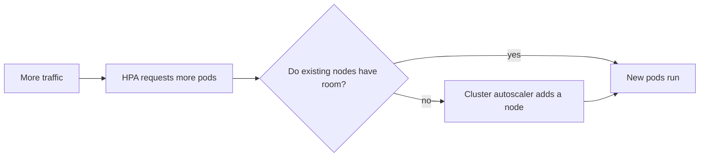

## Health checks answer different questions

Kubernetes has three checks. They are easy to confuse, so keep this table nearby.


| Check | Question | If it fails |
| --- | --- | --- |
| **Startup** | Has this slow app finished starting? | Kubernetes waits before using other checks |
| **Liveness** | Is the app process stuck? | Kubernetes restarts the container |
| **Readiness** | Can this pod handle requests right now? | Kubernetes stops sending it Service traffic |

```yaml
containers:
  - name: api
    image: registry.example.com/shop-api:1.9.0
    readinessProbe:
      httpGet:
        path: /health/ready
        port: 3000
    livenessProbe:
      httpGet:
        path: /health/live
        port: 3000
```

Keep liveness simple: “is the process responding?” Do not make it fail just because the database is temporarily down. Database availability usually belongs in readiness: stop traffic, but do not restart every app pod pointlessly.

## A safe shutdown

When Kubernetes replaces a pod, it sends `SIGTERM`. Your app should stop accepting new requests, finish active requests, close connections, then exit. This works with readiness checks to avoid cutting off visitors during a deployment.

## Scale app copies with HPA

The **HorizontalPodAutoscaler (HPA)** changes the number of Deployment replicas based on a metric, commonly CPU usage.

```yaml
apiVersion: autoscaling/v2
kind: HorizontalPodAutoscaler
metadata:
  name: shop-api
spec:
  scaleTargetRef:
    apiVersion: apps/v1
    kind: Deployment
    name: shop-api
  minReplicas: 3
  maxReplicas: 20
  metrics:
    - type: Resource
      resource:
        name: cpu
        target:
          type: Utilization
          averageUtilization: 60
```

If the average CPU rises above 60% of the requested CPU, the HPA asks for more pods. For this to work, pods need CPU requests and the cluster needs `metrics-server`.



The HPA adds pods. A **cluster autoscaler** (or Karpenter on AWS) can add nodes if those pods have nowhere to run.

## Remember this

- Liveness restarts a stuck app; readiness removes it from traffic.
- Readiness is essential for safe rolling updates.
- Handle `SIGTERM` so active requests can finish.
- HPA adds or removes pods; cluster autoscaling adds or removes servers.
