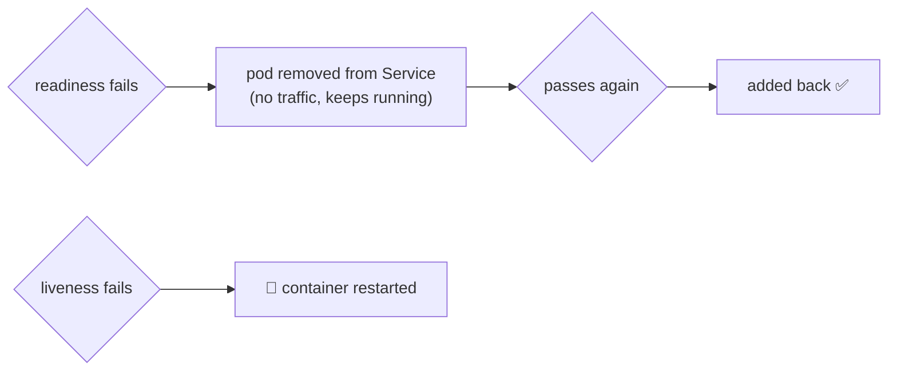
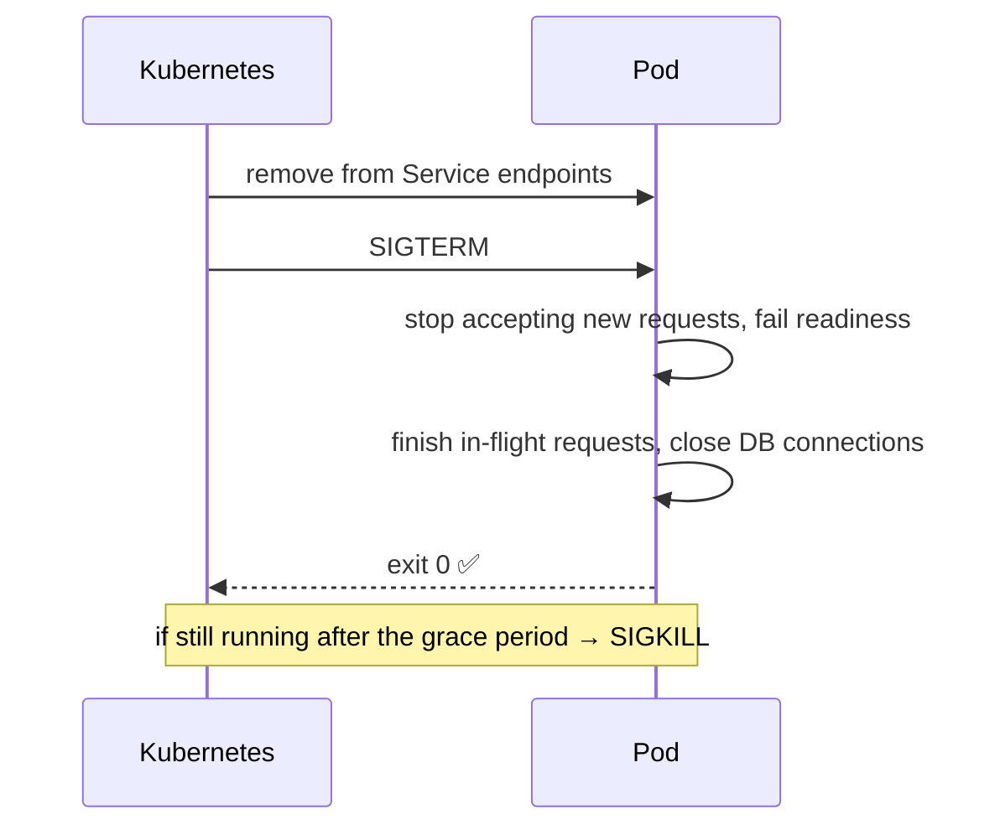
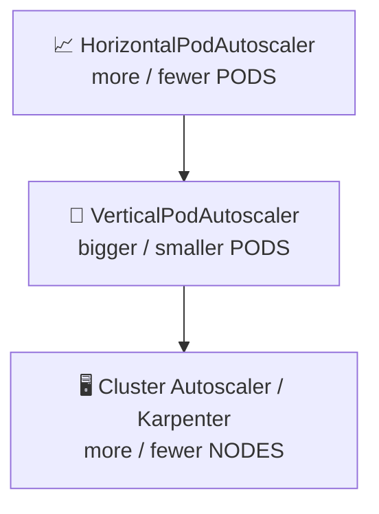
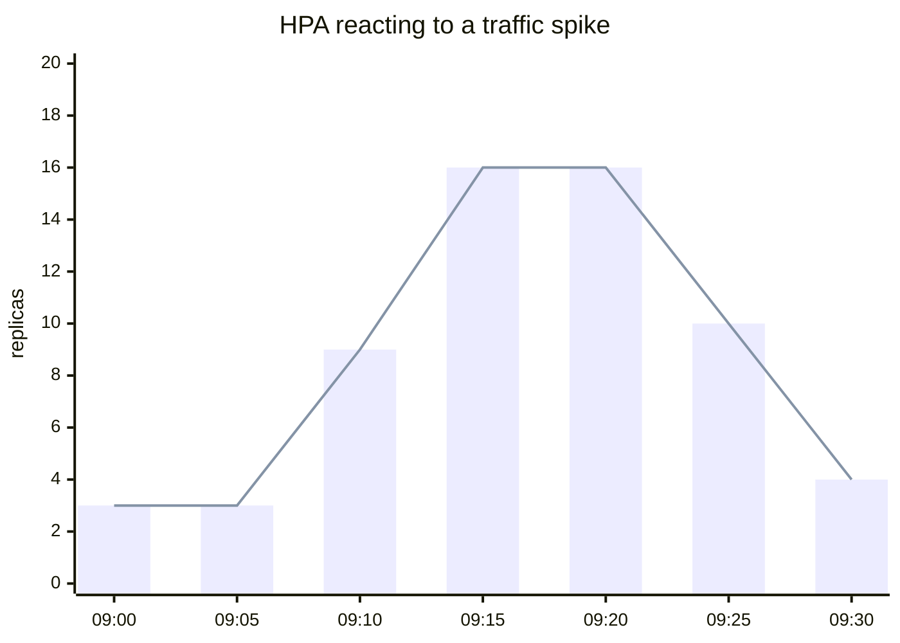
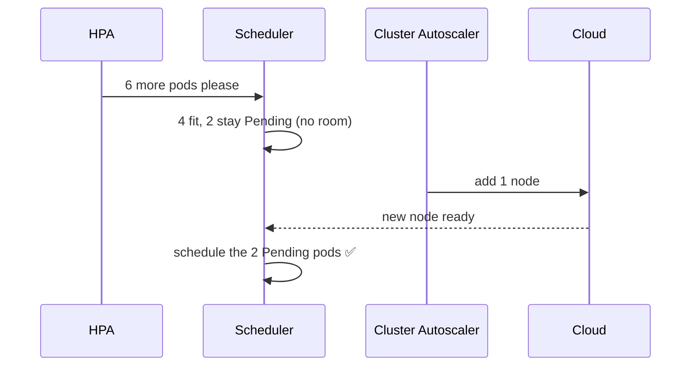

## Part 1: Health probes

### The big idea

A lifeguard watches every swimmer and asks two questions:

- **"Are you alive?"** If a swimmer is unresponsive, the lifeguard rescues them (**liveness** → restart).
- **"Are you ready to join the relay race?"** A swimmer catching their breath sits the next lap out, but is fine (**readiness** → temporarily removed from traffic).


### The three probes

| Probe | Question | If it fails… | Typical check |
| --- | --- | --- | --- |
| **Liveness** | Is the process stuck or dead? | 🔁 Container is **restarted** | `/health/live`: returns 200 if the event loop responds |
| **Readiness** | Can it serve traffic **right now**? | 🚫 Pod is **removed from Service endpoints** (not restarted) | `/health/ready`: DB reachable, caches warm |
| **Startup** | Has a slow app finished starting? | Other probes wait; restarts only after the deadline | For apps that take a long time to boot |

```yaml
containers:
  - name: api
    image: registry.example.com/shop-api:1.9.0
    ports: [{ containerPort: 3000 }]
    startupProbe:
      httpGet: { path: /health/live, port: 3000 }
      failureThreshold: 30          # up to 30 × 2s = 60s to start
      periodSeconds: 2
    livenessProbe:
      httpGet: { path: /health/live, port: 3000 }
      periodSeconds: 10
      failureThreshold: 3           # restart after ~30s of failures
    readinessProbe:
      httpGet: { path: /health/ready, port: 3000 }
      periodSeconds: 5
      failureThreshold: 2
```

```js
// Express health endpoints
app.get("/health/live", (req, res) => res.sendStatus(200)); // cheap: "the process responds"

app.get("/health/ready", async (req, res) => {
  try {
    await db.query("SELECT 1");                               // dependencies I truly need
    res.sendStatus(isShuttingDown ? 503 : 200);
  } catch {
    res.sendStatus(503);
  }
});
```



> ⚠️ **Don't check external dependencies in the liveness probe.** If the database goes down and every pod's liveness fails, Kubernetes restarts *all* your pods at once, which doesn't fix the database and makes recovery harder. Dependencies belong in **readiness**.

### Graceful shutdown

When a pod is terminated (a deploy, scale-down or node drain), Kubernetes sends `SIGTERM`, removes the pod from endpoints, waits up to `terminationGracePeriodSeconds` (30 s by default), then sends `SIGKILL`.



```js
let isShuttingDown = false;
process.on("SIGTERM", () => {
  isShuttingDown = true;                 // readiness now returns 503
  setTimeout(() => {                     // give load balancers a moment to notice
    server.close(() => process.exit(0)); // finish in-flight requests
  }, 5000);
});
```

---

## Part 2: Autoscaling

### The big idea

A supermarket opens **more checkout lanes** when the queues get long, and closes some when it's quiet. It can also **rent a bigger building** if even every lane isn't enough.



### HorizontalPodAutoscaler (HPA) ⭐

The HPA watches a metric (CPU by default) and adjusts a Deployment's replica count to keep it near a target.

```yaml
apiVersion: autoscaling/v2
kind: HorizontalPodAutoscaler
metadata:
  name: shop-api
spec:
  scaleTargetRef: { apiVersion: apps/v1, kind: Deployment, name: shop-api }
  minReplicas: 3
  maxReplicas: 30
  metrics:
    - type: Resource
      resource:
        name: cpu
        target: { type: Utilization, averageUtilization: 60 }   # % of the CPU *request*
  behavior:
    scaleDown:
      stabilizationWindowSeconds: 300    # wait 5 min before scaling down (avoid flapping)
```



**The formula:** `desired = ceil(current × currentMetric / target)`. Four pods at 90% CPU with a 60% target → `ceil(4 × 90/60) = 6` pods.

> 💡 CPU utilisation is measured **against the requests** you set. No requests = the HPA can't work. It also needs **metrics-server** installed.

**Scaling on other metrics:** requests per second, queue length, Kafka consumer lag… via custom/external metrics, or **KEDA**, which can even scale to zero when a queue is empty.

```yaml
# KEDA: scale consumers on Kafka lag
triggers:
  - type: kafka
    metadata:
      bootstrapServers: kafka:9092
      consumerGroup: email-service
      topic: shop.orders.placed
      lagThreshold: "1000"
```

### Vertical scaling (VPA)

The **VerticalPodAutoscaler** recommends (or applies) better CPU and memory **requests** based on real usage. It's useful for right-sizing. Don't let VPA and HPA both act on CPU for the same workload.

### Cluster autoscaling

When pods are `Pending` because **no node has room**, the **Cluster Autoscaler** (or **Karpenter** on AWS) adds nodes. When nodes are underused, it drains and removes them.



## Staying available during maintenance

**PodDisruptionBudget (PDB):** "during voluntary disruptions (node upgrades, drains), always keep at least N pods running."

```yaml
apiVersion: policy/v1
kind: PodDisruptionBudget
metadata:
  name: shop-api
spec:
  minAvailable: 2
  selector:
    matchLabels: { app: shop-api }
```

**Spread replicas** across nodes and zones, so losing one node or zone doesn't take out every replica:

```yaml
topologySpreadConstraints:
  - maxSkew: 1
    topologyKey: topology.kubernetes.io/zone
    whenUnsatisfiable: ScheduleAnyway
    labelSelector: { matchLabels: { app: shop-api } }
```

## Key takeaways

- **Liveness** restarts stuck containers; **readiness** removes pods from traffic; **startup** protects slow-booting apps.
- Keep dependency checks out of liveness; put them in readiness.
- Handle `SIGTERM`: stop taking traffic, finish in-flight work, then exit.
- The **HPA** scales pods on CPU or custom metrics (needs requests + metrics-server); **KEDA** scales on queues and lag.
- The **Cluster Autoscaler** / Karpenter adds nodes for Pending pods; **PDBs** and **topology spread** keep apps available.
