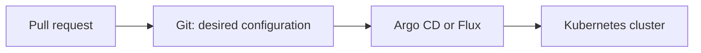

## Helm: a reusable Kubernetes package

One app usually needs several YAML files: a Deployment, Service, Ingress, settings, and possibly autoscaling. **Helm** keeps them together as a chart and lets you change values per environment.


| Helm word | Simple meaning |
| --- | --- |
| **Chart** | A reusable folder of Kubernetes templates |
| **Values** | The settings used by those templates |
| **Release** | One installed copy of a chart |

```bash
helm upgrade --install shop-api ./shop-api -f values-prod.yaml -n production
helm template ./shop-api -f values-prod.yaml  # inspect generated YAML first
helm rollback shop-api 1 -n production
```

Use `helm template` or `helm diff` before a production change so you can see what will be applied.

## GitOps: Git becomes the source of truth

With GitOps, reviewed manifests or Helm values live in Git. A tool such as Argo CD or Flux watches that repository and makes the cluster match it.



This gives your team a review trail and a simple rollback: revert the Git change, then let the tool sync it.

## A small, useful kubectl set

```bash
kubectl get pods -n team-shop
kubectl describe pod <pod-name> -n team-shop
kubectl logs <pod-name> --previous -n team-shop
kubectl get events --sort-by=.lastTimestamp -n team-shop
kubectl rollout status deployment/shop-api -n team-shop
kubectl rollout undo deployment/shop-api -n team-shop
kubectl port-forward svc/shop-api 8080:80 -n team-shop
```

For a problem, start with `get`, then `describe`, then logs. Do not delete or restart things until you understand the event or error.

## Minimum safety rules

- Use a dedicated ServiceAccount with only the permissions the app needs (least-privilege RBAC).
- Run containers as a non-root user where possible.
- Keep secrets in a secret manager, not Git.
- Pin images to a known version or digest; do not deploy a vague `latest` tag.
- Add a readiness check, CPU/memory requests, and a memory limit.
- Keep at least two replicas for a customer-facing app when availability matters.

## Your first production-ready checklist

- [ ] Deployment with the right number of replicas
- [ ] Service using labels that match the Deployment pod labels
- [ ] Readiness check; liveness check only when you understand it
- [ ] CPU and memory requests, plus a memory limit
- [ ] Configuration separated from the image; no real secrets in Git
- [ ] Logs, events, and a rollback path checked before release
- [ ] Manifests or Helm values reviewed in Git

## What to do next

Try one small app end to end: Deployment → Service → port-forward → change the image → watch the rollout → undo it. That practice makes the vocabulary much easier than reading more definitions.
