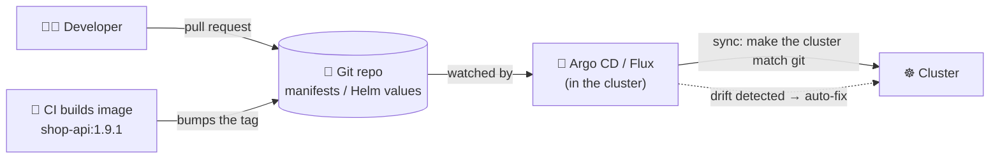
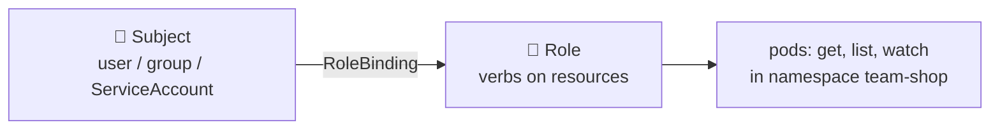
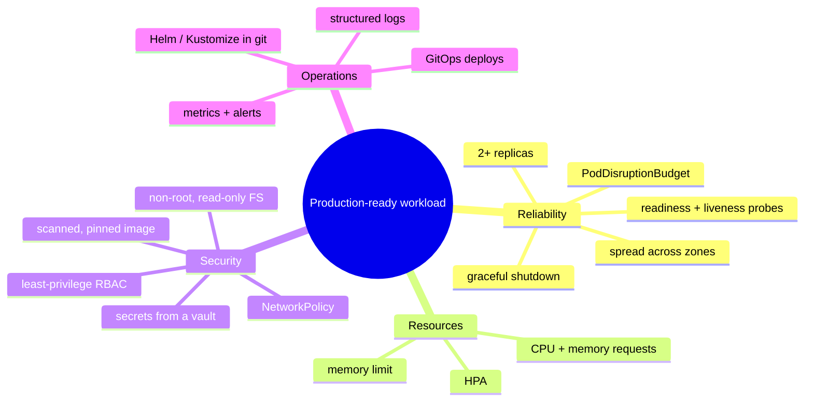

## Part 1: Helm, the package manager

### The big idea

Installing an app by hand means writing a Deployment, a Service, an Ingress, a ConfigMap, a Secret, an HPA… and copying them all for each environment with small changes. **Helm** is like **npm for Kubernetes**: it packages those YAML files into a **chart** with **templates** and **values**, so you can install, upgrade and roll back with one command.


| Helm term | Meaning | npm analogy |
| --- | --- | --- |
| **Chart** | A package of templated Kubernetes YAML | A package |
| **Values** | Settings that fill the templates (`values.yaml`) | Config options |
| **Release** | One installed instance of a chart | An installed dependency |
| **Repository** | Where charts are published | The npm registry |

### Using existing charts

```bash
helm repo add bitnami https://charts.bitnami.com/bitnami
helm install my-redis bitnami/redis --namespace cache --create-namespace --set auth.enabled=true
helm list -A
helm upgrade my-redis bitnami/redis -f my-redis-values.yaml
helm rollback my-redis 1
helm uninstall my-redis -n cache
```

### Your own chart

```text
shop-api/
├── Chart.yaml          # name, version
├── values.yaml         # defaults
├── values-prod.yaml    # production overrides
└── templates/
    ├── deployment.yaml
    ├── service.yaml
    ├── ingress.yaml
    └── hpa.yaml
```

```yaml
# templates/deployment.yaml (excerpt)
apiVersion: apps/v1
kind: Deployment
metadata:
  name: {{ .Release.Name }}
spec:
  replicas: {{ .Values.replicaCount }}
  template:
    spec:
      containers:
        - name: api
          image: "{{ .Values.image.repository }}:{{ .Values.image.tag }}"
          resources:
            {{- toYaml .Values.resources | nindent 12 }}
```

```yaml
# values.yaml                         # values-prod.yaml
replicaCount: 1                       # replicaCount: 5
image:                                # image:
  repository: registry.example.com/shop-api
  tag: "1.9.0"                        #   tag: "1.9.0"
resources:                            # resources:
  requests: { cpu: 100m, memory: 128Mi }  #   requests: { cpu: 500m, memory: 512Mi }
```

```bash
helm upgrade --install shop-api ./shop-api -f values-prod.yaml -n prod
helm template ./shop-api -f values-prod.yaml   # render locally to inspect the YAML
```

**Alternative: Kustomize** (built into `kubectl apply -k`) layers plain-YAML **patches** per environment instead of templates. Simpler for small differences; Helm is better for distributing reusable packages.

## Part 2: GitOps

Instead of running `kubectl apply` from laptops, the **desired state lives in git**, and an operator in the cluster (**Argo CD** or **Flux**) continuously syncs the cluster to match.



✅ Every change is reviewed and versioned; rollback = `git revert`; the cluster self-corrects manual drift; and nobody needs production credentials on their laptop.

## Part 3: Security basics

### RBAC: who can do what

```yaml
apiVersion: rbac.authorization.k8s.io/v1
kind: Role
metadata: { name: read-pods, namespace: team-shop }
rules:
  - apiGroups: [""]
    resources: ["pods", "pods/log"]
    verbs: ["get", "list", "watch"]
---
apiVersion: rbac.authorization.k8s.io/v1
kind: RoleBinding
metadata: { name: devs-read-pods, namespace: team-shop }
subjects: [{ kind: Group, name: shop-developers }]
roleRef: { kind: Role, name: read-pods, apiGroup: rbac.authorization.k8s.io }
```



`Role` + `RoleBinding` apply within a namespace; `ClusterRole` + `ClusterRoleBinding` apply cluster-wide. Follow **least privilege**.

### Pod security essentials

```yaml
securityContext:
  runAsNonRoot: true
  runAsUser: 10001
  allowPrivilegeEscalation: false
  readOnlyRootFilesystem: true
  capabilities: { drop: ["ALL"] }
```

Plus: scan images, pull only from trusted registries, use NetworkPolicies, keep Secrets in a vault, and enforce the **Pod Security Standards** (`restricted` profile) per namespace.

## Part 4: kubectl cheat sheet

| Task | Command |
| --- | --- |
| Apply YAML | `kubectl apply -f app.yaml` / `-f dir/` / `-k overlay/` |
| List things | `kubectl get pods,svc,deploy -n team-shop -o wide` |
| Watch live | `kubectl get pods -w` |
| Details + events | `kubectl describe pod <name>` |
| Logs | `kubectl logs <pod> [-c container] [-f] [--previous]` |
| Logs of all pods of an app | `kubectl logs -l app=shop-api --tail=50` |
| Shell into a container | `kubectl exec -it <pod> -- sh` |
| Port-forward | `kubectl port-forward svc/shop-api 8080:80` |
| Scale | `kubectl scale deploy/shop-api --replicas=5` |
| Update image | `kubectl set image deploy/shop-api api=repo/shop-api:1.9.1` |
| Rollout status / undo | `kubectl rollout status deploy/shop-api` / `kubectl rollout undo deploy/shop-api` |
| Restart pods | `kubectl rollout restart deploy/shop-api` |
| Resource usage | `kubectl top pods` / `kubectl top nodes` |
| Recent events | `kubectl get events --sort-by=.lastTimestamp` |
| Dry run + diff | `kubectl diff -f app.yaml` |
| Generate YAML | `kubectl create deploy web --image=nginx --dry-run=client -o yaml` |
| Explain a field | `kubectl explain deployment.spec.strategy` |
| Switch namespace | `kubectl config set-context --current --namespace=team-shop` |
| Drain a node | `kubectl drain <node> --ignore-daemonsets` |

> 💡 Handy tools: **k9s** (a terminal UI), **kubectx/kubens** (fast context and namespace switching), **stern** (tail logs from many pods), **Lens** (a desktop UI).

## Part 5: Production checklist for every workload



- [ ] At least 2 replicas, spread across nodes and zones
- [ ] Readiness and liveness probes (and startup, if boot is slow)
- [ ] Resource requests on every container, memory limits set
- [ ] HPA configured, and a PodDisruptionBudget
- [ ] Graceful `SIGTERM` handling
- [ ] Image pinned by version (or digest), scanned, pulled from a trusted registry
- [ ] Runs as non-root with a restrictive `securityContext`
- [ ] Config in ConfigMaps, secrets from a secret manager
- [ ] NetworkPolicy limiting who can reach it
- [ ] Logs to stdout in JSON, metrics exposed, alerts defined
- [ ] Manifests in git, deployed through GitOps

## Key takeaways

- **Helm** packages Kubernetes YAML as reusable, configurable charts (install, upgrade, rollback); **Kustomize** patches plain YAML.
- **GitOps** (Argo CD, Flux) keeps the cluster in sync with git: reviewed, versioned, self-healing deploys.
- Secure with **RBAC** (least privilege), a restrictive **securityContext**, NetworkPolicies and a secret manager.
- Keep the kubectl cheat sheet close; `describe`, `logs --previous` and `get events` solve most problems.
- Run through the production checklist for every workload.
