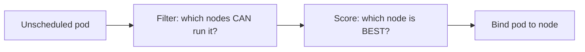

## How scheduling works

The **kube-scheduler** watches for pods with no node and picks one in two phases.



Filtering checks resource requests, taints, node selectors and affinity. Scoring prefers nodes by spread, image locality and free capacity.

## Requests and limits

```yaml
resources:
  requests:
    cpu: 250m
    memory: 256Mi
  limits:
    memory: 512Mi
```

- **Requests** are what the scheduler reserves. They decide placement and HPA percentages.
- **Limits** are the hard ceiling at runtime.
- Going over a **CPU limit** throttles the container. Going over a **memory limit** kills it (`OOMKilled`).
- A common practice: always set memory request equal to memory limit, set a CPU request, and be careful with CPU limits because throttling can add latency.

### QoS classes

Kubernetes ranks pods for eviction when a node runs short of memory:

| Class | Condition | Evicted |
| --- | --- | --- |
| **Guaranteed** | Every container has requests equal to limits for CPU and memory | Last |
| **Burstable** | At least one request or limit set | Middle |
| **BestEffort** | Nothing set | First |

Use **LimitRange** to set per-namespace defaults and **ResourceQuota** to cap a namespace's total usage.

## Steering pods to nodes

### nodeSelector (simple)

```yaml
spec:
  nodeSelector:
    disktype: ssd
```

### Node affinity (expressive)

```yaml
affinity:
  nodeAffinity:
    requiredDuringSchedulingIgnoredDuringExecution:
      nodeSelectorTerms:
        - matchExpressions:
            - key: topology.kubernetes.io/zone
              operator: In
              values: [ap-south-1a, ap-south-1b]
```

`required...` is a hard rule. `preferred...` is a soft hint with a weight.

### Pod affinity and anti-affinity

Place pods **near** or **away from** other pods.

```yaml
affinity:
  podAntiAffinity:
    preferredDuringSchedulingIgnoredDuringExecution:
      - weight: 100
        podAffinityTerm:
          topologyKey: kubernetes.io/hostname
          labelSelector:
            matchLabels: { app: shop-api }
```

This spreads `shop-api` pods across different nodes.

### Topology spread constraints (preferred for spreading)

```yaml
topologySpreadConstraints:
  - maxSkew: 1
    topologyKey: topology.kubernetes.io/zone
    whenUnsatisfiable: DoNotSchedule
    labelSelector:
      matchLabels: { app: shop-api }
```

This keeps zone counts within 1 of each other. It is simpler and more scalable than anti-affinity for even spreading.

## Taints and tolerations

A **taint** on a node repels pods. A **toleration** on a pod allows it through.

```bash
kubectl taint nodes gpu-1 gpu=true:NoSchedule
```

```yaml
tolerations:
  - key: gpu
    operator: Equal
    value: "true"
    effect: NoSchedule
```

Effects: `NoSchedule` (do not place), `PreferNoSchedule` (try not to), `NoExecute` (also evict running pods).

Remember: a toleration only *allows*. To *force* GPU pods onto GPU nodes, combine the toleration with a node selector or affinity.

## Surviving disruptions

A **PodDisruptionBudget (PDB)** limits voluntary disruptions such as node drains and upgrades.

```yaml
apiVersion: policy/v1
kind: PodDisruptionBudget
metadata:
  name: shop-api
spec:
  minAvailable: 2
  selector:
    matchLabels: { app: shop-api }
```

`kubectl drain` will wait rather than drop below 2 ready pods. Do not set `minAvailable` equal to `replicas`, or drains will block forever.

**PriorityClasses** let important pods preempt less important ones when the cluster is full.

## Remember this

- Requests drive scheduling; limits drive runtime enforcement.
- Memory over limit means OOMKill; CPU over limit means throttling.
- Prefer topology spread constraints for even spread across zones.
- Taints repel, tolerations permit, affinity attracts. Combine them for dedicated nodes.
- Add a PDB to every production workload with more than one replica.
