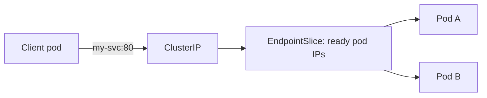

## The Kubernetes network model

Three rules hold in every conformant cluster:

1. Every pod gets its **own IP address**.
2. Pods can reach all other pods **without NAT**.
3. Agents on a node can reach all pods on that node.

A **CNI plugin** (Calico, Cilium, AWS VPC CNI, Flannel) implements these rules. The plugin you choose decides performance, observability and whether NetworkPolicies are enforced.

## How a Service really works

A Service has a virtual IP (ClusterIP). **kube-proxy** on each node programs iptables or IPVS rules so traffic to that IP is spread over healthy pod IPs. Cilium can replace kube-proxy using eBPF.



**EndpointSlices** list the ready pod IPs behind a Service. A pod that fails its readiness probe is removed from the slice.

### Service types recap

| Type | Reachable from |
| --- | --- |
| ClusterIP | Inside the cluster only |
| NodePort | Node IP and a high port |
| LoadBalancer | A cloud load balancer |
| ExternalName | A DNS CNAME to an outside host |
| Headless (`clusterIP: None`) | DNS returns pod IPs directly |

## DNS and service discovery

**CoreDNS** answers DNS inside the cluster.

```text
<service>.<namespace>.svc.cluster.local
```

From the same namespace, `http://shop-api` works. From another, use `http://shop-api.prod`.

Pods get a `resolv.conf` with `ndots:5`, meaning names with fewer than 5 dots are tried against search domains first. External lookups such as `api.stripe.com` can trigger several wasted queries. Fix by using a trailing dot (`api.stripe.com.`), lowering `ndots` via `dnsConfig`, or running **NodeLocal DNSCache**.

Debug DNS:

```bash
kubectl run -it --rm dns-test --image=busybox:1.36 --restart=Never -- nslookup shop-api.prod
kubectl -n kube-system logs deploy/coredns
```

## NetworkPolicy: a firewall for pods

By default, **all pods can talk to all pods**. A NetworkPolicy restricts that, but only if your CNI enforces it.

Step 1: deny all ingress in a namespace.

```yaml
apiVersion: networking.k8s.io/v1
kind: NetworkPolicy
metadata:
  name: default-deny-ingress
  namespace: prod
spec:
  podSelector: {}
  policyTypes: [Ingress]
```

Step 2: allow only what is needed.

```yaml
apiVersion: networking.k8s.io/v1
kind: NetworkPolicy
metadata:
  name: allow-api-to-db
  namespace: prod
spec:
  podSelector:
    matchLabels: { app: db }
  policyTypes: [Ingress]
  ingress:
    - from:
        - podSelector:
            matchLabels: { app: shop-api }
      ports:
        - port: 5432
```

Notes:

- Policies are **additive allow lists**. There is no "deny" rule; a pod selected by any policy is denied everything not allowed.
- If you restrict **egress**, remember to allow DNS (UDP/TCP 53 to kube-system).
- Namespaces are matched with `namespaceSelector` and the automatic `kubernetes.io/metadata.name` label.

## Ingress and the Gateway API

Ingress is simple but limited and relies on controller-specific annotations. The **Gateway API** is its modern successor with clearer roles:

| Resource | Owned by | Purpose |
| --- | --- | --- |
| **GatewayClass** | Infrastructure provider | Which controller implements gateways |
| **Gateway** | Platform team | Listeners, ports, TLS |
| **HTTPRoute** | App team | Host/path matching, header rules, traffic splitting |

```yaml
apiVersion: gateway.networking.k8s.io/v1
kind: HTTPRoute
metadata:
  name: shop
spec:
  parentRefs: [{ name: public-gateway }]
  hostnames: ["shop.example.com"]
  rules:
    - matches: [{ path: { type: PathPrefix, value: /api } }]
      backendRefs:
        - { name: shop-api, port: 80, weight: 90 }
        - { name: shop-api-canary, port: 80, weight: 10 }
```

Weighted `backendRefs` give you canary traffic splitting without annotations.

## Remember this

- Every pod has an IP; Services give stable virtual IPs over changing pods.
- DNS names follow `service.namespace.svc.cluster.local`; watch out for `ndots:5`.
- Start with default-deny NetworkPolicies, then allow explicitly, and always allow DNS egress.
- Verify your CNI enforces NetworkPolicy before relying on it.
- Gateway API is the future of cluster ingress.
