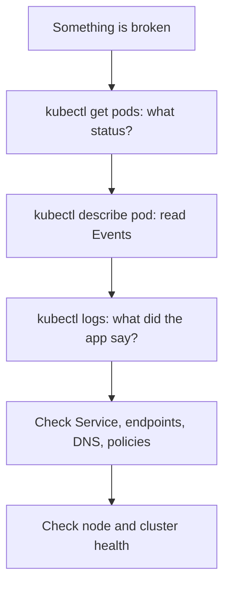

## Work from the outside in

Do not guess. Follow the same order each time.



The three most useful commands:

```bash
kubectl get pods -o wide
kubectl describe pod <pod>       # scroll to Events at the bottom
kubectl logs <pod> --previous    # logs from the crashed container
```

Also useful: `kubectl get events --sort-by=.lastTimestamp -A`.

## Status by status

### Pending

The pod is not scheduled. `describe` shows why.

| Event message | Cause | Fix |
| --- | --- | --- |
| `Insufficient cpu/memory` | Requests exceed free capacity | Lower requests or add nodes |
| `node(s) had untolerated taint` | Missing toleration | Add toleration or use other nodes |
| `didn't match Pod's node affinity/selector` | Impossible rule | Fix labels or the rule |
| `unbound immediate PersistentVolumeClaims` | PVC has no volume | Check StorageClass and PVC events |

### ImagePullBackOff / ErrImagePull

- Typo in image name or tag.
- Private registry without `imagePullSecrets`.
- Node cannot reach the registry (network, rate limit).

```bash
kubectl describe pod <pod> | grep -A5 -i "failed"
```

### CrashLoopBackOff

The container starts and exits repeatedly, with growing delays.

1. `kubectl logs <pod> --previous` to see the last crash.
2. Check the exit code in `describe` under *Last State*: `1` app error, `137` killed (often OOM), `139` segfault, `143` SIGTERM.
3. Common causes: missing env var or Secret, wrong command, failed DB connection, **liveness probe too strict**.

### OOMKilled

`Reason: OOMKilled`, exit code 137. The container exceeded its memory limit.

```bash
kubectl top pod <pod> --containers
```

Raise the limit if the app genuinely needs it, or fix a memory leak. Also check runtime settings such as the Node.js `--max-old-space-size` or the JVM heap versus the container limit.

### Running but not Ready

The readiness probe fails. Check the probe path and port, and whether the app actually listens on `0.0.0.0` rather than `127.0.0.1`.

## When a Service does not work

```bash
kubectl get svc,endpoints shop-api
kubectl get endpointslices -l kubernetes.io/service-name=shop-api
```

| Symptom | Likely cause |
| --- | --- |
| Endpoints list is empty | Service `selector` does not match pod labels, or pods are not Ready |
| Connection refused | `targetPort` is wrong or app listens on another port |
| Works by pod IP, not by name | DNS problem |
| Works from one namespace only | NetworkPolicy |

Test from inside the cluster:

```bash
kubectl run -it --rm debug --image=nicolaka/netshoot --restart=Never -- bash
# then: curl -v http://shop-api.prod/health ; dig shop-api.prod
```

## Ephemeral debug containers

Distroless images have no shell. Attach a temporary one:

```bash
kubectl debug -it <pod> --image=busybox:1.36 --target=<container>
kubectl debug node/<node> -it --image=ubuntu    # inspect a node
kubectl debug <pod> --copy-to=debug-copy --container=app -- sh   # debug a copy
```

## Node-level problems

```bash
kubectl get nodes
kubectl describe node <node>     # check Conditions: MemoryPressure, DiskPressure, PIDPressure
kubectl top nodes
```

`NotReady` nodes usually mean kubelet or container runtime trouble, full disk, or lost network. Evicted pods point to node pressure.

## Remember this

- Order: status, describe events, logs, then network, then node.
- `--previous` is the key flag for crash loops.
- Empty endpoints almost always means label mismatch or failing readiness.
- Use `kubectl debug` instead of baking debugging tools into production images.
