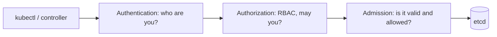

## The request path

Every API request goes through three gates before it is stored.



## RBAC building blocks

| Object | Scope | Meaning |
| --- | --- | --- |
| **Role** | One namespace | A set of allowed verbs on resources |
| **ClusterRole** | Whole cluster | Same, plus cluster-wide resources (nodes, CRDs) |
| **RoleBinding** | One namespace | Grants a Role or ClusterRole to subjects there |
| **ClusterRoleBinding** | Whole cluster | Grants a ClusterRole everywhere |

Subjects can be users, groups or **ServiceAccounts**.

```yaml
apiVersion: rbac.authorization.k8s.io/v1
kind: Role
metadata:
  name: pod-reader
  namespace: prod
rules:
  - apiGroups: [""]
    resources: ["pods", "pods/log"]
    verbs: ["get", "list", "watch"]
---
apiVersion: rbac.authorization.k8s.io/v1
kind: RoleBinding
metadata:
  name: ci-reads-pods
  namespace: prod
subjects:
  - kind: ServiceAccount
    name: ci-bot
    namespace: prod
roleRef:
  kind: Role
  name: pod-reader
  apiGroup: rbac.authorization.k8s.io
```

Check access without guessing:

```bash
kubectl auth can-i delete pods -n prod --as system:serviceaccount:prod:ci-bot
kubectl auth can-i --list -n prod
```

RBAC rules to live by:

- Only **allow** rules exist; there is no deny.
- Avoid `*` verbs or resources and avoid `cluster-admin` for apps.
- `secrets` read access is effectively credential access. Treat `get`/`list` on secrets as sensitive.
- Beware escalation verbs: `create` on pods, `bind`, `escalate`, `impersonate`.

## ServiceAccounts for workloads

Each pod runs as a ServiceAccount. Create a dedicated one per app and disable token mounting when the app does not call the API.

```yaml
apiVersion: v1
kind: ServiceAccount
metadata:
  name: shop-api
automountServiceAccountToken: false
```

For cloud access, use **workload identity** (EKS IRSA or Pod Identity, GKE Workload Identity). The pod receives short-lived cloud credentials mapped from its ServiceAccount, so no long-lived keys sit in Secrets.

## Hardening the pod

```yaml
spec:
  securityContext:
    runAsNonRoot: true
    seccompProfile:
      type: RuntimeDefault
  containers:
    - name: api
      image: registry.example.com/shop-api:1.9.0
      securityContext:
        allowPrivilegeEscalation: false
        readOnlyRootFilesystem: true
        capabilities:
          drop: ["ALL"]
```

Avoid `privileged: true`, `hostNetwork`, `hostPID`, and `hostPath` mounts unless you truly need them.

## Pod Security Standards

Built-in **Pod Security Admission** enforces three profiles per namespace through labels:

| Profile | Meaning |
| --- | --- |
| **privileged** | Unrestricted |
| **baseline** | Blocks known privilege escalations |
| **restricted** | Current hardening best practice |

```bash
kubectl label ns prod \
  pod-security.kubernetes.io/enforce=restricted \
  pod-security.kubernetes.io/warn=restricted
```

Start with `warn` and `audit` to see what would break, then switch to `enforce`.

## Secrets done properly

Kubernetes Secrets are only base64-encoded by default. Improve this by:

1. Enabling **encryption at rest** for Secrets in etcd (ideally with a KMS provider).
2. Restricting RBAC on secrets.
3. Syncing from a real secret store with **External Secrets Operator** or the **Secrets Store CSI driver** (AWS Secrets Manager, Vault).
4. Preferring mounted files over environment variables, since env vars leak into logs and crash dumps more easily.

## Supply chain and runtime

- Pin images by **digest** (`image@sha256:...`) or immutable tags; scan with Trivy or Grype in CI.
- **Sign images** (cosign) and verify at admission with Kyverno or a policy engine.
- Use minimal base images (distroless, Chainguard).
- Detect runtime anomalies with Falco or Tetragon.
- Combine with NetworkPolicies and keep the API server off the public internet.

## Remember this

- RBAC is allow-only; grant least privilege, per namespace, to dedicated ServiceAccounts.
- Run as non-root, drop all capabilities, read-only filesystem, no privilege escalation.
- Enforce the `restricted` Pod Security Standard where possible.
- Use workload identity instead of static cloud keys, and encrypt or externalize secrets.
