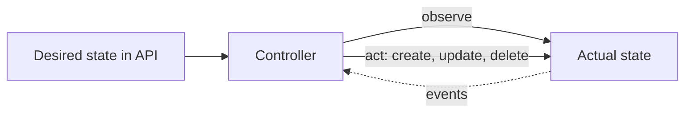

## Kubernetes is a platform for control loops

Everything in Kubernetes follows the same pattern: a **controller** watches the *desired state*, compares it with the *actual state*, and acts to close the gap. You can add your own.



This **reconcile loop** must be **idempotent** and **level-triggered**: it looks at current state, not only at the event that woke it.

## Custom Resource Definitions (CRDs)

A CRD adds a new API type, so `kubectl get postgresclusters` just works.

```yaml
apiVersion: apiextensions.k8s.io/v1
kind: CustomResourceDefinition
metadata:
  name: backups.shop.example.com
spec:
  group: shop.example.com
  scope: Namespaced
  names:
    kind: Backup
    plural: backups
    singular: backup
  versions:
    - name: v1
      served: true
      storage: true
      subresources:
        status: {}
      schema:
        openAPIV3Schema:
          type: object
          properties:
            spec:
              type: object
              required: [schedule, target]
              properties:
                schedule: { type: string }
                target:   { type: string }
                retention:
                  type: integer
                  minimum: 1
                  default: 7
            status:
              type: object
              properties:
                lastRun: { type: string, format: date-time }
```

Then users create instances:

```yaml
apiVersion: shop.example.com/v1
kind: Backup
metadata:
  name: nightly-db
spec:
  schedule: "0 2 * * *"
  target: db-0
```

A CRD alone only **stores data**. Something must act on it.

Good CRD practice:

- Define a strict **schema** with validation, defaults and CEL rules (`x-kubernetes-validations`).
- Use the **status subresource** so users write `spec` and controllers write `status`.
- Plan **versioning** (`v1alpha1`, `v1beta1`, `v1`) with a conversion strategy.
- Use **finalizers** so a controller can clean up external resources before an object disappears.

## Operators

An **Operator** is a CRD plus a controller that encodes human operations knowledge: provisioning, failover, backups, upgrades.

Well-known operators: cert-manager, Prometheus Operator, CloudNativePG, Strimzi (Kafka), Argo CD, Crossplane.

Build your own with:

| Tool | Language | Notes |
| --- | --- | --- |
| **Kubebuilder** / controller-runtime | Go | Standard choice |
| **Operator SDK** | Go, Ansible, Helm | Built on controller-runtime |
| **kopf** | Python | Fast for simple operators |
| **Metacontroller** / shell-operator | Any | Lightweight |

Most operator work goes into the reconcile function:

```text
reconcile(request):
  obj = get(request)
  if obj is being deleted: run finalizer cleanup; return
  ensure child resources exist and match spec (Deployments, Services, Secrets)
  update obj.status with observed facts
  requeue if something is still in progress
```

Set **owner references** on children so garbage collection removes them when the parent goes.

## Admission control

After authentication and authorization, **admission** can modify or reject requests before they are persisted.

| Type | Purpose |
| --- | --- |
| **Mutating** | Change the object: inject sidecars, add default labels |
| **Validating** | Accept or reject: require resource limits, block `latest` tags |

### ValidatingAdmissionPolicy (no webhook needed)

Built in and written in CEL.

```yaml
apiVersion: admissionregistration.k8s.io/v1
kind: ValidatingAdmissionPolicy
metadata:
  name: require-limits
spec:
  failurePolicy: Fail
  matchConstraints:
    resourceRules:
      - apiGroups: ["apps"]
        apiVersions: ["v1"]
        operations: ["CREATE", "UPDATE"]
        resources: ["deployments"]
  validations:
    - expression: >
        object.spec.template.spec.containers.all(c,
          has(c.resources) && has(c.resources.limits))
      message: "Every container must set resource limits"
```

It is bound to namespaces with a `ValidatingAdmissionPolicyBinding`.

### Webhooks and policy engines

For logic beyond CEL, register an admission **webhook**, or use a policy engine:

- **Kyverno**: policies written as YAML; can validate, mutate and generate resources.
- **OPA Gatekeeper**: policies written in Rego.

Webhook cautions: a broken webhook with `failurePolicy: Fail` can block the whole cluster, including its own recovery. Exclude `kube-system` and the webhook's own namespace, keep timeouts short, and run multiple replicas.

## Remember this

- Controllers reconcile desired and actual state; make them idempotent.
- CRD plus controller equals Operator.
- Use schemas, status subresources, finalizers and owner references.
- Prefer ValidatingAdmissionPolicy or Kyverno for guardrails; be careful with webhook failure policies.
