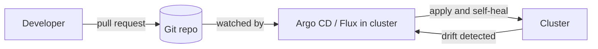

## GitOps: Git is the source of truth

Instead of running `kubectl apply` from laptops or CI, an in-cluster agent continuously **pulls** the desired state from Git and reconciles it.



Benefits: full audit trail, easy rollback (`git revert`), drift correction, and no cluster credentials in CI.

```yaml
apiVersion: argoproj.io/v1alpha1
kind: Application
metadata:
  name: shop-api
  namespace: argocd
spec:
  project: default
  source:
    repoURL: https://github.com/example/platform.git
    targetRevision: main
    path: apps/shop-api/overlays/prod
  destination:
    server: https://kubernetes.default.svc
    namespace: prod
  syncPolicy:
    automated:
      prune: true
      selfHeal: true
```

Use **Kustomize** overlays (base plus per-environment patches) or Helm values per environment. Keep application code and deployment config in separate repos or folders so a config change does not require a rebuild.

## Progressive delivery

A rolling update replaces pods gradually, but sends real traffic to the new version with no safety net. **Argo Rollouts** or **Flagger** add controlled strategies:

| Strategy | How it works |
| --- | --- |
| **Blue/green** | Run a full new stack, switch traffic at once, keep old for instant rollback |
| **Canary** | Send 5%, 25%, 50%, 100% of traffic in steps |
| **Analysis** | Automatically promote or abort based on metrics |

```yaml
apiVersion: argoproj.io/v1alpha1
kind: Rollout
metadata:
  name: shop-api
spec:
  replicas: 6
  strategy:
    canary:
      steps:
        - setWeight: 10
        - pause: { duration: 5m }
        - setWeight: 50
        - pause: { duration: 10m }
  selector:
    matchLabels: { app: shop-api }
  template:
    metadata:
      labels: { app: shop-api }
    spec:
      containers:
        - name: api
          image: registry.example.com/shop-api:2.0.0
```

Attach an analysis that queries Prometheus for error rate and latency; if the canary exceeds the threshold, it rolls back without a human.

## Observability: metrics, logs, traces

| Signal | Common tools |
| --- | --- |
| **Metrics** | Prometheus, kube-state-metrics, node-exporter, Grafana |
| **Logs** | Fluent Bit/Vector to Loki, Elasticsearch or CloudWatch |
| **Traces** | OpenTelemetry Collector to Tempo, Jaeger |

The **kube-prometheus-stack** Helm chart installs Prometheus, Alertmanager and Grafana. Apps expose `/metrics`, and a `ServiceMonitor` tells Prometheus to scrape them:

```yaml
apiVersion: monitoring.coreos.com/v1
kind: ServiceMonitor
metadata:
  name: shop-api
spec:
  selector:
    matchLabels: { app: shop-api }
  endpoints:
    - port: http
      path: /metrics
```

Alert on symptoms users feel (error rate, latency, saturation) rather than every cause. Useful cluster alerts:

- Pods in `CrashLoopBackOff` or not ready for more than 10 minutes.
- Node `NotReady`, disk or memory pressure.
- CPU throttling and memory near limit.
- PVC almost full, certificate expiring.
- Deployment replicas unavailable.

Example PromQL for restart storms:

```text
increase(kube_pod_container_status_restarts_total[15m]) > 3
```

## Smarter autoscaling

| Tool | What it scales |
| --- | --- |
| **HPA** | Pod count from CPU, memory or custom metrics |
| **VPA** | Pod requests and limits (right-sizing); do not combine with HPA on the same metric |
| **KEDA** | Pod count from events: queue length, Kafka lag, cron, with scale to zero |
| **Cluster Autoscaler / Karpenter** | Node count; Karpenter picks the cheapest fitting instance type and consolidates |

```yaml
apiVersion: keda.sh/v1alpha1
kind: ScaledObject
metadata:
  name: worker
spec:
  scaleTargetRef:
    name: worker
  minReplicaCount: 0
  maxReplicaCount: 50
  triggers:
    - type: aws-sqs-queue
      metadata:
        queueURL: https://sqs.ap-south-1.amazonaws.com/123456789012/jobs
        queueLength: "20"
        awsRegion: ap-south-1
```

## Cost and multi-tenancy

- Set requests honestly; over-requesting wastes money, under-requesting causes noisy neighbours.
- Use namespaces with **ResourceQuota**, **LimitRange**, RBAC and NetworkPolicies per team.
- Use spot or preemptible nodes for fault-tolerant workloads, protected by PDBs and topology spread.
- Tools such as Kubecost or OpenCost attribute spend to namespaces and labels.

## Remember this

- GitOps: Git describes the cluster; an agent pulls and self-heals.
- Canary or blue/green with automated metric analysis beats a blind rolling update.
- Monitor symptoms, not only causes; instrument apps with `/metrics` and traces.
- HPA for pods, VPA for sizing, KEDA for event-driven scale, Karpenter for nodes.
