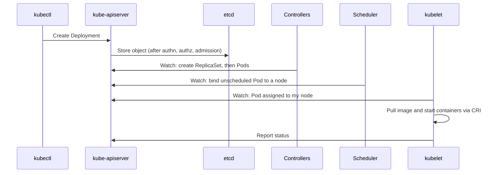

## What happens on `kubectl apply`



Key point: **components never talk to each other directly**. They all watch and update the API server, which is the only component that reads and writes etcd.

## etcd

etcd is a consistent key-value store using the **Raft** consensus algorithm.

- Run **3 or 5** members (odd numbers), so a majority survives failures: 3 tolerates 1 loss, 5 tolerates 2.
- It is sensitive to **disk latency**; use fast SSDs and keep it off noisy disks.
- Losing quorum makes the cluster read-only or unavailable, though running pods keep running.
- Back it up regularly:

```bash
ETCDCTL_API=3 etcdctl snapshot save /backup/etcd-$(date +%F).db \
  --endpoints=https://127.0.0.1:2379 \
  --cacert=/etc/kubernetes/pki/etcd/ca.crt \
  --cert=/etc/kubernetes/pki/etcd/server.crt \
  --key=/etc/kubernetes/pki/etcd/server.key
```

On managed services (EKS, GKE, AKS) the provider runs the control plane; you back up **workloads and volumes** instead, with tools such as **Velero**.

## Extension interfaces

| Interface | Plugs in | Examples |
| --- | --- | --- |
| **CRI** | Container runtime | containerd, CRI-O |
| **CNI** | Pod networking | Cilium, Calico, VPC CNI |
| **CSI** | Storage | EBS CSI, EFS CSI, Ceph |

## Upgrading safely

1. Read the release notes and check for **removed APIs** (for example `kubectl get --raw /metrics | grep apiserver_requested_deprecated_apis`, or tools like `pluto`).
2. Upgrade **one minor version at a time** (1.30 to 1.31, never skipping).
3. Upgrade order: control plane first, then node pools, then add-ons.
4. For nodes use rolling replacement: cordon, drain (respecting PDBs), replace.
5. Test in a staging cluster first and have a rollback plan.

```bash
kubectl cordon node-1
kubectl drain node-1 --ignore-daemonsets --delete-emptydir-data
# upgrade or replace the node
kubectl uncordon node-1
```

Version skew: kubelets may be older than the API server by a few minors (check the current policy); never newer.

## Resilience patterns

- Spread replicas over **zones** with topology spread; add PDBs.
- Keep at least 2 replicas and set readiness probes and graceful shutdown (`preStop` plus `terminationGracePeriodSeconds`).
- Set a **PriorityClass** so critical system pods win during pressure.
- **Multi-cluster** for blast-radius isolation or regions: Argo CD ApplicationSets, a service mesh or Cilium Cluster Mesh, global DNS for failover.
- Practice restores. A backup never tested is a hope, not a backup.

## Service mesh in one paragraph

A mesh (Istio, Linkerd, Cilium) adds a proxy layer, either sidecars or per-node/ambient, that provides **mTLS**, retries, timeouts, traffic shifting and telemetry without app code changes. The cost is extra complexity and resource use, so adopt it when you need those features at scale, not by default.

## Interview questions

**1. What happens when you create a Deployment?**
The API server authenticates, authorizes, runs admission, and stores it in etcd. The Deployment controller creates a ReplicaSet, which creates Pods. The scheduler binds each Pod to a node, and the kubelet starts the containers.

**2. Liveness vs readiness vs startup probes?**
Liveness restarts a stuck container, readiness removes a pod from Service endpoints, and startup delays the other two until a slow app has booted.

**3. Requests vs limits, and what are QoS classes?**
Requests drive scheduling; limits are runtime ceilings (CPU throttles, memory OOMKills). QoS classes Guaranteed, Burstable and BestEffort decide eviction order.

**4. Deployment vs StatefulSet?**
Deployments manage interchangeable pods. StatefulSets give stable names, ordered rollout and per-pod persistent volumes.

**5. How do you debug a pod in CrashLoopBackOff?**
`describe` for events and exit code, `logs --previous` for the last crash, then check config, Secrets, probes, memory limits and dependencies.

**6. How does a Service route traffic?**
A ClusterIP is virtual. kube-proxy (or eBPF) rules send traffic to ready pod IPs in the EndpointSlices that match the Service selector.

**7. Taints vs node affinity?**
Taints repel pods from nodes unless tolerated; affinity attracts pods to nodes. Dedicated node pools usually need both.

**8. How would you secure a cluster?**
Least-privilege RBAC, dedicated ServiceAccounts with workload identity, Pod Security `restricted`, default-deny NetworkPolicies, encrypted and externalized secrets, image scanning and signing, admission policies, a private API endpoint, and audit logging.

**9. What is an Operator?**
A CRD plus a controller that automates the lifecycle of an application using a reconcile loop.

**10. How do you do zero-downtime deployments?**
Rolling update with `maxUnavailable: 0`, correct readiness probes, graceful `SIGTERM` handling, a `preStop` delay, PDBs and enough replicas across zones. For extra safety, canary with automated analysis.

**11. How do you upgrade a cluster?**
Check deprecated APIs, upgrade one minor version at a time, control plane first, then node pools using cordon and drain, then add-ons, with backups and staging tests beforehand.

**12. What if etcd loses quorum?**
The API becomes unavailable for writes, though running workloads continue. Restore members or recover from a snapshot, which is why regular tested backups matter.

## Remember this

- The API server is the hub; everything else watches and reconciles.
- Keep etcd healthy and backed up, or rely on a managed control plane and back up workloads with Velero.
- Upgrade one minor version at a time, check for removed APIs, drain respecting PDBs.
- Be ready to explain the full lifecycle from `kubectl apply` to running container.
