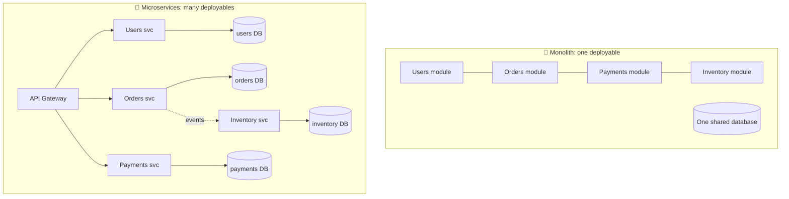
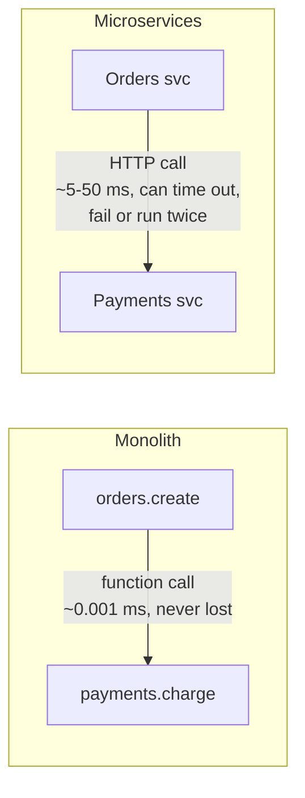
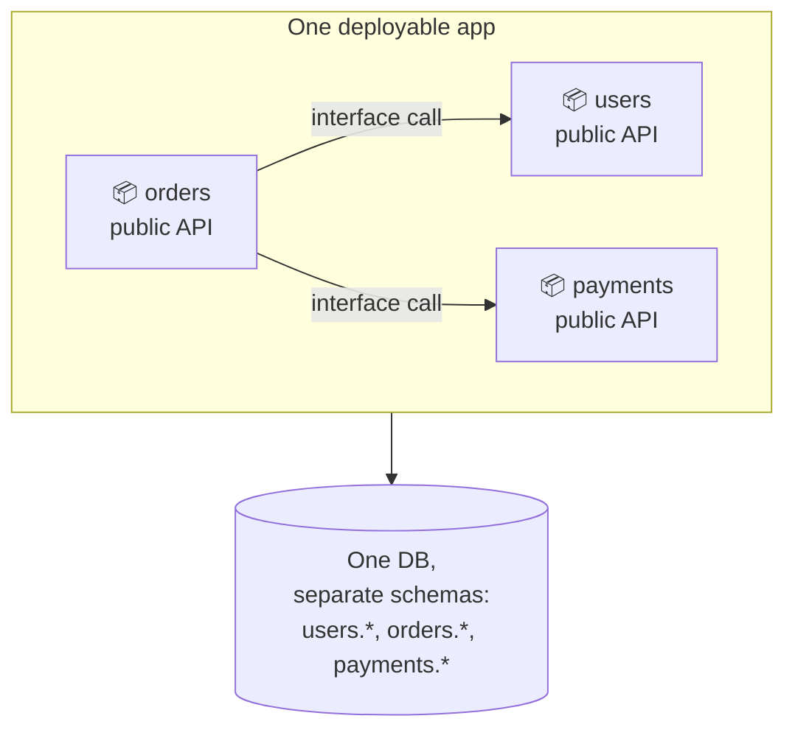
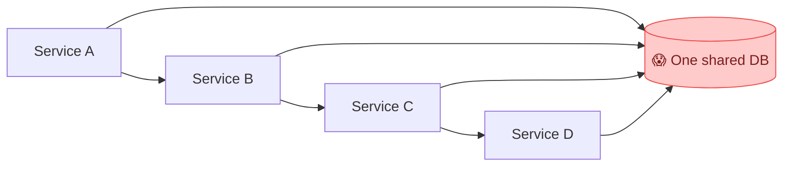

## The big idea

- A **monolith** is like a **department store**: everything (clothes, food, electronics) under one roof, one building, one manager. Easy to run while it's small.
- **Microservices** are like a **shopping mall**: many independent shops, each with its own staff, stockroom and opening hours, connected by shared corridors.

A mall lets each shop renovate, hire or close without affecting the others. But it also needs security, signs, maintenance and coordination that a single store never did.

## Definitions

**Monolith:** one application, one codebase, deployed as **one unit**, usually with one database.

**Microservices:** an application split into **small, independently deployable services**, each owning **one business capability** and **its own data**, talking over the network.

## The trade-offs

| | Monolith | Microservices |
| --- | --- | --- |
| **Deploy** | Everything at once | Each service independently ✅ |
| **Scale** | The whole app | Only the busy services ✅ |
| **Team autonomy** | Teams step on each other | Each team owns its services ✅ |
| **Tech choice** | One stack | Best tool per service ✅ |
| **Failure isolation** | One bug can crash everything | A failing service can be contained ✅ |
| **Simplicity** | ✅ One codebase, easy to debug | ❌ Distributed system complexity |
| **Calls between parts** | ✅ Fast, in-memory function calls | ❌ Slow, unreliable network calls |
| **Transactions** | ✅ One ACID database transaction | ❌ Sagas, eventual consistency |
| **Testing end to end** | ✅ Easy | ❌ Hard |
| **Ops cost** | ✅ Low | ❌ High: CI/CD, monitoring, tracing, orchestration |

## The hidden costs ("the distributed systems tax")

The **8 fallacies of distributed computing** are all things developers wrongly assume when splitting a system:

1. The network is reliable.
2. Latency is zero.
3. Bandwidth is infinite.
4. The network is secure.
5. Topology doesn't change.
6. There is one administrator.
7. Transport cost is zero.
8. The network is homogeneous.

Every function call that becomes a network call needs timeouts, retries, idempotency, authentication, monitoring and versioning.

## The middle path: the modular monolith ⭐

One deployable, but with **strict internal boundaries**: each module has its own folder, public interface and (ideally) its own database schema. Modules talk only through public interfaces, never by reaching into each other's tables.

You get most of the **organisational** benefits with none of the network pain. And when one module really needs to scale or deploy separately, you can **extract** it into a service easily, because the boundary already exists.

## When microservices make sense

✅ **Good reasons:**

- **Many teams** (roughly 5+) blocking each other in one codebase.
- Parts of the system with **very different scaling needs** (video transcoding vs user profiles).
- Parts that need **different release speeds** or **different technology**.
- **Fault isolation** requirements: payments must keep working when recommendations are down.

❌ **Bad reasons:**

- "Netflix does it." (Netflix has thousands of engineers.)
- A new product with 3 developers and unclear requirements.
- To "fix" messy code: you'll just get a **distributed mess**.

> 💡 **Monolith first** (Martin Fowler): start with a well-structured monolith, learn where the real boundaries are, then extract services when the pain is real.

## The distributed monolith: the worst of both worlds

Services that must be **deployed together**, share a database, or call each other in long synchronous chains. You pay the full microservices cost and get none of the benefits.

Warning signs: "we need to deploy these 4 services together", "changing one table breaks 3 services", "one slow service makes everything slow".

## Conway's Law

> 📘 *"Organisations design systems that mirror their own communication structure."* (Melvin Conway)

Your architecture will end up looking like your org chart. So design **team boundaries** and **service boundaries** together: one team owns a few services end to end (the "you build it, you run it" model).

## Key takeaways

- Monolith = one deployable; microservices = independently deployable services, each owning its data.
- Microservices buy team autonomy, independent scaling and fault isolation, at the cost of distributed-systems complexity.
- A **modular monolith** is the best starting point for most teams.
- Extract services when real pain appears: team contention, scaling differences, isolation needs.
- Avoid the distributed monolith: no shared databases, no lock-step deploys.
