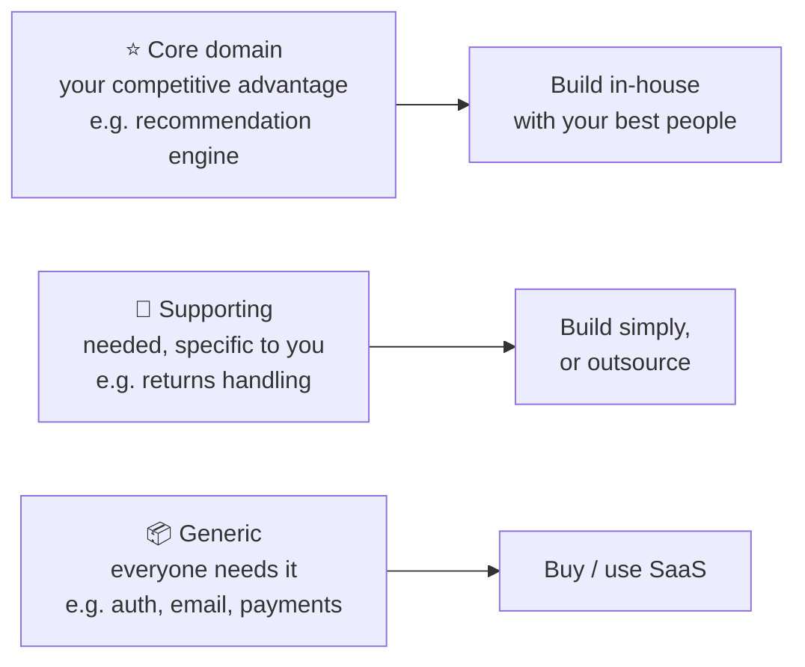
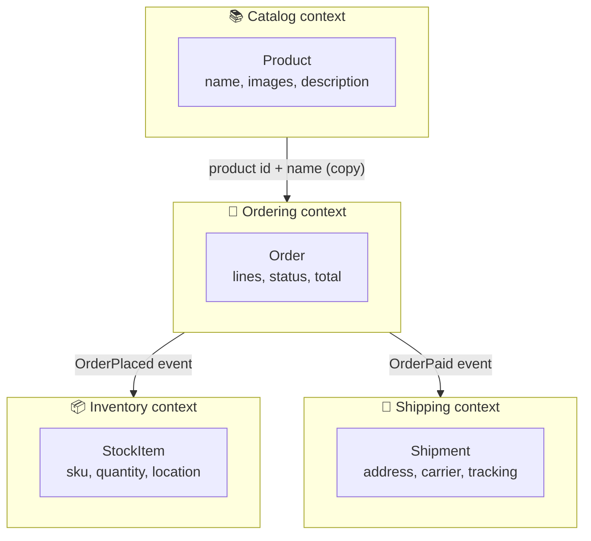
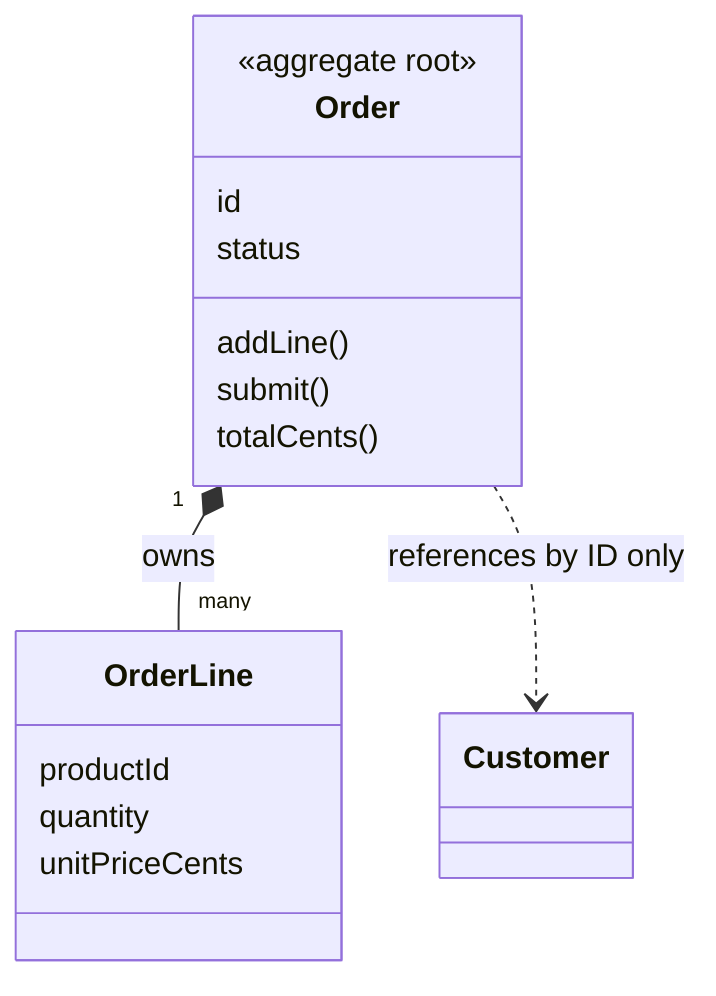
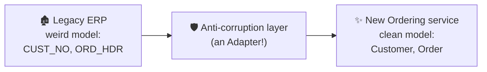
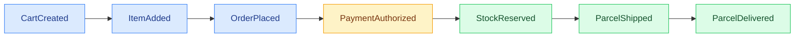

## The big idea

The word **"Product"** means different things in different departments of a shop:

- **Catalogue team:** name, photos, description, categories.
- **Warehouse:** weight, shelf location, stock count.
- **Billing:** price, tax class, discounts.

If one giant `Product` class tries to serve everyone, every team edits it, it grows to 80 fields, and any change risks breaking someone else.

**Domain-Driven Design (DDD)** says: let each department have **its own model** of a product, inside its own boundary. That boundary is a **bounded context**, and it's the best guide for where to draw service boundaries.


> 🏛️ This lesson applies DDD to **service boundaries**. For the full picture, see [DDD strategic design](/learn/software-architecture/ddd-strategic-design) and [DDD tactical patterns](/learn/software-architecture/ddd-tactical-design) in the Software Architecture topic.

## Key DDD vocabulary

| Term | Meaning | Example |
| --- | --- | --- |
| **Domain** | The business area you're building for | Online retail |
| **Subdomain** | A distinct part of the business | Catalogue, ordering, shipping, billing |
| **Bounded context** | A boundary inside which one model and one language apply | The *Shipping* context |
| **Ubiquitous language** | Words that developers and business experts share inside a context | "Shipment", "parcel", "carrier" |
| **Aggregate** | A cluster of objects changed together as one unit, with one root | `Order` + its `OrderLines` |
| **Domain event** | Something that happened that others care about | `OrderPlaced`, `PaymentFailed` |
| **Context map** | How bounded contexts relate to each other | Ordering → Shipping (events) |

## Subdomains: where to invest



Put your best engineers and cleanest design into the **core**; buy generic pieces (Auth0, Stripe, SendGrid) instead of building them.

## From contexts to services



A bounded context usually becomes **one service** (or a small group of services owned by one team). Each context:

- Has **its own database**: nobody else reads its tables.
- Shares data only through **APIs and events**.
- Keeps **only the data it needs**: Ordering stores the product ID, name and price *at the time of ordering*, not the full catalogue entry.

## Aggregates: consistency boundaries

An **aggregate** is a group of objects that must stay consistent **together**, changed in one transaction through one entry point, the **aggregate root**.

```js
// Order is the aggregate root: outside code never edits OrderLines directly
class Order {
  #lines = [];
  #status = "draft";

  addLine(productId, quantity, unitPriceCents) {
    if (this.#status !== "draft") throw new Error("Cannot change a submitted order");
    if (quantity <= 0) throw new Error("Quantity must be positive");
    this.#lines.push({ productId, quantity, unitPriceCents });
  }

  submit() {
    if (this.#lines.length === 0) throw new Error("Order is empty");
    this.#status = "submitted";
    return { type: "OrderSubmitted", orderId: this.id, totalCents: this.totalCents }; // domain event
  }

  get totalCents() {
    return this.#lines.reduce((sum, l) => sum + l.quantity * l.unitPriceCents, 0);
  }
}
```



**Aggregate rules of thumb:**

- Keep aggregates **small**.
- Reference other aggregates **by ID**, not by object.
- **One transaction = one aggregate.** Changes across aggregates (or services) happen through events: *eventual consistency*.

## Context mapping: how contexts relate

| Relationship | Meaning |
| --- | --- |
| **Customer / Supplier** | Downstream team's needs influence the upstream team's API |
| **Conformist** | Downstream just accepts the upstream model as it is |
| **Anti-Corruption Layer (ACL)** | Downstream translates the upstream model into its own, protecting itself from a messy or legacy model |
| **Published language** | A shared, documented format (for example, event schemas) |
| **Shared kernel** | A small, jointly owned shared model (use sparingly) |



## Practical heuristics for cutting services

1. **Follow business capabilities**, not technical layers. ✅ "Payments service". ❌ "Database service", "Validation service".
2. **High cohesion inside, loose coupling outside:** things that change together stay together.
3. **Look at the language:** where the meaning of a word changes, there's probably a boundary.
4. **Check the chattiness:** if two services call each other for every request, they're probably one context.
5. **Align with teams:** one team should own a context end to end.
6. **Event storming:** put business experts and developers in a room with sticky notes for every domain event (`OrderPlaced`, `ItemShipped`), then group them. The clusters reveal the contexts.



*Colour groups from event storming: Ordering (blue), Payments (yellow), Fulfilment (green).*

## Key takeaways

- One word can mean different things in different parts of a business; give each part its own model.
- A **bounded context** is the natural boundary for a microservice, with its own data and language.
- **Aggregates** are consistency boundaries: small, changed in one transaction, referenced by ID.
- Contexts communicate through APIs and **domain events**; protect clean models with an anti-corruption layer.
- Cut by business capability, not technical layer. Event storming helps find the seams.
