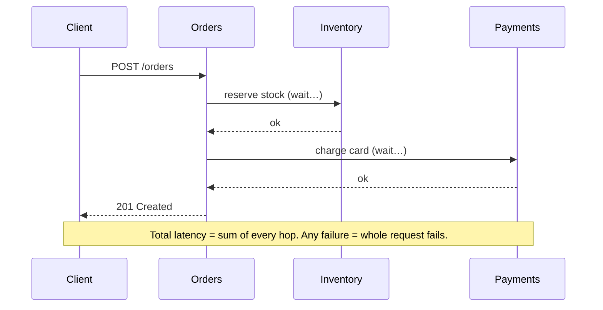
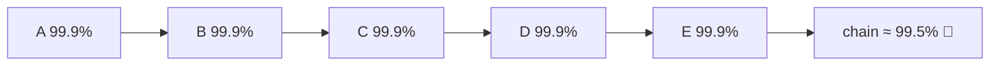
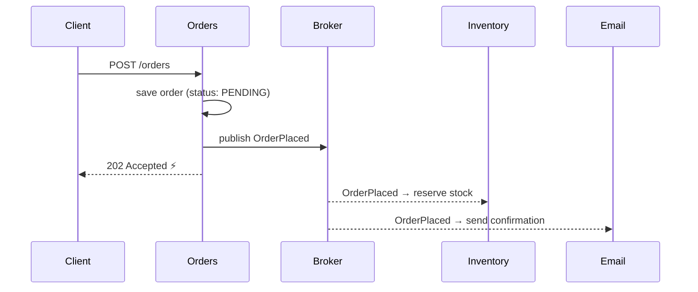
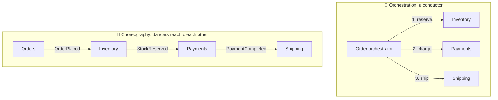
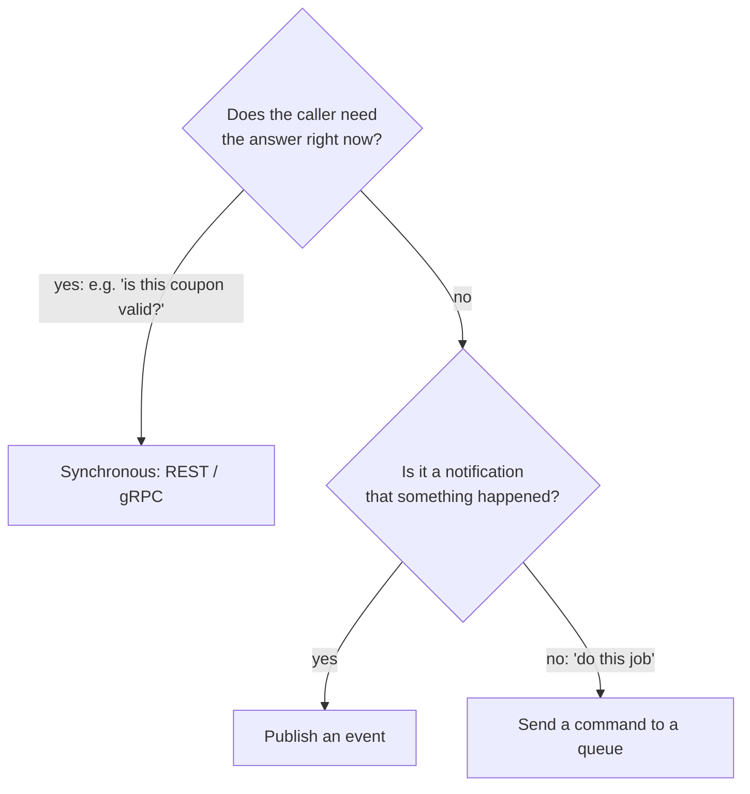
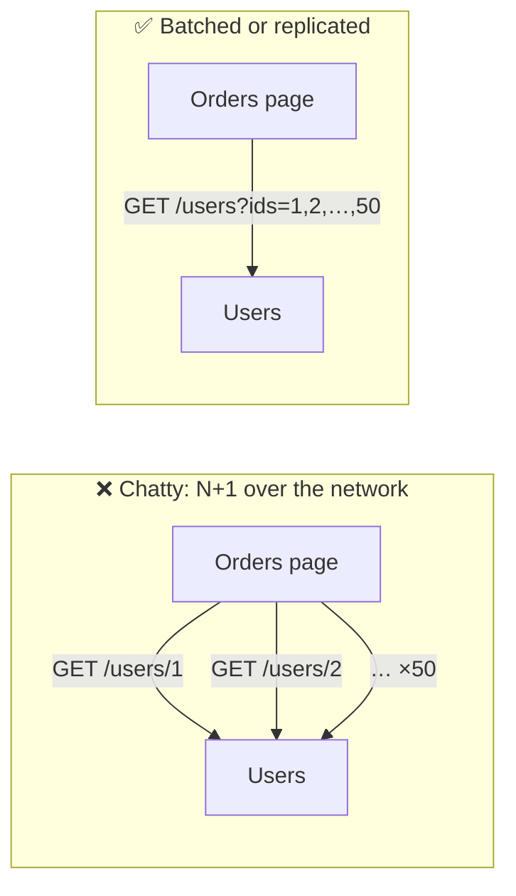

## The big idea

Two ways to get something from a colleague:

- **Phone call (synchronous):** you call, wait on the line, and get the answer right now. If they don't pick up, you're stuck.
- **Email (asynchronous):** you send a message and carry on with your day. They reply when they can. Nobody is blocked.

Services talk to each other the same two ways.


## Synchronous: request/response

One service calls another (HTTP/REST or gRPC) and **waits** for the answer.



✅ **Simple** to understand and debug; you get an **immediate answer**.
❌ **Temporal coupling**: every service in the chain must be up *right now*. Latencies add up, and failures cascade.

### Availability multiplies

If each service is available 99.9% of the time, a request that must pass through 5 services synchronously succeeds only:

**0.999⁵ ≈ 99.5%**. That's roughly 5× more downtime than any single service.



## Asynchronous: messaging and events

A service publishes a **message** to a broker (Kafka, RabbitMQ, SQS) and moves on. Interested services consume it when they're ready.



✅ **Loose coupling**: the publisher doesn't know who listens; consumers can be offline for a while; traffic spikes are buffered; new consumers can be added without touching the publisher.
❌ **Eventual consistency** (data is not updated everywhere instantly), harder debugging, and you need idempotency and ordering strategies.

## Commands vs events

| | Command | Event |
| --- | --- | --- |
| Meaning | "Please do this" | "This happened" |
| Naming | Imperative: `ReserveStock`, `SendEmail` | Past tense: `OrderPlaced`, `PaymentFailed` |
| Receivers | Exactly one handler | Zero, one or many subscribers |
| Coupling | The sender knows who does the work | The publisher doesn't know who listens |

```json
{
  "eventId": "7f3c9a1e-…",
  "type": "OrderPlaced",
  "version": 1,
  "occurredAt": "2026-09-28T10:15:00Z",
  "data": { "orderId": "ord_42", "customerId": "cus_7", "totalCents": 8997, "items": [{ "sku": "KB-1", "qty": 1 }] }
}
```

> 💡 Give every event an **ID** (for idempotency), a **type**, a **version** (for schema evolution) and a **timestamp**.

## Orchestration vs choreography

When a business process spans several services, who's in charge?



| | Orchestration | Choreography |
| --- | --- | --- |
| Control | A central coordinator tells each service what to do | Each service reacts to events on its own |
| Visibility | ✅ The whole flow is in one place | ❌ The flow is spread across services |
| Coupling | The orchestrator knows every step | ✅ Services only know events |
| Best for | Complex flows with many steps and compensations | Simple flows, many independent reactions |
| Tools | Temporal, AWS Step Functions, Camunda | Kafka, RabbitMQ, SNS/SQS |

## Choosing a style



**A common, healthy mix:**

- **Queries** (reads the user is waiting for) → synchronous, with timeouts and fallbacks.
- **State changes other services react to** → events.
- **Background jobs** → command queues.

## Keeping sync calls safe

- ⏱️ **Always set timeouts.** No timeout = one slow service can exhaust every thread.
- 🔁 **Retry with backoff**, but only idempotent operations.
- ⚡ **Circuit breakers** to fail fast when a dependency is down.
- 🧊 **Fallbacks**: a cached value, a default, or a degraded feature.

All covered in *Resilience Patterns*.

## Avoid chatty services



Or keep a **local copy** of the data you need (for example, the customer's name inside the order), kept up to date through events.

## Key takeaways

- **Sync** (REST/gRPC) is simple and immediate, but couples services in time; latency and failures add up.
- **Async** (events/queues) decouples services and absorbs spikes, at the cost of eventual consistency.
- Commands say "do this" (one handler); events say "this happened" (many subscribers).
- Orchestration centralises a flow; choreography lets services react to events.
- Mix them: sync for queries the user waits on, events for state changes, queues for background jobs.
