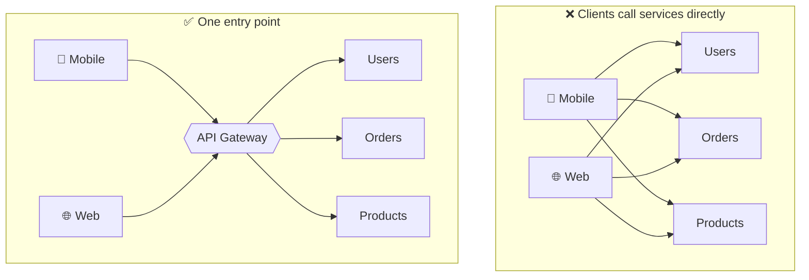
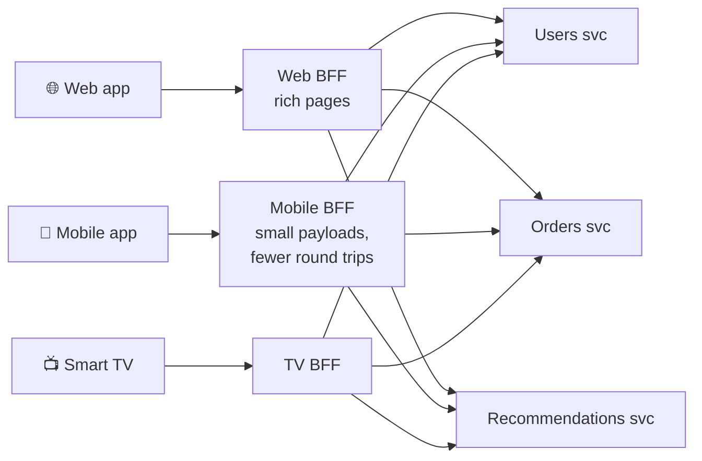
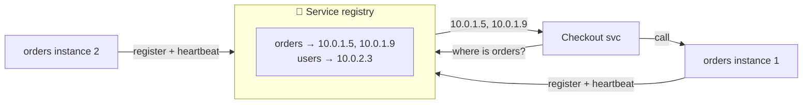
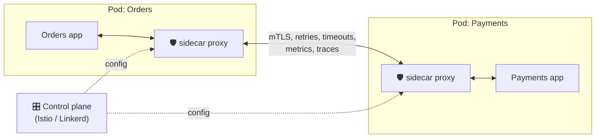

## The big idea

A big hotel has one **front desk**. Guests don't wander the corridors looking for housekeeping, the restaurant or the spa; they ask at the desk, which checks their room key and sends the request to the right place.

An **API gateway** is that front desk: **one entry point** for all clients, routing each request to the right microservice and handling shared concerns on the way.


## Without vs with a gateway



Without a gateway, every client must know every service address, and every service must implement auth, rate limiting and CORS itself.

## What a gateway does

| Responsibility | Example |
| --- | --- |
| **Routing** | `/api/orders/*` → orders service, `/api/users/*` → users service |
| **Authentication** | Verify the JWT once; pass the user ID downstream |
| **Rate limiting** | 100 requests/minute per API key |
| **TLS termination** | Handle HTTPS at the edge |
| **Request aggregation** | One client call → fetch from 3 services → one combined response |
| **Protocol translation** | Public REST/JSON outside, gRPC inside |
| **Caching** | Cache public GET responses |
| **Observability** | Access logs, metrics, start a trace ID |
| **Canary routing** | Send 5% of traffic to the new version |

```yaml
# Simplified gateway routing config (Kong / NGINX / Envoy style)
routes:
  - path: /api/users
    service: http://users-svc:8080
    plugins: [jwt-auth, rate-limit: { minute: 100 }]
  - path: /api/orders
    service: http://orders-svc:8080
    plugins: [jwt-auth]
  - path: /api/products
    service: http://catalog-svc:8080
    plugins: [cache: { ttl: 60 }]
```

> ⚠️ **Keep business logic out of the gateway.** It should route and protect, not decide discounts. A gateway full of business rules becomes a new monolith, and a single point of failure (so run several instances).

**Popular gateways:** Kong, NGINX, Envoy, Traefik, AWS API Gateway, Azure API Management, Apigee.

## Backend for Frontend (BFF)

Different clients need different data: a mobile screen wants a small payload; a web dashboard wants everything. One generic API serves nobody well. A **BFF** is a small backend **tailored to one frontend**, owned by that frontend team.



```js
// Mobile BFF: one endpoint shaped exactly for the home screen
app.get("/mobile/home", async (req, res) => {
  const [user, orders, recs] = await Promise.all([
    usersClient.get(req.user.id),
    ordersClient.recent(req.user.id, { limit: 3 }),
    recsClient.forUser(req.user.id, { limit: 5 }).catch(() => []), // degrade gracefully
  ]);
  res.json({
    greeting: `Hi ${user.firstName}`,
    recentOrders: orders.map(({ id, status }) => ({ id, status })),
    recommendations: recs.map(({ id, title, thumbUrl }) => ({ id, title, thumbUrl })),
  });
});
```

A Next.js server (Server Components and Route Handlers) often acts as the BFF for a web app.

## Service discovery: how services find each other

In a dynamic environment, service instances come and go (autoscaling, deploys, crashes), and their IP addresses change constantly. Hard-coding `10.0.3.17:8080` doesn't work.



| Style | How | Examples |
| --- | --- | --- |
| **Client-side discovery** | The client asks the registry and load-balances itself | Netflix Eureka, Consul + client library |
| **Server-side discovery** | The client calls a stable address; a load balancer/router finds an instance | **Kubernetes Services**, AWS ALB |
| **DNS-based** | A stable DNS name resolves to healthy instances | Kubernetes DNS: `orders.default.svc.cluster.local` |

In **Kubernetes** this is built in: you call `http://orders-svc`, and the platform routes to a healthy pod. (See *Kubernetes → Services & Ingress*.)

## Service mesh: networking as infrastructure

As services multiply, every one needs retries, timeouts, mutual TLS, metrics and tracing. Instead of coding this into every service (in every language), a **service mesh** puts a small proxy (**sidecar**) next to each service that handles it all.



| Mesh gives you | Without writing code |
| --- | --- |
| 🔐 Mutual TLS | Encrypted, authenticated service-to-service traffic |
| 🔁 Retries, timeouts, circuit breaking | Configured in YAML |
| 🚦 Traffic splitting | Canary releases, A/B tests |
| 📊 Telemetry | Golden-signal metrics and traces for every call |

**Trade-off:** more moving parts, extra latency per hop and extra resources. Worth it with many services and strict security needs; overkill for five services.

**Gateway vs mesh:** the gateway handles **north-south** traffic (clients → system); the mesh handles **east-west** traffic (service ↔ service).

## Key takeaways

- An **API gateway** is the single front door: routing, auth, rate limiting, TLS, aggregation. Keep business logic out.
- A **BFF** tailors an API to one client type (web, mobile), owned by that frontend team.
- **Service discovery** lets services find each other as instances change; Kubernetes provides it through Services and DNS.
- A **service mesh** moves retries, mTLS and telemetry into sidecar proxies, for east-west traffic.
