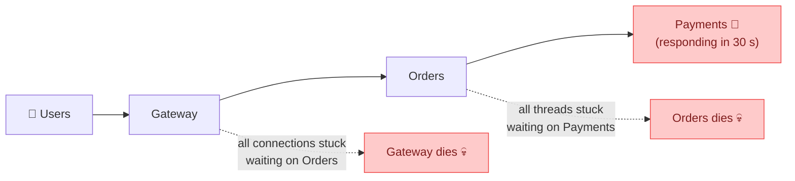
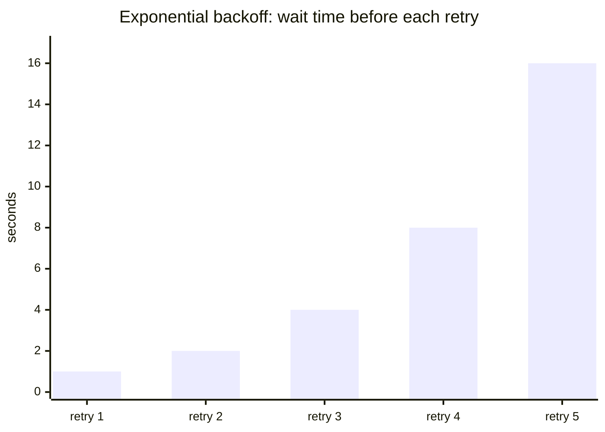
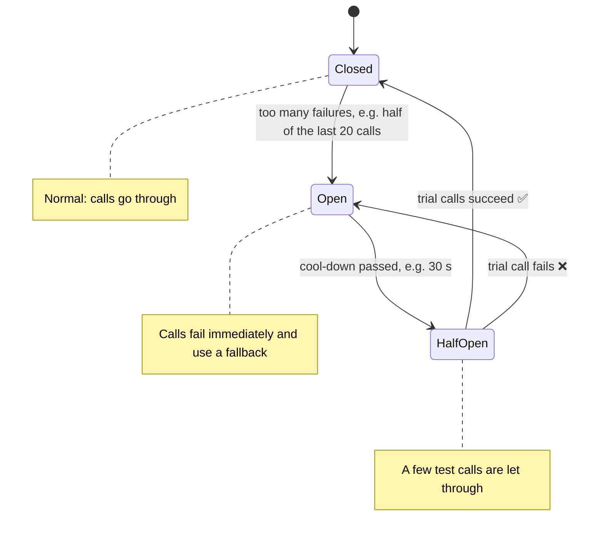
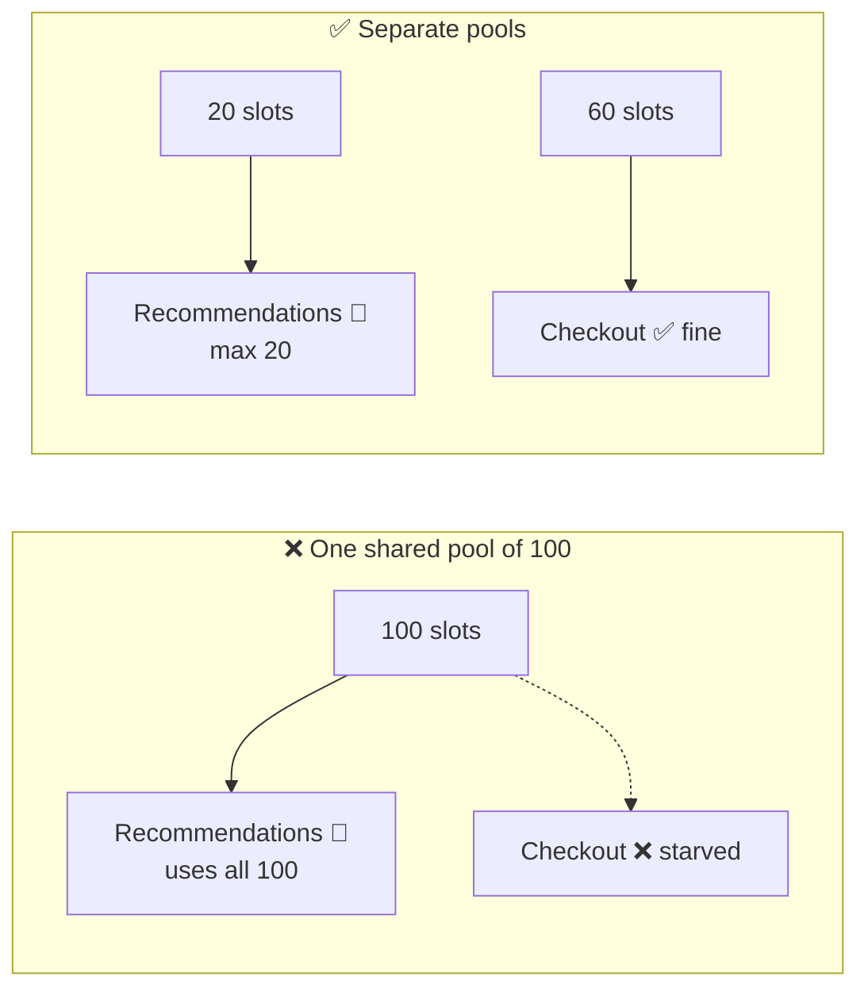
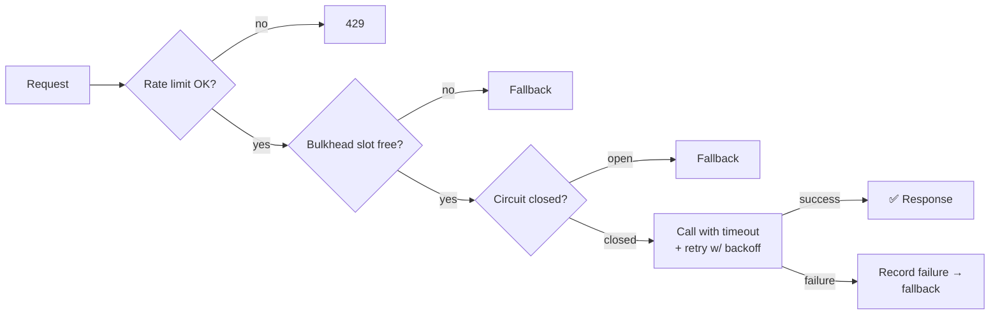

## The big idea

Your house has a **circuit breaker** in the fuse box. When one appliance shorts out, the breaker trips and cuts power to that circuit only, so the whole house doesn't burn down. You fix the appliance, then flip the breaker back on.

Microservices need the same kind of protection. Without it, one slow service causes a **cascading failure**:



One slow dependency took down everything upstream. The patterns below stop that.


## 1. Timeouts: never wait forever

Every network call needs a timeout. Without one, a hung dependency holds your threads, connections and memory hostage.

```js
const response = await fetch("http://payments-svc/charge", {
  method: "POST",
  body: JSON.stringify(payment),
  signal: AbortSignal.timeout(2000), // give up after 2 s
});
```

> 💡 Base timeouts on the dependency's **p99 latency** plus a margin, and make sure upstream timeouts are **longer** than downstream ones (the gateway's 5 s > orders' 3 s > payments' 2 s).

## 2. Retries with exponential backoff and jitter

Many failures are brief: a network blip, a pod restarting. Retrying often helps, but retrying **immediately and all at once** can finish off a struggling service (a "retry storm").



```js
async function withRetry(fn, { attempts = 4, baseMs = 200, maxMs = 5000 } = {}) {
  for (let attempt = 1; ; attempt++) {
    try {
      return await fn();
    } catch (error) {
      const retryable = error.status === undefined || error.status >= 500 || error.status === 429;
      if (!retryable || attempt >= attempts) throw error;
      const backoff = Math.min(maxMs, baseMs * 2 ** (attempt - 1));
      const jitter = Math.random() * backoff;           // spread clients out
      await new Promise((r) => setTimeout(r, jitter));
    }
  }
}
```

**Retry rules:**

- ✅ Retry **transient** errors: timeouts, 502, 503, 504, 429 (respect `Retry-After`).
- ❌ Don't retry **client** errors: 400, 401, 403, 404, 422. They'll fail again.
- ⚠️ Only retry **idempotent** operations, or use **idempotency keys** (see *REST API Design*).
- Limit retries at **one layer**. If 3 layers each retry 3 times, one request becomes 27.

## 3. Circuit breaker ⭐

If a dependency keeps failing, stop calling it for a while. **Fail fast** instead of waiting for timeouts, and give it time to recover.



```js
import CircuitBreaker from "opossum";

const breaker = new CircuitBreaker(callRecommendations, {
  timeout: 1000,                 // a call slower than 1 s counts as a failure
  errorThresholdPercentage: 50,  // open when half of the calls fail
  resetTimeout: 30_000,          // try again after 30 s
});

breaker.fallback(() => []);      // no recommendations? show none instead of an error
breaker.on("open", () => logger.warn("recommendations circuit OPEN"));

const recs = await breaker.fire(userId);
```

## 4. Bulkhead: isolate resources

Ships are divided into watertight compartments (**bulkheads**). A hole floods one compartment, not the whole ship.

In software: give each dependency its **own limited pool** of connections, threads or concurrent calls. A slow recommendations service can then exhaust only *its* pool, while checkout keeps working.



```js
import pLimit from "p-limit";
const recsLimit = pLimit(20);     // at most 20 concurrent calls to recommendations
const recs = await recsLimit(() => breaker.fire(userId));
```

## 5. Fallbacks and graceful degradation

When a non-critical dependency fails, **degrade** instead of erroring:

| Failed dependency | Fallback |
| --- | --- |
| Recommendations | Show best-sellers (cached) or hide the section |
| Reviews | "Reviews are temporarily unavailable" |
| Personalised prices | Show the standard price |
| Search | A simple database `LIKE` query |
| Payments | ❌ No fallback: fail clearly and let the user retry |

Decide in advance which features are **critical** (must work or fail loudly) and which are **optional** (degrade silently).

## 6. Rate limiting and load shedding

Protect a service from being overwhelmed by rejecting excess traffic early (**429 Too Many Requests** or **503**), preferably dropping low-priority requests first. It's better to serve 80% of users well than 100% of users badly.

## 7. Health checks

- **Liveness:** "Is the process alive?" If not, restart it.
- **Readiness:** "Can it serve traffic right now?" If not, stop sending requests (for example, while warming up or when the DB is unreachable).

Load balancers and Kubernetes use these to route around sick instances. (See *Kubernetes → Health Probes*.)

## Putting it together



## Chaos engineering

How do you know these protections work? **Break things on purpose**, in a controlled way: kill pods, add latency, drop network packets, then watch whether the system degrades gracefully. Netflix's **Chaos Monkey** made this famous; tools today include Chaos Mesh, Gremlin and AWS Fault Injection Service.

## Key takeaways

- Assume every dependency will fail or slow down.
- **Timeouts** on every call; **retries** only for transient errors, with exponential backoff and jitter, on idempotent operations.
- **Circuit breakers** fail fast and give failing services time to recover (closed → open → half-open).
- **Bulkheads** isolate resources so one slow dependency can't starve everything.
- **Fallbacks** keep the experience working when optional features fail.
- Verify it all with health checks and chaos experiments.
