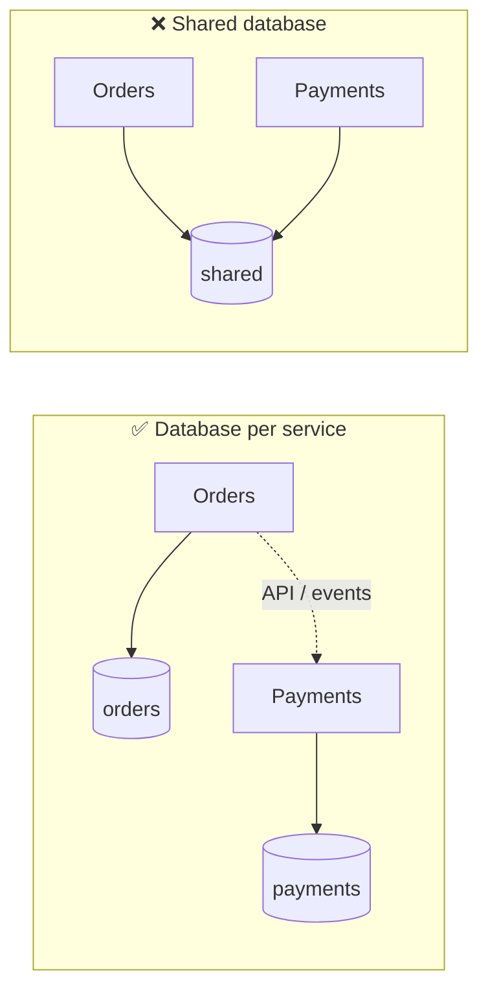
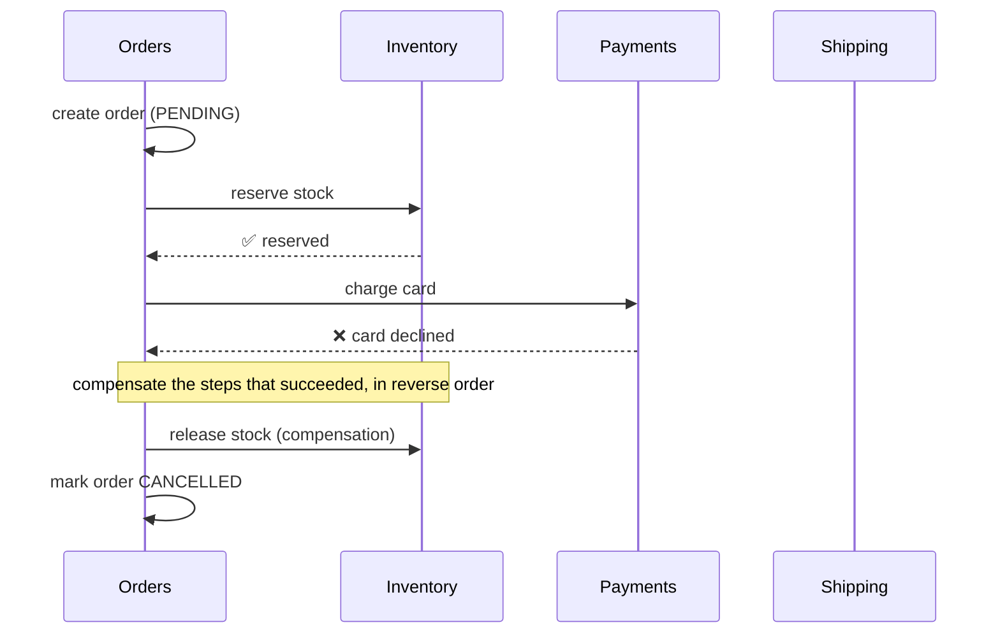
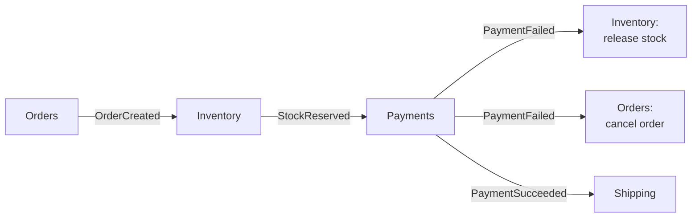
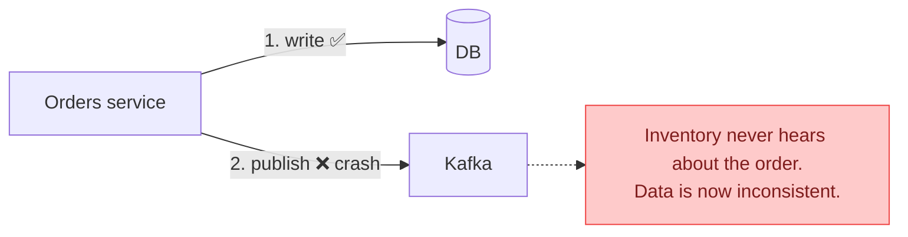
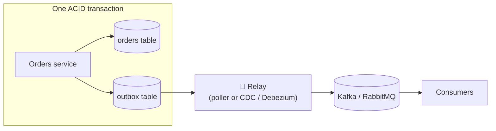

## The big idea

Booking a holiday means booking a **flight**, a **hotel** and a **car** from three different companies. No single "transaction" covers all three. If the car rental fails, you don't magically undo everything; you **cancel the hotel** and **cancel the flight** yourself.

That's a **saga**: a sequence of local steps, each with a **compensating action** that undoes it if a later step fails.


## Rule #1: database per service

Each service owns its data. **Nobody else touches its tables**, only its API and events.



**Why?** With a shared database, one team's schema change breaks another team's service, services can't be deployed independently, and you've built a *distributed monolith*.

**The consequence:** there is no single `BEGIN … COMMIT` across services. We need other tools.

## Why not a distributed transaction (2PC)?

**Two-phase commit** asks every participant "can you commit?" and then "commit!". It exists, but in microservices it's usually avoided:

- Every participant is **locked** while waiting for the slowest one.
- If the coordinator crashes mid-way, participants can stay stuck.
- Many modern systems (Kafka, most NoSQL stores, SaaS APIs like Stripe) **don't support it**.

So microservices accept **eventual consistency** and use sagas.

## The saga pattern

A saga is a series of **local transactions**. Each one updates a single service's database and triggers the next step. If a step fails, the saga runs **compensating transactions** for the steps that already succeeded.



| Step | Action | Compensation |
| --- | --- | --- |
| 1 | Create order (PENDING) | Mark order CANCELLED |
| 2 | Reserve stock | Release stock |
| 3 | Charge card | Refund card |
| 4 | Schedule shipment | *(last step: nothing after it can fail)* |

> ⚠️ Compensation isn't always a perfect "undo". You can't un-send an email; you send an apology email instead. Design compensations as **business actions**.

### Choreography saga (events)

Each service listens for events and reacts. No central coordinator.



✅ Simple for short flows, loosely coupled. ❌ Hard to see the whole flow; risk of cyclic event chains.

### Orchestration saga (a coordinator)

A **saga orchestrator** tells each service what to do and tracks the state.

```js
// A simple orchestrator (tools like Temporal make this durable and crash-safe)
async function placeOrderSaga(order) {
  const done = [];
  try {
    await inventory.reserve(order.items);          done.push(() => inventory.release(order.items));
    const payment = await payments.charge(order);  done.push(() => payments.refund(payment.id));
    await shipping.schedule(order);
    await orders.markConfirmed(order.id);
  } catch (error) {
    for (const compensate of done.reverse()) await compensate(); // undo in reverse order
    await orders.markCancelled(order.id, error.message);
    throw error;
  }
}
```

✅ The whole flow is visible and testable in one place. ❌ The orchestrator is extra infrastructure, and it must survive crashes: **Temporal**, **AWS Step Functions** and **Camunda** persist saga state for you.

## The dual-write problem

A very common bug: a service saves to its database **and** publishes an event, as two separate steps.

```js
// ❌ Dual write
await db.orders.insert(order);             // 1. succeeds
await kafka.publish("OrderCreated", order); // 2. crashes here → event never sent 😱
```



Swapping the order doesn't help: publishing first and then failing the DB write sends an event about an order that doesn't exist.

## The transactional outbox pattern ⭐

Write the event into an **outbox table in the same database, in the same transaction** as the business data. A separate **relay** process reads the outbox and publishes to the broker.



```sql
BEGIN;
INSERT INTO orders (id, customer_id, total_cents, status) VALUES ('ord_42', 'cus_7', 8997, 'PENDING');
INSERT INTO outbox (id, aggregate_id, type, payload, created_at)
VALUES (gen_random_uuid(), 'ord_42', 'OrderCreated', '{"orderId":"ord_42","totalCents":8997}', now());
COMMIT; -- both rows or neither
```

```js
// Relay: publish unsent outbox rows, then mark them as sent
setInterval(async () => {
  const rows = await db.query(
    "SELECT * FROM outbox WHERE sent_at IS NULL ORDER BY created_at LIMIT 100 FOR UPDATE SKIP LOCKED",
  );
  for (const row of rows) {
    await broker.publish(row.type, row.payload, { messageId: row.id });
    await db.query("UPDATE outbox SET sent_at = now() WHERE id = $1", [row.id]);
  }
}, 500);
```

**Guarantee:** if the order is saved, the event **will** eventually be published, *at least once*. If the relay crashes after publishing but before marking the row, the event is published twice, so consumers must be **idempotent**.

**Change Data Capture (CDC)** tools like **Debezium** read the database's transaction log and stream outbox rows to Kafka, with no polling needed.

## The inbox pattern: idempotent consumers

The receiving side records which message IDs it has processed, **in the same transaction** as its own changes:

```sql
BEGIN;
INSERT INTO inbox (message_id) VALUES ('evt_7f3c…');  -- UNIQUE: a duplicate fails here
UPDATE stock SET reserved = reserved + 1 WHERE sku = 'KB-1';
COMMIT;
```

Outbox on the producer side plus inbox (idempotency) on the consumer side gives **effectively exactly-once** processing.

## Querying across services

"Show orders with customer names and shipping status" needs data from three services. Options:

| Approach | How | Trade-off |
| --- | --- | --- |
| **API composition** | A BFF/gateway calls each service and joins in memory | Simple; slow for big lists |
| **Data replication** | Services keep local read-only copies of data they need, updated by events | Fast; eventually consistent |
| **CQRS read model** | A dedicated query database built from events | Fast, flexible queries; more infrastructure (next lesson) |

## Key takeaways

- **Database per service**: no shared tables, so no cross-service ACID transactions.
- Avoid 2PC; use **sagas**: local transactions plus compensating actions, run by choreography (events) or orchestration (a coordinator).
- Never dual-write. Use the **transactional outbox** so data changes and events are committed together.
- Delivery is at-least-once, so make consumers **idempotent** (the inbox pattern).
- Cross-service queries: API composition, replicated data, or CQRS read models.
