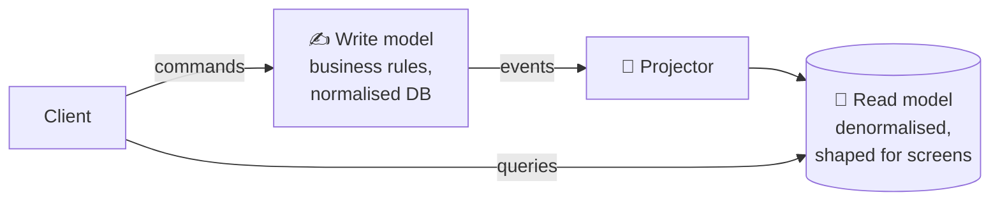
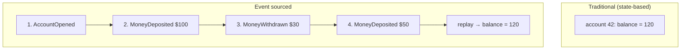
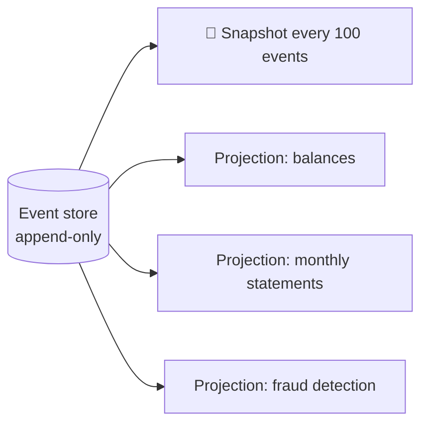
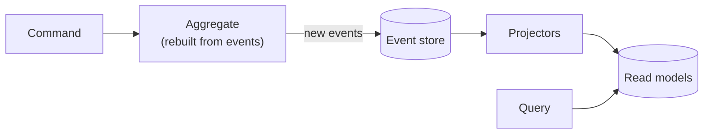

## Part 1: CQRS

### The big idea

A restaurant kitchen and its menu board are optimised for different jobs. The kitchen is organised for **cooking** (making changes); the menu board is organised for **customers reading quickly**. Nobody tries to read the menu off the kitchen shelves.

**CQRS (Command Query Responsibility Segregation)** separates:

- **Commands** (writes): "place an order", "change an address". They validate business rules and change state.
- **Queries** (reads): "show my order history". They return data and change nothing.




### Why split them?

Reads and writes usually have **very different needs**:

| | Writes (commands) | Reads (queries) |
| --- | --- | --- |
| Volume | Few | Often 10–1000× more |
| Shape | Normalised, enforces rules | Denormalised, joined, pre-computed |
| Storage | Postgres (transactions) | Elasticsearch (search), Redis (fast lookups), a reporting DB |
| Scaling | Consistency matters | Scale out freely |

**Example:** the "My orders" screen shows the order, product names, images, shipping status and total. With CQRS, a projector keeps an `order_summaries` view with exactly those fields, so one fast query, no joins across services.

```js
// Command side: rules and state changes
async function changeShippingAddress({ orderId, address }) {
  const order = await orderRepository.load(orderId);
  order.changeAddress(address);           // throws if already shipped
  await orderRepository.save(order);      // + outbox event "ShippingAddressChanged"
}

// Projector: keeps the read model in sync
on("ShippingAddressChanged", async (event) => {
  await readDb.orderSummaries.update(event.orderId, { shippingCity: event.address.city });
});

// Query side: dumb and fast
app.get("/orders/mine", async (req, res) => {
  res.json(await readDb.orderSummaries.find({ customerId: req.user.id }).sort({ placedAt: -1 }));
});
```

### The catch: eventual consistency

The read model updates **a moment after** the write. A user might save a change and not see it on the next screen for a few milliseconds. Common fixes: show the updated value optimistically in the UI, or read from the write side right after the user's own change.

> 💡 CQRS doesn't require separate databases. Even separate **classes** for reads and writes inside one app is CQRS. Start there.

---

## Part 2: Event Sourcing

### The big idea

Your **bank account** doesn't store just "balance: $120". It stores **every transaction**: deposit $100, withdraw $30, deposit $50. The balance is simply the sum. You can always see *how* you got there, and what the balance was on any past date.

**Event sourcing** stores **every change as an immutable event**, instead of overwriting the current state.



```js
const events = [
  { type: "AccountOpened", accountId: 42 },
  { type: "MoneyDeposited", amount: 100 },
  { type: "MoneyWithdrawn", amount: 30 },
  { type: "MoneyDeposited", amount: 50 },
];

// Current state = a left fold (reduce) over the events
function applyEvent(state, event) {
  switch (event.type) {
    case "AccountOpened": return { id: event.accountId, balance: 0 };
    case "MoneyDeposited": return { ...state, balance: state.balance + event.amount };
    case "MoneyWithdrawn": return { ...state, balance: state.balance - event.amount };
    default: return state;
  }
}

const account = events.reduce(applyEvent, null); // { id: 42, balance: 120 }
```

### Handling a command

```js
async function withdraw(accountId, amount) {
  const history = await eventStore.load(`account-${accountId}`);
  const account = history.reduce(applyEvent, null);
  if (account.balance < amount) throw new Error("Insufficient funds"); // business rule on current state

  await eventStore.append(`account-${accountId}`, [{ type: "MoneyWithdrawn", amount }], {
    expectedVersion: history.length, // optimistic concurrency: fails if someone appended meanwhile
  });
}
```

### What you get

| Benefit | Example |
| --- | --- |
| 🧾 **Complete audit log** | Every change, who made it and when: banking, healthcare, legal |
| ⏪ **Time travel** | "What did this cart look like last Tuesday?" Replay events up to that date |
| 🔄 **New read models anytime** | Need a new report? Replay all events into a new projection |
| 🐛 **Debugging** | Replay the exact sequence of events that caused a bug |
| 📣 **Natural fit for events** | Events are already the source of truth, ready to publish |

### What it costs

| Challenge | Mitigation |
| --- | --- |
| Replaying thousands of events is slow | **Snapshots**: save state every N events, then replay only newer events |
| Event schemas change over time | Versioned events, upcasters (convert old events to the new format on read) |
| Querying is hard ("all accounts over $1,000") | **CQRS** read models built from the events |
| "Deleting" data (GDPR) with immutable events | Crypto-shredding: encrypt personal data per user and delete the key |
| Steeper learning curve | Use it only where the benefits are real |



**Tools:** EventStoreDB, Axon, Marten (Postgres), or Kafka as the event log.

## CQRS + event sourcing together

They're often used together, but they're **independent**: you can use CQRS without event sourcing (very common), and event sourcing almost always needs CQRS for queries.



## When to use them

✅ **Good fit:** complex domains with rich business rules, strong audit requirements (finance, healthcare, insurance), very different read/write loads, and a need to answer "what happened and when?".

❌ **Poor fit:** simple CRUD apps (a to-do list, a basic admin panel), small teams without the need, domains where eventual consistency confuses users.

> ⚠️ Apply these patterns to **one bounded context** that needs them, not to your whole system.

## Key takeaways

- **CQRS:** separate models (or even separate stores) for writes and reads, synced by events.
- Read models are shaped for screens: fast, denormalised, eventually consistent.
- **Event sourcing:** store every change as an immutable event; current state = replaying events.
- You get audit history, time travel and new projections at any time; you pay with complexity, schema evolution and snapshots.
- Use them where the domain truly benefits, not everywhere.
