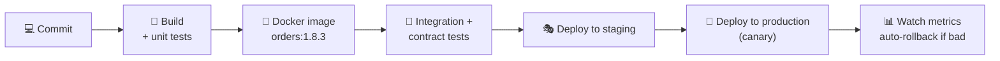
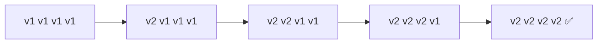
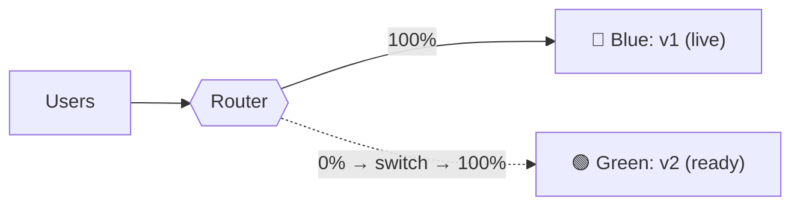
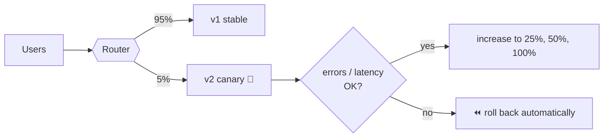
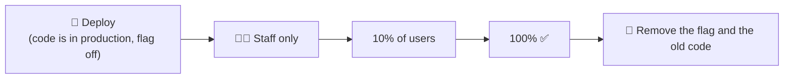
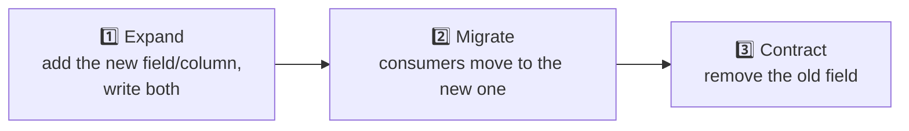
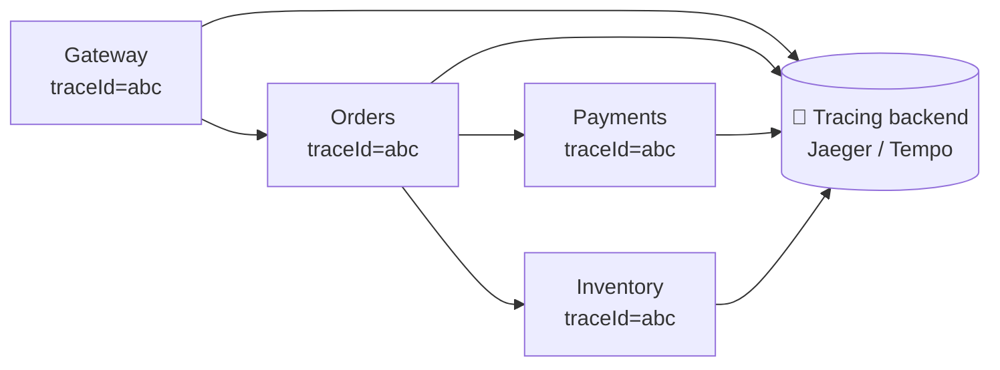

## The big idea

A theatre changes the set **between scenes** without stopping the play: the curtain drops for a moment, the crew swaps pieces, and the show goes on. The audience barely notices.

The whole point of microservices is being able to **deploy one service many times a day, safely, without downtime**. That takes automation, careful release strategies and good visibility.


## One pipeline per service

Each service has its own repository (or its own folder in a monorepo), its own tests and its own pipeline.



- Build **once**; promote the **same image** through every environment.
- Tag images with the git SHA or a version, never just `latest`.
- Store configuration in the environment, not in the image.

## Release strategies

### Rolling update (the Kubernetes default)

Replace instances **a few at a time**. Simple, no extra capacity needed; old and new versions run side by side for a while.



### Blue-green

Run two identical environments. **Blue** serves traffic; deploy to **green**, test it, then **switch the router** in one step. Rollback = switch back.



✅ Instant switch and instant rollback. ❌ Double the infrastructure while both run; database changes must work with both versions.

### Canary ⭐

Send a **small slice** of real traffic (1% → 5% → 25% → 100%) to the new version, watching error rates and latency at each step. If metrics get worse, roll back automatically.



✅ Limits the blast radius of a bad release to a few users. Tools: Argo Rollouts, Flagger, service mesh traffic splitting.

| Strategy | Rollback speed | Extra cost | Risk exposure |
| --- | --- | --- | --- |
| Rolling | Medium | None | Grows gradually |
| Blue-green | ⚡ Instant | 2× capacity during release | All users at the switch |
| Canary | Fast | Small | ✅ Smallest |

## Feature flags: deploy ≠ release

Ship code **turned off**, then turn it on for specific users (staff, 10% of users, one country) without redeploying.

```js
if (await flags.isEnabled("new-checkout", { userId: user.id, country: user.country })) {
  return renderNewCheckout();
}
return renderOldCheckout();
```



Flags also act as **kill switches**: turn a broken feature off in seconds. Remember to delete old flags, or they become technical debt.

## Never break your consumers

Other services depend on your API and your events. Changes must be **backward compatible**.

| ✅ Safe (additive) | ❌ Breaking |
| --- | --- |
| Add a new optional field | Remove or rename a field |
| Add a new endpoint | Change a field's type |
| Add a new event type | Make an optional field required |
| Accept new optional input | Change what an error code means |

**Expand and contract** for breaking changes, including database changes:



**Consumer-driven contract tests** (such as **Pact**) let each consumer publish what it expects from your API; your pipeline fails if a change would break any of them, before it reaches production.

## Observability across services

With dozens of services, you **must** be able to follow a request across all of them.



- **Distributed tracing** with OpenTelemetry: one trace ID across every hop.
- **Structured logs** including the trace ID and service name.
- **Golden signals** per service: latency, traffic, errors, saturation.
- **Correlate** everything in one place (Grafana, Datadog, Honeycomb).

(See *Backend → Observability* for the details.)

## Production-readiness checklist

Before a service goes live, it should have:

- [ ] Health endpoints (`/health/live`, `/health/ready`)
- [ ] Timeouts, retries with backoff, and circuit breakers on outgoing calls
- [ ] Graceful shutdown (finish in-flight requests on SIGTERM)
- [ ] Structured logging with trace IDs
- [ ] Metrics and a dashboard for the golden signals
- [ ] Alerts linked to a runbook
- [ ] Resource limits (CPU/memory) and autoscaling rules
- [ ] Config through environment variables; secrets in a secret manager
- [ ] API docs (OpenAPI) and versioning policy
- [ ] Automated tests and a one-click (or automatic) rollback
- [ ] A clear owning team and an on-call rotation

```js
// Graceful shutdown in Node.js
process.on("SIGTERM", () => {
  server.close(async () => {          // stop accepting new requests, finish current ones
    await db.end();
    await broker.disconnect();
    process.exit(0);
  });
  setTimeout(() => process.exit(1), 25_000).unref(); // force-quit if it takes too long
});
```

## Key takeaways

- Each service has its own pipeline; build one image and promote it through environments.
- Rolling updates are the default; **blue-green** gives instant rollback; **canary** limits the blast radius.
- Feature flags separate deploying code from releasing features.
- Keep APIs and events backward compatible (expand → migrate → contract) and use contract tests.
- Tracing, logs and golden-signal metrics across services are non-negotiable; use a production-readiness checklist.
