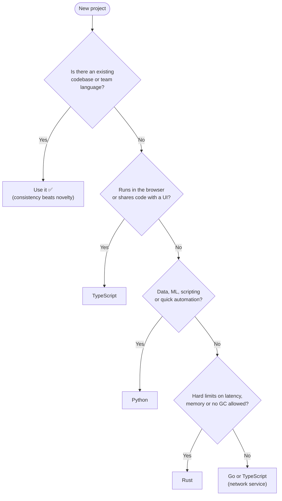
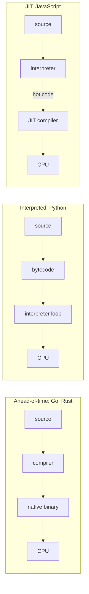
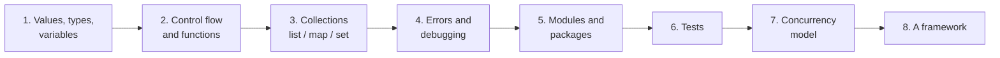

## The big idea

A programming language is a **toolbox**. A carpenter doesn't ask "which tool is the best?"; they ask "what am I building, who is helping me, and what is already on site?"

- A **multi-tool** (JavaScript/TypeScript) does a bit of everything and works both in the browser and on the server.
- A **friendly power drill** (Python) is easy to pick up and has an attachment for every job, especially data and AI.
- A **nail gun** (Go) does one job, network services, very fast and with almost no setup.
- A **precision lathe** (Rust) makes perfect parts, but you need training before you touch it.


## The questions that actually decide



> 💡 The best language for a team is usually the one the team can **operate at 3 a.m.**: debug, profile, deploy and hire for. Raw benchmark speed is rarely the bottleneck; the database and the network usually are.

## Comparing the four on what matters

| | TypeScript (Node.js) | Python | Go | Rust |
| --- | --- | --- | --- | --- |
| **How it runs** | JIT-compiled JS on V8 | Interpreted (CPython) | Compiled to a native binary | Compiled to a native binary |
| **Typing** | Static types, erased at runtime | Dynamic, optional type hints | Static, simple | Static, very expressive |
| **Memory** | Garbage collected | Garbage collected (ref counting + GC) | Garbage collected | **Ownership**, no GC |
| **Concurrency** | Event loop + `async/await` | `asyncio`, threads (GIL), processes | Goroutines + channels | Threads + `async` (Tokio), no data races |
| **Startup / deploy** | `node` + `node_modules` | Interpreter + virtualenv | One static binary | One static binary |
| **Learning curve** | Gentle | Gentlest | Gentle | Steep |
| **Sweet spot** | Full-stack web, APIs, real-time | Automation, data, AI/ML, APIs | Microservices, CLIs, cloud tooling | Performance-critical, systems, WASM |
| **Famous users** | VS Code, Slack desktop | Instagram, most ML research | Docker, Kubernetes | Firefox components, Cloudflare |

### Compiled, interpreted or JIT?



- **Ahead-of-time** languages catch more mistakes before running and start instantly.
- **Interpreted** languages are fast to edit and run, but slower in tight loops.
- **JIT** languages start interpreted and compile "hot" code while running, a middle ground.

## Static vs dynamic typing

| | Static (TS, Go, Rust) | Dynamic (Python, plain JS) |
| --- | --- | --- |
| When type errors appear | While compiling / in the editor | When that line runs |
| Refactoring a large codebase | Safe: the compiler finds every caller | Relies on tests |
| Speed of writing a script | Slightly slower | Fastest |
| Documentation | Types *are* documentation | Needs docstrings / type hints |

Python's **type hints** and TypeScript's **types** are both *checked by a tool* (mypy/pyright, `tsc`), not enforced by the runtime. Data from outside (HTTP bodies, files, env vars) must still be **validated at runtime**.

## The same program in four languages

**Task:** sum the even numbers in a list.

```ts
// TypeScript
const sumEvens = (xs: number[]): number => xs.filter((x) => x % 2 === 0).reduce((a, b) => a + b, 0);
```

```python
# Python
def sum_evens(xs: list[int]) -> int:
    return sum(x for x in xs if x % 2 == 0)
```

```go
// Go
func SumEvens(xs []int) int {
	total := 0
	for _, x := range xs {
		if x%2 == 0 {
			total += x
		}
	}
	return total
}
```

```rust
// Rust
fn sum_evens(xs: &[i64]) -> i64 {
    xs.iter().filter(|x| *x % 2 == 0).sum()
}
```

Notice the personalities: Python reads like English, Go is explicit and loop-based on purpose, Rust borrows the list (`&[i64]`) instead of taking it, and TypeScript chains array methods.

## Languages vs frameworks

A framework is a **tool inside the language choice**, not a replacement for learning the language.

| Language | Minimal HTTP | Batteries-included | Covered in |
| --- | --- | --- | --- |
| TypeScript | Express, Fastify | NestJS | *Node.js & Express*, *NestJS* |
| Python | FastAPI, Flask | Django | *Python Web APIs* |
| Go | `net/http`, Gin | (Go prefers libraries) | *Go Web Services with Gin* |
| Rust | Axum, Actix Web | (Rust prefers libraries) | *Rust: Types, Errors & Concurrency* |

## A learning path that works for any language



The best first project is a small **CLI or API** that reads input, validates it, stores data, handles errors and has tests. Build the *same* project in a second language later: you'll learn more from the differences than from any tutorial.

## Key takeaways

- Choose by **team, existing code, runtime needs and operations**, not by popularity or benchmarks.
- TypeScript for full-stack web, Python for automation/data/AI, Go for network services, Rust when performance and memory safety are hard requirements.
- Static types catch errors earlier, but **runtime validation** at the boundary is still required in every language.
- Learn the language fundamentals first; a framework is much easier once you know what it's doing for you.
