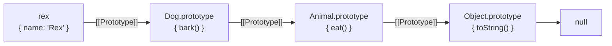

## The big idea

JavaScript has only a few building blocks: **primitive values**, **objects**, and **functions** (which are also objects). Almost every "weird" behaviour comes from one question: *am I holding the thing itself, or a reference to it?*

Think of a **house** and its **address**. A primitive (a number, a string) is like writing a number on a sticky note: copy the note and you have two independent notes. An object is a house: copying the variable only copies the **address**, and both variables point at the same house.


> 📘 This lesson covers the language itself. The event loop, closures and `this` are explained visually in *Frontend → JavaScript Essentials*; async code on the server is in the next lesson.

## Values and types

| Type | Examples | Kind |
| --- | --- | --- |
| `number` | `42`, `3.14`, `NaN`, `Infinity` | primitive |
| `bigint` | `9007199254740993n` | primitive |
| `string` | `"hi"`, `` `Hi ${name}` `` | primitive |
| `boolean` | `true`, `false` | primitive |
| `undefined` | a declared variable with no value | primitive |
| `null` | "intentionally empty" | primitive |
| `symbol` | `Symbol("id")` | primitive |
| `object` | `{}`, `[]`, functions, `Date`, `Map` | reference |

```js
let a = 5;
let b = a;      // copies the value
b++;
console.log(a); // 5

const user = { name: "Ana" };
const same = user;    // copies the reference
same.name = "Bo";
console.log(user.name); // "Bo" — same object

const copy = { ...user };           // shallow copy
const deep = structuredClone(user); // deep copy (nested objects too)
```

> ⚠️ `const` means the **variable** can't be reassigned, not that the object is frozen. `const user = {}` still allows `user.name = "x"`. Use `Object.freeze` for a (shallow) read-only object.

## Equality and coercion

```js
0 == "0";            // true  — loose equality converts types
0 == "";             // true
"0" == "";           // false  😵 not transitive
null == undefined;   // true
NaN === NaN;         // false — use Number.isNaN(x)
[1] === [1];         // false — two different objects
```

**Rule:** always use `===` and `!==`. The only common exception is `x == null`, which checks for both `null` and `undefined`.

### Truthy and falsy

The falsy values are: `false`, `0`, `-0`, `0n`, `""`, `null`, `undefined`, `NaN`. **Everything else is truthy**, including `"0"`, `[]` and `{}`.

```js
const port = config.port || 3000; // ❌ a port of 0 becomes 3000
const port2 = config.port ?? 3000; // ✅ only null/undefined fall back
const city = user?.address?.city;  // optional chaining: undefined instead of a crash
```

## Variables and scope

| | `var` | `let` | `const` |
| --- | --- | --- | --- |
| Scope | Function | Block `{ }` | Block `{ }` |
| Reassign | ✅ | ✅ | ❌ |
| Use before declaration | `undefined` (hoisted) | ❌ ReferenceError (TDZ) | ❌ ReferenceError (TDZ) |
| Use it? | Avoid | When the value changes | **Default** |

```js
for (var i = 0; i < 3; i++) setTimeout(() => console.log(i)); // 3 3 3
for (let j = 0; j < 3; j++) setTimeout(() => console.log(j)); // 0 1 2 — new j per loop
```

## Functions

```js
function add(a, b) { return a + b; }          // declaration (hoisted)
const sub = function (a, b) { return a - b; }; // expression
const mul = (a, b) => a * b;                   // arrow: short, no own `this`

function greet(name = "friend", ...rest) {     // default + rest parameters
  return `Hello ${name}, and ${rest.length} others`;
}

const { id, email: mail = "n/a" } = user;      // object destructuring with rename + default
const [first, , third] = [10, 20, 30];         // array destructuring
```

Functions are **values**: you can pass them, return them and store them. A function that takes or returns a function is a *higher-order function*.

```js
const once = (fn) => {
  let done = false, result;
  return (...args) => (done ? result : ((done = true), (result = fn(...args))));
};
const init = once(() => console.log("connecting…"));
init(); init(); // logs once
```

## Objects, prototypes and classes

Every object has a hidden link to a **prototype**. When a property isn't found on the object, JavaScript walks up the chain.



`class` is clean syntax over that same prototype system:

```js
class Animal {
  #energy = 10;                  // truly private field
  constructor(name) { this.name = name; }
  eat() { this.#energy++; return this; }
  get energy() { return this.#energy; }
  static create(name) { return new this(name); }
}

class Dog extends Animal {
  bark() { return `${this.name}: woof`; }
}

const rex = Dog.create("Rex");
rex.eat().bark();                  // "Rex: woof"
Object.getPrototypeOf(rex) === Dog.prototype; // true
```

### Is JavaScript object-oriented?

Yes, and also functional. It supports the four OOP pillars:

| Pillar | In JavaScript |
| --- | --- |
| **Encapsulation** | `#private` fields, closures, modules |
| **Abstraction** | Expose a small public API, hide details |
| **Inheritance** | Prototypes / `extends` (prefer composition when in doubt) |
| **Polymorphism** | Any object with the right method works ("duck typing") |

## Arrays and collections

```js
const orders = [
  { id: 1, total: 40, paid: true },
  { id: 2, total: 15, paid: false },
  { id: 3, total: 90, paid: true },
];

const paidTotal = orders.filter((o) => o.paid).map((o) => o.total).reduce((a, b) => a + b, 0); // 130
const big = orders.find((o) => o.total > 50);      // { id: 3, … }
const anyUnpaid = orders.some((o) => !o.paid);     // true
const byId = new Map(orders.map((o) => [o.id, o])); // fast lookup by key
const sorted = orders.toSorted((a, b) => b.total - a.total); // non-mutating (ES2023)
```

| Need | Use |
| --- | --- |
| Ordered list | `Array` |
| Key → value with any key type, frequent add/remove | `Map` |
| Unique values | `Set` |
| Fixed record shape | plain object `{}` |

> ⚠️ `sort()`, `reverse()` and `splice()` **mutate** the array. `toSorted()`, `toReversed()` and `toSpliced()` return a copy.

## Modules

Modern JavaScript uses **ES modules** (`import`/`export`). Node.js also still supports the older **CommonJS** (`require`).

```js
// math.js
export const PI = 3.14159;
export default function area(r) { return PI * r * r; }

// app.js
import area, { PI } from "./math.js";
const { readFile } = await import("node:fs/promises"); // dynamic import
```

| | ES modules | CommonJS |
| --- | --- | --- |
| Syntax | `import` / `export` | `require` / `module.exports` |
| Loading | Static, analysed before running (tree-shaking) | Dynamic, at runtime |
| Top-level `await` | ✅ | ❌ |
| Enable in Node | `"type": "module"` or `.mjs` | default / `.cjs` |

## Errors

```js
class NotFoundError extends Error {
  constructor(resource, id) {
    super(`${resource} ${id} not found`);
    this.name = "NotFoundError";
  }
}

try {
  const user = findUser(42) ?? (() => { throw new NotFoundError("User", 42); })();
} catch (err) {
  if (err instanceof NotFoundError) console.warn(err.message);
  else throw err; // don't swallow errors you don't understand
} finally {
  closeConnection();
}
```

Throw `Error` objects (not strings) so you keep a **stack trace**, and use `cause` to wrap lower-level errors: `throw new Error("Save failed", { cause: err })`.

## Quick check

<details>
<summary>What does <code>typeof null</code> return, and why?</summary>

`"object"`. It's a bug from the first version of JavaScript that can never be fixed without breaking the web. Check for null with `value === null`.
</details>

<details>
<summary>Why does <code>[10, 9, 1].sort()</code> return <code>[1, 10, 9]</code>?</summary>

Without a compare function, `sort` converts items to **strings** and sorts them alphabetically. Use `sort((a, b) => a - b)` for numbers.
</details>

## Key takeaways

- Primitives are copied by **value**; objects, arrays and functions are shared by **reference**.
- Use `===`, `const` by default, `let` when needed, never `var`. Use `??` and `?.` for missing values.
- Classes are syntax over **prototypes**; `#private` fields give real encapsulation.
- Prefer non-mutating array methods, `Map`/`Set` for lookups and uniqueness, and ES modules for new code.
- Throw real `Error` objects, rethrow what you can't handle, and wrap with `cause`.
