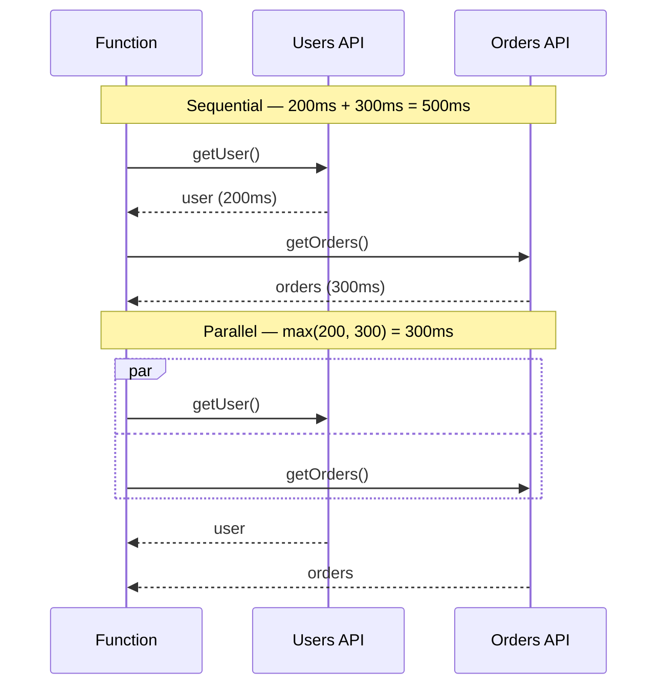
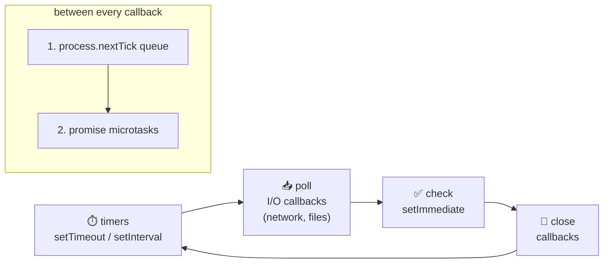

## The big idea

Ordering food at a busy counter: you don't stand frozen at the till until your burger is ready. You get a **receipt with a number**, step aside, and the cashier serves the next person. When your number is called, you collect your food, or you hear "sorry, we're out of burgers".

A **Promise** is that receipt. It's an object that represents a value that isn't ready yet. It is **pending**, and later becomes **fulfilled** (here's your food) or **rejected** (sorry, an error).


> 📘 The browser event loop, call stack and the famous `setTimeout` vs `Promise` quiz are in *Frontend → JavaScript Essentials*. Here we focus on writing correct async code, especially on the server.

## From callbacks to async/await

```js
// 1. Callbacks: nesting grows sideways ("callback hell"), errors passed by hand
readUser(id, (err, user) => {
  if (err) return done(err);
  readOrders(user.id, (err, orders) => {
    if (err) return done(err);
    done(null, orders);
  });
});

// 2. Promises: a flat chain, one error handler
readUser(id)
  .then((user) => readOrders(user.id))
  .then((orders) => console.log(orders))
  .catch((err) => console.error(err));

// 3. async/await: looks like normal code, same promises underneath
async function loadOrders(id) {
  const user = await readUser(id);
  return readOrders(user.id);
}
```

An `async` function **always returns a promise**. `await` pauses *that function only*, not the whole program; the event loop keeps serving other work.

## Sequential vs parallel ⭐

The most common async performance bug is awaiting independent work one after another.



```js
// ❌ 500ms: the second call waits for the first for no reason
const user = await getUser(id);
const orders = await getOrders(id);

// ✅ 300ms: start both, then wait for both
const [user2, orders2] = await Promise.all([getUser(id), getOrders(id)]);
```

## The promise combinators

| Method | Resolves when | Rejects when | Use for |
| --- | --- | --- | --- |
| `Promise.all` | **all** fulfil | **any** rejects (fail fast) | Independent calls that all must succeed |
| `Promise.allSettled` | all finish, either way | never | Batch jobs where you report each result |
| `Promise.race` | the **first** settles | the first settles with an error | Timeouts |
| `Promise.any` | the **first** fulfils | **all** reject (`AggregateError`) | Fastest of several mirrors |

```js
const results = await Promise.allSettled(emails.map(sendEmail));
const failed = results.filter((r) => r.status === "rejected");
console.log(`${results.length - failed.length} sent, ${failed.length} failed`);
```

### Limiting concurrency

`Promise.all(10_000 items)` starts 10,000 requests at once and can overload a database or get you rate-limited. Process in small batches (or use a library such as `p-limit`):

```js
async function mapLimit(items, limit, fn) {
  const results = [];
  for (let i = 0; i < items.length; i += limit) {
    const batch = items.slice(i, i + limit);
    results.push(...(await Promise.all(batch.map(fn))));
  }
  return results;
}
```

## Error handling

```js
async function saveOrder(order) {
  try {
    await db.insert(order);
  } catch (err) {
    throw new Error(`Could not save order ${order.id}`, { cause: err });
  }
}
```

| Mistake | What goes wrong | Fix |
| --- | --- | --- |
| Forgetting `await` | Errors escape `try/catch`; code runs out of order | Always `await` or `return` the promise |
| `array.forEach(async …)` | `forEach` doesn't wait; errors are lost | `for…of` with `await`, or `Promise.all(array.map(…))` |
| `.then()` with no `.catch()` | **Unhandled rejection**: Node crashes by default | End chains with `.catch` or use `try/await` |
| `new Promise(async (resolve) => …)` | Errors inside aren't caught | Just write an `async` function |

```js
process.on("unhandledRejection", (reason) => {
  logger.error({ reason }, "unhandled rejection");
  process.exit(1); // crash loudly and let the supervisor restart you
});
```

## Timeouts and cancellation with AbortController

A promise can't be "cancelled" by itself, but many APIs (`fetch`, Node's `fs`, `setTimeout` from `timers/promises`) accept an **AbortSignal**.

```js
// Give up after 2 seconds
const res = await fetch("https://api.example.com/rates", {
  signal: AbortSignal.timeout(2000),
});

// Cancel manually, e.g. when the HTTP client disconnects
const controller = new AbortController();
req.on("close", () => controller.abort());
await db.query(sql, { signal: controller.signal });
```

## Node.js: what runs in which order

Node's event loop (built on **libuv**) runs in **phases**. Between every callback, Node empties two high-priority queues: first `process.nextTick`, then promise microtasks.



```js
setTimeout(() => console.log("timeout"), 0);
setImmediate(() => console.log("immediate"));
Promise.resolve().then(() => console.log("promise"));
process.nextTick(() => console.log("nextTick"));
console.log("sync");
```

<details>
<summary>What's the output?</summary>

```text
sync
nextTick
promise
timeout      (these two can swap when run from the main module,
immediate     but inside an I/O callback, setImmediate always runs first)
```

Synchronous code first, then `nextTick`, then promise microtasks, then the timers and check phases.
</details>

### Don't block the loop

One thread runs all your JavaScript. A 2-second CPU loop makes **every** request wait 2 seconds.

| Work | Blocks the loop? | What to do |
| --- | --- | --- |
| DB queries, HTTP calls, file reads | No (done by the OS / libuv) | `await` them |
| `JSON.parse` of a 50 MB body | Yes | Limit body size, stream |
| Password hashing, image resizing | Yes | Async APIs (`bcrypt`), **worker threads**, or a queue |
| `fs.readFileSync` in a request | Yes | Use `fs/promises` |

```js
import { Worker } from "node:worker_threads";

function runInWorker(file, data) {
  return new Promise((resolve, reject) => {
    const worker = new Worker(file, { workerData: data });
    worker.once("message", resolve);
    worker.once("error", reject);
  });
}
```

## Async iteration and streams

```js
import { createReadStream } from "node:fs";
import { createInterface } from "node:readline";

// Process a 5 GB log file line by line with constant memory
const lines = createInterface({ input: createReadStream("app.log") });
let errors = 0;
for await (const line of lines) {
  if (line.includes("ERROR")) errors++;
}
console.log({ errors });
```

## Key takeaways

- A Promise is a receipt for a future value: pending → fulfilled or rejected, once.
- `await` independent work **together** with `Promise.all`; limit concurrency for large batches.
- Every promise needs an owner: `await` it, `return` it or `.catch` it. Never `forEach(async …)`.
- Use `AbortSignal` for timeouts and cancellation.
- Node runs `nextTick` → microtasks → timers → I/O → `setImmediate`. Keep CPU-heavy work off the event loop.
