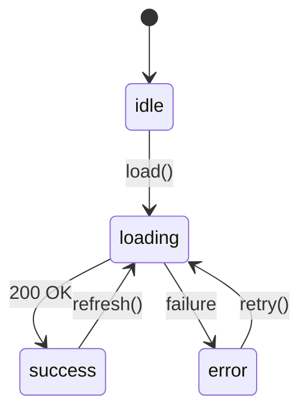
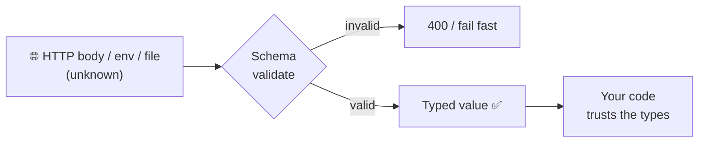

## The big idea

TypeScript is a **spell-checker for your program's shapes**. It reads your code *before* it runs and says "you promised this was a `User`, but here it might be `undefined`". Then it disappears: the compiler outputs plain JavaScript, and **no types exist at runtime**.

That gives one golden rule: *types describe what you've already checked*. Data from the outside world (HTTP bodies, JSON files, env vars) must be **validated**, and then TypeScript can trust it.


> 📘 Basic types, interfaces vs types, unions and utility types are introduced in *Frontend → TypeScript Essentials*. This lesson focuses on the patterns you need to design safe code.

## Structural typing: shapes, not names

TypeScript compares **shapes**. If it has the right properties, it fits.

```ts
interface Point { x: number; y: number }

class Pixel { constructor(public x: number, public y: number, public color: string) {} }

const p: Point = new Pixel(1, 2, "red"); // ✅ a Pixel has x and y, so it is a Point
```

Sometimes you *want* two identical shapes to be different, so you can't pass a `UserId` where an `OrderId` is expected. Use a **brand**:

```ts
type UserId = string & { readonly __brand: "UserId" };
type OrderId = string & { readonly __brand: "OrderId" };

declare function getOrder(id: OrderId): Promise<Order>;
const uid = "u_1" as UserId;
getOrder(uid); // ❌ compile error — exactly what we want
```

## `any` vs `unknown` vs `never`

| Type | Means | You can… | Use it for |
| --- | --- | --- | --- |
| `any` | "Turn the checker off" | do anything (unsafe) | Almost never; migration only |
| `unknown` | "Some value, not checked yet" | nothing until you **narrow** it | JSON, `catch (err)`, external input |
| `never` | "This cannot happen" | nothing | Exhaustive checks, functions that always throw |

```ts
function errorMessage(err: unknown): string {
  if (err instanceof Error) return err.message;
  if (typeof err === "string") return err;
  return "Unknown error";
}
```

## Discriminated unions: model states, not flags ⭐

A bag of optional fields allows impossible combinations:

```ts
// ❌ Can be loading AND have an error AND data at the same time
type Bad = { loading: boolean; error?: string; data?: User[] };
```

A **discriminated union** makes illegal states unrepresentable:

```ts
type RemoteData<T> =
  | { status: "idle" }
  | { status: "loading" }
  | { status: "success"; data: T }
  | { status: "error"; error: string };

function render(state: RemoteData<User[]>): string {
  switch (state.status) {
    case "idle":    return "Press load";
    case "loading": return "Loading…";
    case "success": return `${state.data.length} users`; // data exists here ✅
    case "error":   return `Failed: ${state.error}`;
    default:        return assertNever(state);           // compile error if a case is missing
  }
}

function assertNever(x: never): never {
  throw new Error(`Unhandled case: ${JSON.stringify(x)}`);
}
```



Add a new status like `"stale"` and the compiler points at every `switch` that forgot it.

## Narrowing toolkit

```ts
function area(shape: Circle | Square | null) {
  if (shape === null) return 0;                  // equality narrowing
  if ("radius" in shape) return Math.PI * shape.radius ** 2; // `in` narrowing
  return shape.side ** 2;                        // must be Square
}

// A custom type guard: the return type teaches TypeScript
function isUser(v: unknown): v is User {
  return typeof v === "object" && v !== null && "id" in v && "email" in v;
}

// An assertion function: throws or narrows
function assertDefined<T>(v: T | undefined, name: string): asserts v is T {
  if (v === undefined) throw new Error(`${name} is required`);
}
```

## Generics with constraints

Generics are **type parameters**: placeholders filled in when the function is used.

```ts
// T is "whatever the array holds"
function first<T>(items: readonly T[]): T | undefined {
  return items[0];
}

// K must be a key of T, and the return type follows it
function pluck<T, K extends keyof T>(items: T[], key: K): T[K][] {
  return items.map((item) => item[key]);
}

const users = [{ id: 1, email: "a@x.io" }];
const emails = pluck(users, "email"); // string[]
pluck(users, "password");             // ❌ "password" is not a key of the user
```

```ts
// A typed repository interface that works for any entity with an id
interface Entity { id: string }

interface Repository<T extends Entity> {
  findById(id: string): Promise<T | null>;
  save(entity: T): Promise<void>;
  list(filter?: Partial<T>): Promise<T[]>;
}
```

## Deriving types instead of repeating them

```ts
const ROLES = ["admin", "editor", "viewer"] as const;
type Role = (typeof ROLES)[number];            // "admin" | "editor" | "viewer"

type User = { id: string; email: string; role: Role; passwordHash: string };

type PublicUser = Omit<User, "passwordHash">;
type UserPatch = Partial<Pick<User, "email" | "role">>;
type ReadonlyUser = Readonly<User>;

// Mapped type: turn every property into a validation message
type Errors<T> = { [K in keyof T]?: string };
const formErrors: Errors<UserPatch> = { email: "Invalid email" };

// Conditional type + infer: unwrap what a function resolves to
type Awaited2<T> = T extends Promise<infer U> ? U : T;
type Loaded = Awaited2<ReturnType<typeof loadUser>>;
```

> 💡 Prefer a **union of string literals** (or an `as const` array) over `enum`. It's plain JavaScript at runtime, works with JSON, and needs no import.

## `satisfies`: check without widening

```ts
type Route = { path: string; auth: boolean };

// With a type annotation you lose the exact keys
const routes = {
  home: { path: "/", auth: false },
  admin: { path: "/admin", auth: true },
} satisfies Record<string, Route>;

routes.admin.path; // ✅ known key, and every value was checked against Route
routes.missing;    // ❌ compile error
```

## Runtime validation: making the types honest

`JSON.parse` returns `any`, and `as User` is just a promise *you* make to the compiler. A schema library (Zod, Valibot, ArkType) checks the data **and** produces the type:

```ts
import { z } from "zod";

const CreateUser = z.object({
  email: z.string().email(),
  age: z.number().int().min(13),
  role: z.enum(["admin", "editor", "viewer"]).default("viewer"),
});
type CreateUser = z.infer<typeof CreateUser>; // one source of truth

app.post("/users", (req, res) => {
  const parsed = CreateUser.safeParse(req.body);
  if (!parsed.success) return res.status(400).json(parsed.error.flatten());
  createUser(parsed.data); // fully typed and actually valid
});
```



## A strict `tsconfig.json` for a Node.js service

```json
{
  "compilerOptions": {
    "target": "ES2022",
    "module": "NodeNext",
    "moduleResolution": "NodeNext",
    "strict": true,
    "noUncheckedIndexedAccess": true,
    "exactOptionalPropertyTypes": true,
    "noImplicitOverride": true,
    "verbatimModuleSyntax": true,
    "outDir": "dist",
    "sourceMap": true
  },
  "include": ["src"]
}
```

| Option | What it catches |
| --- | --- |
| `strict` | Implicit `any`, unchecked `null`/`undefined`, unsafe `this` |
| `noUncheckedIndexedAccess` | `arr[5]` and `map[key]` might be `undefined` |
| `exactOptionalPropertyTypes` | Distinguishes "missing" from "explicitly `undefined`" |

## Key takeaways

- Types disappear at runtime: **validate external data** with a schema and infer the type from it.
- Use `unknown` for untrusted values and narrow them; avoid `any`.
- Model state with **discriminated unions** and an `assertNever` exhaustive check.
- Generics with `extends` and `keyof` give reusable code that stays precise.
- Derive types (`Pick`, `Omit`, mapped types, `as const`, `satisfies`) instead of copying them, and turn on `strict`.
