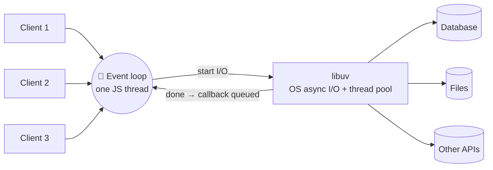
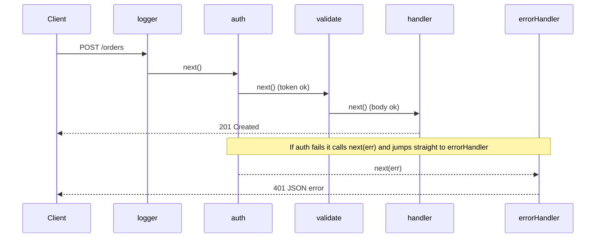

## The big idea

**Node.js** is the JavaScript engine from Chrome (V8) taken out of the browser, plus a library (libuv) that talks to the operating system for files, networks and timers. It lets JavaScript be a server.

**Express** is a thin layer on top: a way to say "when a `GET /users/:id` arrives, run these functions in order". Those functions are **middleware**, like stations on an **airport security line**: check the ticket, scan the bag, check the passport, and at any station you can be sent back.


## Node.js in one picture



| Feature | What it means for you |
| --- | --- |
| Non-blocking I/O | One process can hold thousands of idle connections cheaply |
| Single JS thread | CPU-heavy code blocks everyone (see the async lesson) |
| npm | The largest package registry; also the largest supply-chain risk |
| Same language as the frontend | Share types and validation between client and server |
| `cluster` / multiple processes | Use all CPU cores (or run several containers behind a load balancer) |

### Node vs Express

| Node.js alone | With Express |
| --- | --- |
| `http.createServer((req, res) => …)` | `app.get("/users/:id", handler)` |
| Parse URL, method and body yourself | Routing, params, `express.json()` built in |
| Write your own plumbing for errors | Error-handling middleware |

## A first server

```js
import express from "express";

const app = express();
app.use(express.json({ limit: "100kb" })); // parse JSON bodies, with a size cap

app.get("/health", (_req, res) => res.json({ ok: true }));

app.get("/users/:id", async (req, res) => {
  const user = await users.findById(req.params.id);
  if (!user) return res.status(404).json({ error: "User not found" });
  res.json(user);
});

app.listen(3000, () => console.log("Listening on http://localhost:3000"));
```

| Where data lives | Example | Read with |
| --- | --- | --- |
| Path parameter | `/users/42` | `req.params.id` |
| Query string | `/users?page=2` | `req.query.page` (always a **string**) |
| Body | JSON in a POST | `req.body` (after `express.json()`) |
| Header | `Authorization: Bearer …` | `req.get("authorization")` |

## Middleware: the pipeline ⭐

A middleware is `(req, res, next) => { … }`. It can **read/modify** the request, **end** the response, or call `next()` to pass it on.



```js
// Application-level: runs for every request
app.use((req, res, next) => {
  const start = performance.now();
  res.on("finish", () => {
    console.log(`${req.method} ${req.originalUrl} ${res.statusCode} ${Math.round(performance.now() - start)}ms`);
  });
  next();
});

// Route-level: only where you attach it
function requireAuth(req, _res, next) {
  const token = req.get("authorization")?.replace("Bearer ", "");
  if (!token) return next(new HttpError(401, "Missing token"));
  try {
    req.user = verifyJwt(token);
    next();
  } catch {
    next(new HttpError(401, "Invalid token"));
  }
}

app.post("/orders", requireAuth, validate(CreateOrder), createOrder);
```

> ⚠️ **Order matters.** Middleware runs in the order you `app.use()` it. Body parsing must come before routes that read `req.body`; the error handler must come **last**.

## Validation and errors

```js
import { z } from "zod";

class HttpError extends Error {
  constructor(status, message) { super(message); this.status = status; }
}

const validate = (schema) => (req, _res, next) => {
  const result = schema.safeParse(req.body);
  if (!result.success) return next(new HttpError(400, result.error.issues[0].message));
  req.body = result.data;
  next();
};

// The error handler has FOUR parameters — that's how Express recognises it
app.use((err, req, res, _next) => {
  const status = err.status ?? 500;
  if (status >= 500) req.log?.error({ err }, "request failed");
  res.status(status).json({
    error: status >= 500 ? "Internal server error" : err.message, // never leak internals
  });
});
```

**Express 5** (the current major version) forwards rejected promises from `async` handlers to the error handler automatically. In Express 4 you needed `try/catch` + `next(err)` or a wrapper in every async route.

## Structuring a larger app

Keep HTTP details at the edge and business rules in plain functions you can test without a server.

```text
src/
├── app.js              # builds the express app (no listen) — easy to test
├── server.js           # reads config, calls app.listen, handles shutdown
├── config.js           # validated environment variables
├── middleware/         # auth, validate, errorHandler, requestId
└── modules/
    └── orders/
        ├── orders.routes.js      # URL → controller
        ├── orders.controller.js  # HTTP in/out only
        ├── orders.service.js     # business rules
        └── orders.repository.js  # database queries
```

```js
// orders.routes.js
import { Router } from "express";
export const ordersRouter = Router();
ordersRouter.get("/", listOrders);
ordersRouter.post("/", requireAuth, validate(CreateOrder), createOrder);

// app.js
app.use("/api/orders", ordersRouter);
```

## Configuration

```js
// config.js — fail at startup, not at the first request
import { z } from "zod";

export const config = z.object({
  NODE_ENV: z.enum(["development", "test", "production"]).default("development"),
  PORT: z.coerce.number().default(3000),
  DATABASE_URL: z.string().url(),
  JWT_SECRET: z.string().min(32),
}).parse(process.env);
```

Load a local `.env` with `node --env-file=.env server.js` (built into Node 20.6+). Never commit `.env` files with real secrets.

## Production essentials

| Concern | Tool / approach |
| --- | --- |
| Security headers | `helmet()` |
| CORS | `cors({ origin: ["https://app.example.com"], credentials: true })`, never `*` with cookies |
| Rate limiting | `express-rate-limit` (with a Redis store when you run several instances) |
| Structured logs | `pino` / `pino-http` with a request ID on every line |
| File uploads | `multer` with size and type limits, store in object storage (S3) |
| Using all cores | Several processes: containers, PM2, or `node:cluster` |
| Unhandled errors | Log, exit and let the orchestrator restart the process |

```js
import helmet from "helmet";
import rateLimit from "express-rate-limit";

app.disable("x-powered-by");
app.use(helmet());
app.use("/api/auth", rateLimit({ windowMs: 15 * 60_000, limit: 20 }));
```

### Graceful shutdown

When Kubernetes or Docker stops your container it sends `SIGTERM`. Finish in-flight requests before exiting:

```js
const server = app.listen(config.PORT);

process.on("SIGTERM", () => {
  server.close(async () => {   // stop accepting, wait for open requests
    await db.end();
    process.exit(0);
  });
  setTimeout(() => process.exit(1), 10_000).unref(); // hard stop if stuck
});
```

## Testing a route

```js
import request from "supertest";
import { buildApp } from "../src/app.js";

test("GET /health returns ok", async () => {
  const res = await request(buildApp()).get("/health");
  expect(res.status).toBe(200);
  expect(res.body).toEqual({ ok: true });
});
```

## Key takeaways

- Node.js = V8 + libuv: one JavaScript thread, non-blocking I/O, great for I/O-heavy APIs.
- Express is routing + a **middleware pipeline**; order matters and the 4-argument error handler goes last.
- Validate every request at the edge, return consistent JSON errors, and never leak stack traces.
- Split routes → controller → service → repository; export the app separately from `listen`.
- Validate config at startup, add `helmet`, CORS, rate limits and structured logs, and shut down gracefully on `SIGTERM`.
