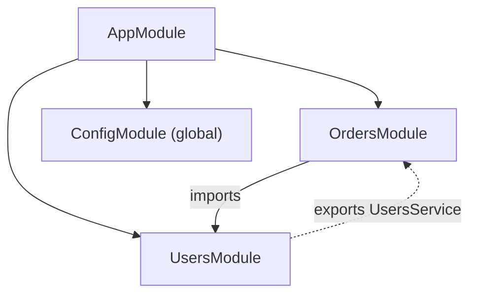
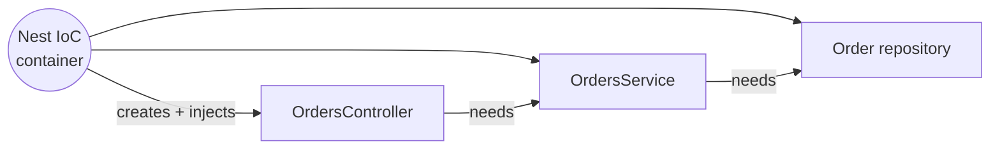
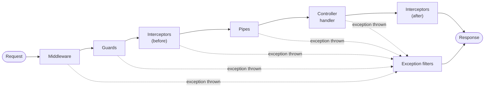

## The big idea

If Express is a box of LEGO bricks, **NestJS is a LEGO set with instructions**. It still uses Express (or Fastify) underneath, but decides *where things go*: every feature is a **module**, HTTP lives in **controllers**, business logic in **providers**, and a built-in **dependency injection** container wires them together.

Think of a **restaurant**: the waiter (controller) takes the order, the chef (service) cooks, the supplier (repository) brings ingredients. Nobody hires their own staff; the **manager** (the DI container) assigns them.


## The building blocks

| Piece | Decorator | Job | Restaurant analogy |
| --- | --- | --- | --- |
| **Module** | `@Module` | Groups related controllers and providers | A department (kitchen, bar) |
| **Controller** | `@Controller`, `@Get` | Maps HTTP routes to methods | Waiter |
| **Provider / Service** | `@Injectable` | Business logic, data access, anything injectable | Chef, supplier |
| **Guard** | `@UseGuards` | Allow or deny the request (auth, roles) | Door staff |
| **Pipe** | `@UsePipes`, `ParseIntPipe` | Validate and transform input | Checking the order is valid |
| **Interceptor** | `@UseInterceptors` | Wrap the handler: logging, caching, mapping responses | Plating the dish |
| **Exception filter** | `@Catch` | Turn exceptions into HTTP responses | Handling complaints |

## Modules

```ts
@Module({
  imports: [TypeOrmModule.forFeature([Order]), UsersModule], // modules we depend on
  controllers: [OrdersController],
  providers: [OrdersService],
  exports: [OrdersService],   // what other modules may inject
})
export class OrdersModule {}

@Module({ imports: [ConfigModule.forRoot({ isGlobal: true }), OrdersModule, UsersModule] })
export class AppModule {}
```



A provider is **private to its module** unless it is listed in `exports`. That boundary is what keeps a large Nest app from becoming a tangle.

## Controllers and services

```ts
@Controller("orders")
export class OrdersController {
  constructor(private readonly orders: OrdersService) {} // injected, not `new`-ed

  @Get(":id")
  findOne(@Param("id", ParseIntPipe) id: number) {
    return this.orders.findOne(id); // returned value → JSON, 200
  }

  @Post()
  @HttpCode(201)
  create(@Body() dto: CreateOrderDto, @Req() req: AuthedRequest) {
    return this.orders.create(req.user.id, dto);
  }
}

@Injectable()
export class OrdersService {
  constructor(@InjectRepository(Order) private readonly repo: Repository<Order>) {}

  async findOne(id: number) {
    const order = await this.repo.findOneBy({ id });
    if (!order) throw new NotFoundException(`Order ${id} not found`);
    return order;
  }
}
```

## Dependency injection ⭐

Classes **declare** what they need in the constructor; Nest creates them once (singletons by default) and hands them over.



Why it matters:

- **Testability:** swap the real repository for a fake in tests.
- **Loose coupling:** the controller doesn't know how the service is built.
- **One instance:** shared connections and caches without global variables.

### Custom providers

```ts
providers: [
  { provide: "PAYMENT_GATEWAY", useClass: process.env.NODE_ENV === "test" ? FakeGateway : StripeGateway },
  { provide: "APP_NAME", useValue: "shop-api" },
  {
    provide: "REDIS",
    useFactory: async (config: ConfigService) => createClient({ url: config.get("REDIS_URL") }).connect(),
    inject: [ConfigService], // async factory: Nest waits before starting
  },
  { provide: "LEGACY_ORDERS", useExisting: OrdersService }, // alias
]

constructor(@Inject("PAYMENT_GATEWAY") private readonly payments: PaymentGateway) {}
```

### Injection scopes

| Scope | New instance | Use when |
| --- | --- | --- |
| `DEFAULT` (singleton) | Once per app | Almost always |
| `REQUEST` | Per HTTP request | Per-request data (tenant, user); slower, and it "bubbles up" to everything that injects it |
| `TRANSIENT` | Per consumer | Each injector needs its own instance (e.g. a logger with context) |

**Circular dependencies** (A needs B, B needs A) usually mean the responsibilities are wrong; extract the shared part into a third provider. As a last resort, use `forwardRef(() => B)`.

## The request lifecycle

Knowing the order is the #1 NestJS interview topic.



| Step | Knows the route handler? | Typical use |
| --- | --- | --- |
| Middleware | ❌ | Request ID, raw logging, cookies |
| Guard | ✅ (`ExecutionContext`) | Authentication, roles |
| Interceptor | ✅ | Timing, caching, response mapping, timeouts |
| Pipe | ✅ (per argument) | Validation, type conversion |
| Filter | ✅ | Error → HTTP response format |

### Guard: who may enter

```ts
@Injectable()
export class RolesGuard implements CanActivate {
  constructor(private readonly reflector: Reflector) {}

  canActivate(ctx: ExecutionContext): boolean {
    const required = this.reflector.get<string[]>("roles", ctx.getHandler());
    if (!required) return true;
    const { user } = ctx.switchToHttp().getRequest();
    return required.some((role) => user?.roles.includes(role));
  }
}

export const Roles = (...roles: string[]) => SetMetadata("roles", roles);

@Delete(":id")
@UseGuards(JwtAuthGuard, RolesGuard)
@Roles("admin")
remove(@Param("id", ParseIntPipe) id: number) { … }
```

### Pipe: validated DTOs

```ts
export class CreateOrderDto {
  @IsString() @IsNotEmpty() productId!: string;
  @IsInt() @Min(1) @Max(100) quantity!: number;
}

// main.ts — validate every body, strip unknown fields, convert types
app.useGlobalPipes(new ValidationPipe({ whitelist: true, forbidNonWhitelisted: true, transform: true }));
```

### Interceptor: wrap the handler

```ts
@Injectable()
export class TimingInterceptor implements NestInterceptor {
  intercept(ctx: ExecutionContext, next: CallHandler) {
    const start = Date.now();
    return next.handle().pipe(                           // an RxJS Observable
      tap(() => console.log(`${ctx.getHandler().name} took ${Date.now() - start}ms`)),
    );
  }
}
```

### Exception filter: one error format

```ts
@Catch()
export class AllExceptionsFilter implements ExceptionFilter {
  catch(exception: unknown, host: ArgumentsHost) {
    const res = host.switchToHttp().getResponse();
    const status = exception instanceof HttpException ? exception.getStatus() : 500;
    res.status(status).json({
      statusCode: status,
      message: status === 500 ? "Internal server error" : (exception as HttpException).message,
      timestamp: new Date().toISOString(),
    });
  }
}
```

## Dynamic modules and lifecycle hooks

```ts
@Module({})
export class MailModule {
  static forRoot(options: { apiKey: string }): DynamicModule {
    return {
      module: MailModule,
      providers: [{ provide: "MAIL_OPTIONS", useValue: options }, MailService],
      exports: [MailService],
    };
  }
}
```

| Hook | Runs when |
| --- | --- |
| `onModuleInit` | The module's providers are created |
| `onApplicationBootstrap` | All modules initialised, before listening |
| `onModuleDestroy` / `beforeApplicationShutdown` / `onApplicationShutdown` | On shutdown (call `app.enableShutdownHooks()`) |

## Testing with the DI container

```ts
describe("OrdersService", () => {
  let service: OrdersService;
  const repo = { findOneBy: jest.fn() };

  beforeEach(async () => {
    const moduleRef = await Test.createTestingModule({
      providers: [OrdersService, { provide: getRepositoryToken(Order), useValue: repo }],
    }).compile();
    service = moduleRef.get(OrdersService);
  });

  it("throws NotFound for a missing order", async () => {
    repo.findOneBy.mockResolvedValue(null);
    await expect(service.findOne(1)).rejects.toThrow(NotFoundException);
  });
});
```

## Express or NestJS?

| Choose Express when… | Choose NestJS when… |
| --- | --- |
| A small service or a few endpoints | A large app with many modules and developers |
| You want full control over structure | You want conventions everyone follows |
| Minimal dependencies | You need DI, guards, validation, OpenAPI, microservice transports out of the box |

## Key takeaways

- Nest = **modules** (boundaries) + **controllers** (HTTP) + **providers** (logic) wired by **dependency injection**.
- Providers are private to their module until **exported**; singletons by default.
- Lifecycle: middleware → guards → interceptors → pipes → handler → interceptors → filters on error.
- Use a global `ValidationPipe` with DTOs, guards for auth/roles, and a filter for one consistent error format.
- DI makes testing easy: `Test.createTestingModule` with fake providers.
