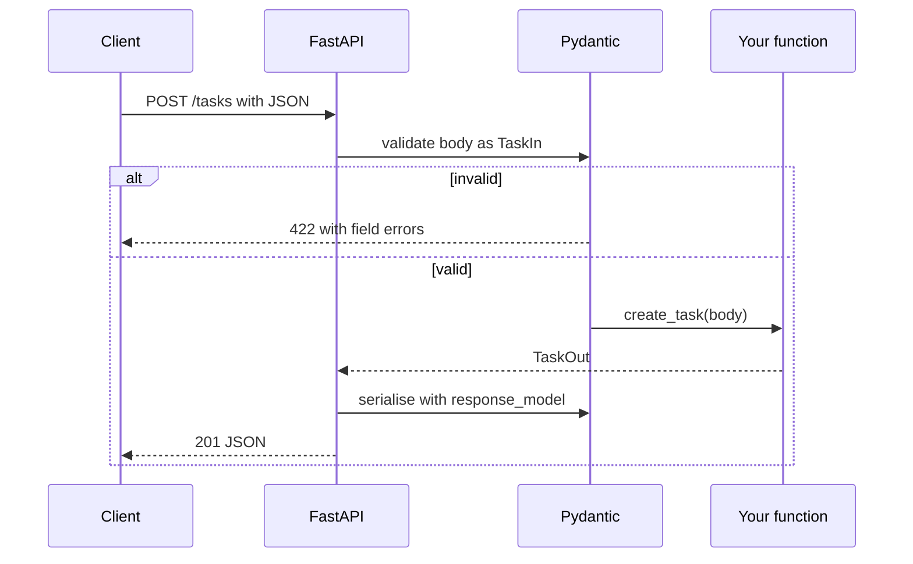
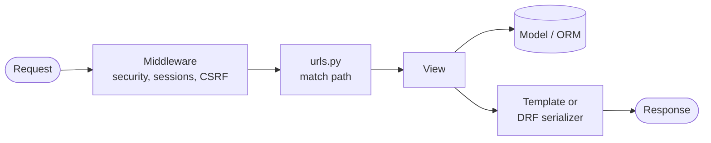

## The big idea

Python has two very different "houses" for web apps:

- **FastAPI** is a **modern kit house**: you pick each room. It's small, fast, async-friendly, and turns your **type hints** into validation and interactive API docs automatically.
- **Django** is a **fully furnished house**: ORM, migrations, admin panel, authentication, forms, templates and security defaults are all included. "Batteries included."


| | FastAPI | Django (+ DRF) |
| --- | --- | --- |
| Style | Micro-framework, API-first | Full-stack framework |
| Validation | Pydantic models from type hints | Forms / DRF serializers |
| Database | Your choice (SQLAlchemy, SQLModel…) | Built-in ORM + migrations |
| Admin UI | ❌ | ✅ generated from models |
| Async | Native (`async def`) | Supported, ORM mostly sync |
| API docs | Automatic OpenAPI at `/docs` | Via drf-spectacular |
| Best for | JSON APIs, ML model serving, microservices | Content sites, internal tools, large CRUD apps |

## FastAPI

### First API

```bash
python -m pip install "fastapi[standard]"
fastapi dev main.py        # auto-reload; open http://127.0.0.1:8000/docs
```

```python
from fastapi import FastAPI, HTTPException, Query, status
from pydantic import BaseModel, Field

app = FastAPI(title="Task API")

class TaskIn(BaseModel):                     # what clients may send
    title: str = Field(min_length=1, max_length=200)
    done: bool = False

class TaskOut(TaskIn):                       # what we return
    id: int

tasks: dict[int, TaskOut] = {}

@app.get("/tasks", response_model=list[TaskOut])
def list_tasks(done: bool | None = None, limit: int = Query(20, le=100)):
    items = [t for t in tasks.values() if done is None or t.done == done]
    return items[:limit]

@app.get("/tasks/{task_id}", response_model=TaskOut)
def get_task(task_id: int):                  # path parameter, converted to int
    if task_id not in tasks:
        raise HTTPException(status_code=404, detail="Task not found")
    return tasks[task_id]

@app.post("/tasks", response_model=TaskOut, status_code=status.HTTP_201_CREATED)
def create_task(body: TaskIn):               # JSON body validated by Pydantic
    task = TaskOut(id=len(tasks) + 1, **body.model_dump())
    tasks[task.id] = task
    return task
```

Send `{"title": ""}` and FastAPI answers **422** with a clear message, before your function even runs.



> 💡 Separate **input** and **output** models. `response_model` filters the response, so a field like `password_hash` on your database object never leaks.

### Dependencies

`Depends` is FastAPI's dependency injection: shared logic (DB sessions, current user, pagination) declared as parameters.

```python
from typing import Annotated
from fastapi import Depends, Header

def get_db():
    db = SessionLocal()
    try:
        yield db             # the request uses the session…
    finally:
        db.close()           # …and it's always closed afterwards

def current_user(authorization: Annotated[str, Header()], db=Depends(get_db)) -> User:
    user = verify_token(authorization.removeprefix("Bearer "), db)
    if not user:
        raise HTTPException(401, "Invalid token")
    return user

DB = Annotated[Session, Depends(get_db)]
CurrentUser = Annotated[User, Depends(current_user)]

@app.get("/me")
def me(user: CurrentUser):
    return {"id": user.id, "email": user.email}
```

### `async def` or plain `def`?

| Endpoint does… | Write | Why |
| --- | --- | --- |
| `await`s async libraries (httpx, asyncpg) | `async def` | Runs on the event loop |
| Blocking calls (requests, sync SQLAlchemy, `time.sleep`) | `def` | FastAPI runs it in a thread pool |
| Blocking calls inside `async def` | ❌ never | Freezes **every** request on that worker |

### Structure for a real project

```text
app/
├── main.py            # create app, include routers
├── config.py          # pydantic-settings: typed env vars
├── database.py        # engine + session dependency
├── models.py          # SQLAlchemy tables
├── schemas.py         # Pydantic request/response models
├── routers/
│   └── tasks.py       # APIRouter(prefix="/tasks")
└── services/
    └── tasks.py       # business rules, no HTTP here
tests/
└── test_tasks.py      # TestClient(app)
```

```python
from fastapi.testclient import TestClient
from app.main import app

client = TestClient(app)

def test_create_task():
    res = client.post("/tasks", json={"title": "Write tests"})
    assert res.status_code == 201
    assert res.json()["title"] == "Write tests"
```

Run in production with several workers: `fastapi run app/main.py --workers 4` (or Uvicorn/Gunicorn behind a reverse proxy).

## Django

### Project and app

```bash
python -m pip install django djangorestframework
django-admin startproject config .
python manage.py startapp tasks          # then add "tasks" to INSTALLED_APPS
python manage.py runserver
```

A Django **project** is the whole site (settings, root URLs); an **app** is one feature (`tasks`, `accounts`) with its own models, views and URLs.



### Models, migrations and the ORM

```python
# tasks/models.py
from django.conf import settings
from django.db import models

class Task(models.Model):
    owner = models.ForeignKey(settings.AUTH_USER_MODEL, on_delete=models.CASCADE, related_name="tasks")
    title = models.CharField(max_length=200)
    done = models.BooleanField(default=False)
    created_at = models.DateTimeField(auto_now_add=True)

    class Meta:
        ordering = ["-created_at"]

    def __str__(self):
        return self.title
```

```bash
python manage.py makemigrations    # write a migration file from model changes
python manage.py migrate           # apply it to the database
python manage.py createsuperuser   # log in to /admin
```

```python
Task.objects.filter(owner=user, done=False).count()
Task.objects.select_related("owner").filter(title__icontains="report")   # JOIN, avoids N+1
Task.objects.get(pk=1)          # raises DoesNotExist / MultipleObjectsReturned
```

```python
# tasks/admin.py — a full CRUD UI in three lines
from django.contrib import admin
from .models import Task

@admin.register(Task)
class TaskAdmin(admin.ModelAdmin):
    list_display = ["title", "owner", "done", "created_at"]
    list_filter = ["done"]
```

### An API with Django REST Framework

```python
# tasks/serializers.py
from rest_framework import serializers
from .models import Task

class TaskSerializer(serializers.ModelSerializer):
    class Meta:
        model = Task
        fields = ["id", "title", "done", "created_at"]

# tasks/views.py
from rest_framework import permissions, viewsets

class TaskViewSet(viewsets.ModelViewSet):
    serializer_class = TaskSerializer
    permission_classes = [permissions.IsAuthenticated]

    def get_queryset(self):
        return Task.objects.filter(owner=self.request.user)   # users see only their tasks

    def perform_create(self, serializer):
        serializer.save(owner=self.request.user)

# config/urls.py
from rest_framework.routers import DefaultRouter
router = DefaultRouter()
router.register("tasks", TaskViewSet, basename="task")
urlpatterns = [path("admin/", admin.site.urls), path("api/", include(router.urls))]
```

That `ModelViewSet` gives you list, retrieve, create, update and delete endpoints.

### Django security essentials

| Setting / habit | Why |
| --- | --- |
| `DEBUG = False` in production | Debug pages leak settings and code |
| `SECRET_KEY` from an environment variable | It signs sessions and tokens |
| `ALLOWED_HOSTS` set | Blocks Host-header attacks |
| `` in every POST form | Prevents cross-site request forgery |
| Filter by owner in every query | A URL ID is **not** permission (IDOR) |
| `python manage.py check --deploy` | Lists missing HTTPS/cookie settings |

## Common mistakes in both

| Mistake | Fix |
| --- | --- |
| Returning database objects directly | Use response models / serializers with explicit fields |
| Blocking calls inside `async def` | Use async libraries or a plain `def` endpoint |
| Querying inside a loop (N+1) | `select_related` / `prefetch_related` / SQLAlchemy `selectinload` |
| Changing a model without a migration | `makemigrations` / Alembic revision, committed with the code |
| Writes via `GET` | Use POST/PUT/PATCH/DELETE |
| Catching every exception | Catch specific ones; let a global handler return 500 |
| In-memory state (dicts) in production | Use a database or Redis: several workers don't share memory |

## Key takeaways

- **FastAPI**: type hints + Pydantic = validation and OpenAPI docs for free; `Depends` for shared logic; never block inside `async def`.
- **Django**: batteries included: ORM, migrations, admin, auth. Add **DRF** for JSON APIs.
- Keep business logic in plain functions/services, separate from the framework, so it's easy to test.
- Separate input and output models; always scope queries to the current user.
- Choose FastAPI for lean APIs and ML serving, Django for data-heavy apps that benefit from an admin and conventions.
