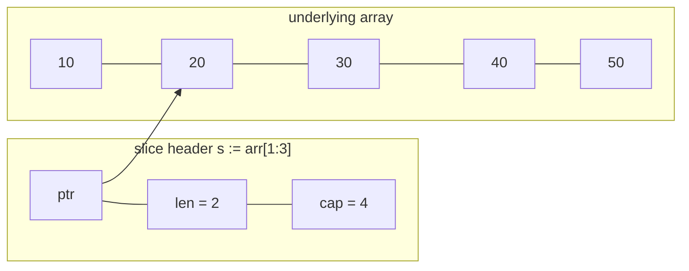
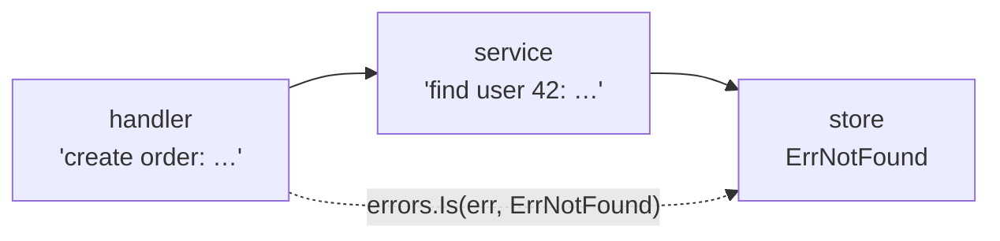

## The big idea

Go was created at Google to make **large teams productive on large codebases**. Its motto could be "less is more": 25 keywords, one formatting style (`gofmt`), one way to loop (`for`), no inheritance, no exceptions. The code is a little longer, but anyone on the team can read anyone's code.

Think of Go as a **flat-pack toolbox from one brand**: every screw fits every hole, the instructions are always in the same format, and there are no special adapters to learn.


## Setup and structure

```bash
go mod init github.com/you/shop     # creates go.mod (module name + Go version)
go run .                            # compile and run
go build -o shop .                  # one static binary, no runtime needed
go test ./...                       # run all tests
go get github.com/gin-gonic/gin     # add a dependency (recorded in go.mod/go.sum)
go vet ./... && gofmt -l .          # static checks and formatting
```

```text
shop/
├── go.mod
├── cmd/api/main.go        # package main — the entry point
└── internal/              # code only this module can import
    ├── orders/            # package orders
    │   ├── orders.go
    │   └── orders_test.go
    └── store/
```

```go
package main

import "fmt"

func main() {
	fmt.Println("Hello, Go")
}
```

**Visibility is decided by the first letter:** `Order` and `Save()` are exported (public); `order` and `save()` are private to the package.

## Variables, types and zero values

```go
var count int             // 0 — every type has a "zero value"
name := "Ana"             // short declaration: type inferred (only inside functions)
const maxRetries = 3

var price float64 = 9.99
var active bool           // false
var p *User               // nil
```

| Type | Zero value |
| --- | --- |
| `int`, `float64` | `0` |
| `string` | `""` |
| `bool` | `false` |
| pointer, slice, map, channel, func, interface | `nil` |
| struct | every field at its zero value |

Zero values mean there's no "uninitialised variable" bug; a good Go type is **useful at its zero value** (like `sync.Mutex` or `bytes.Buffer`).

A `string` is read-only bytes (UTF-8). A `rune` is one Unicode code point: `for i, r := range "héllo"` iterates runes, not bytes.

## Control flow

```go
for i := 0; i < 3; i++ { }            // classic loop
for n < 100 { n *= 2 }                  // "while"
for { break }                           // infinite loop
for i, v := range []string{"a", "b"} { fmt.Println(i, v) }

if err := save(); err != nil {          // init statement scoped to the if
	return err
}

switch day {                            // no fallthrough by default
case "sat", "sun":
	fmt.Println("weekend")
default:
	fmt.Println("weekday")
}
```

## Arrays, slices and maps ⭐

An **array** has a fixed size (`[3]int`). A **slice** is a small view onto an array: a pointer, a **length** and a **capacity**.



```go
nums := []int{1, 2, 3}
nums = append(nums, 4)         // may allocate a bigger array → always reassign
part := nums[1:3]              // [2 3] — shares memory with nums!
part[0] = 99                   // nums is now [1 99 3 4]

safe := slices.Clone(part)     // independent copy
buf := make([]byte, 0, 1024)   // len 0, cap 1024 — preallocate when you know the size

ages := map[string]int{"ana": 30}
ages["bo"] = 25
age, ok := ages["cy"]          // "comma ok": ok is false if missing
delete(ages, "bo")
for k, v := range ages { }     // iteration order is random on purpose
```

> ⚠️ Writing to a `nil` map panics: `var m map[string]int; m["a"] = 1` 💥. Create it with `make(map[string]int)` or a literal.

## Functions

```go
func divide(a, b float64) (float64, error) {   // multiple return values
	if b == 0 {
		return 0, errors.New("division by zero")
	}
	return a / b, nil
}

func sum(nums ...int) int {                     // variadic
	total := 0
	for _, n := range nums { total += n }
	return total
}

counter := func() func() int {                  // closure
	n := 0
	return func() int { n++; return n }
}()
counter(); counter() // 1, 2
```

## Structs, pointers and methods

```go
type Account struct {
	ID      string
	Owner   string
	Balance int64 // cents — never use float for money
}

// Value receiver: works on a copy, can't modify the original
func (a Account) CanAfford(amount int64) bool { return a.Balance >= amount }

// Pointer receiver: modifies the original
func (a *Account) Withdraw(amount int64) error {
	if !a.CanAfford(amount) {
		return ErrInsufficientFunds
	}
	a.Balance -= amount
	return nil
}

acc := &Account{ID: "a1", Owner: "Ana", Balance: 10_000}
acc.Withdraw(2_500)
```

| Use a **pointer receiver** when… | Use a **value receiver** when… |
| --- | --- |
| The method changes the struct | The struct is small and read-only |
| The struct is large (avoid copying) | It's a simple value like `Point` or `Money` |
| It contains a `sync.Mutex` (must not be copied) | You want immutability |

Be consistent: if one method needs a pointer receiver, use pointers for all methods of that type.

**Embedding** is Go's alternative to inheritance: composition with promoted methods.

```go
type Timestamps struct{ CreatedAt, UpdatedAt time.Time }
type Order struct {
	Timestamps          // Order now has .CreatedAt directly
	ID string
}
```

## Interfaces: satisfied implicitly ⭐

There's no `implements` keyword. If a type has the methods, it **is** that interface.

```go
type Notifier interface {
	Notify(ctx context.Context, to, msg string) error
}

type EmailNotifier struct{ client *smtp.Client }
func (e EmailNotifier) Notify(ctx context.Context, to, msg string) error { /* … */ return nil }

type FakeNotifier struct{ Sent []string }
func (f *FakeNotifier) Notify(_ context.Context, to, msg string) error {
	f.Sent = append(f.Sent, to+": "+msg)
	return nil
}

type OrderService struct{ notify Notifier } // depends on behaviour, not a concrete type
```

**Go proverbs for interfaces:**

- Keep them **small** (`io.Reader` has one method).
- **Define interfaces where they are used** (in the consumer package), not next to the implementation.
- "Accept interfaces, return structs."

```go
var v any = 42                  // any = interface{}: holds anything
n, ok := v.(int)                // type assertion with comma ok
switch x := v.(type) {          // type switch
case string: fmt.Println("string", x)
case int:    fmt.Println("int", x)
}
```

## Errors are values

Go has no exceptions for normal failures. Functions **return** an `error`, and callers check it right away.

```go
var ErrNotFound = errors.New("not found")   // sentinel error

func (s *Store) FindUser(id string) (*User, error) {
	u, err := s.db.Get(id)
	if err != nil {
		return nil, fmt.Errorf("find user %s: %w", id, err) // %w wraps, keeping the chain
	}
	return u, nil
}

u, err := store.FindUser("42")
if errors.Is(err, ErrNotFound) {            // looks through the whole wrap chain
	http.Error(w, "user not found", http.StatusNotFound)
	return
}

var ve *ValidationError
if errors.As(err, &ve) {                    // extract a specific error type
	fmt.Println("bad field:", ve.Field)
}
```



### defer, panic and recover

```go
func copyFile(src, dst string) error {
	in, err := os.Open(src)
	if err != nil { return err }
	defer in.Close()                 // runs when the function returns, even on error

	out, err := os.Create(dst)
	if err != nil { return err }
	defer out.Close()                // defers run in reverse order (LIFO)

	_, err = io.Copy(out, in)
	return err
}
```

`panic` is for **programmer bugs** (impossible states), not for "user not found". HTTP frameworks `recover` from panics so one bad request doesn't kill the server.

## Generics

```go
func Map[T, U any](items []T, fn func(T) U) []U {
	out := make([]U, 0, len(items))
	for _, item := range items {
		out = append(out, fn(item))
	}
	return out
}

type Number interface{ ~int | ~int64 | ~float64 }

func Sum[T Number](xs []T) T {
	var total T
	for _, x := range xs { total += x }
	return total
}

names := Map(users, func(u User) string { return u.Name })
```

Use generics for **data structures and helpers** (the standard `slices` and `maps` packages); use interfaces for **behaviour**.

## Table-driven tests

```go
func TestDivide(t *testing.T) {
	tests := []struct {
		name    string
		a, b    float64
		want    float64
		wantErr bool
	}{
		{"normal", 10, 2, 5, false},
		{"by zero", 1, 0, 0, true},
	}
	for _, tt := range tests {
		t.Run(tt.name, func(t *testing.T) {
			got, err := divide(tt.a, tt.b)
			if (err != nil) != tt.wantErr {
				t.Fatalf("err = %v, wantErr %v", err, tt.wantErr)
			}
			if got != tt.want {
				t.Errorf("got %v, want %v", got, tt.want)
			}
		})
	}
}
```

## Key takeaways

- Go is intentionally small: `gofmt`, one loop, no inheritance, exported = **Capitalised**.
- Every type has a useful **zero value**; slices share memory and `append` must be reassigned; nil maps panic on write.
- Pointer receivers to modify, value receivers for small read-only types.
- Interfaces are **implicit** and should be small and defined by the consumer.
- Errors are values: check immediately, wrap with `%w`, inspect with `errors.Is`/`errors.As`; `defer` for cleanup, `panic` only for bugs.
