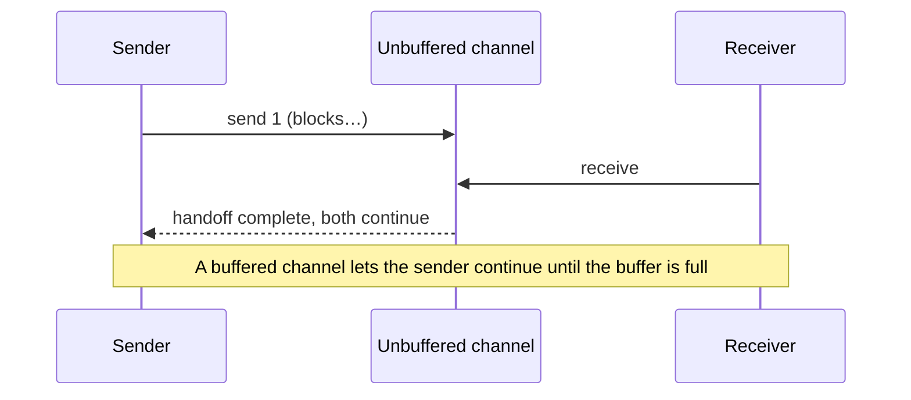
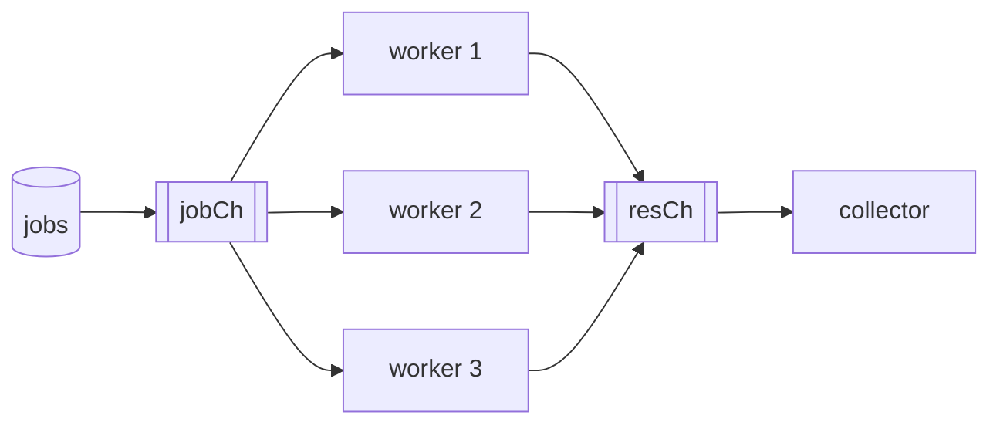
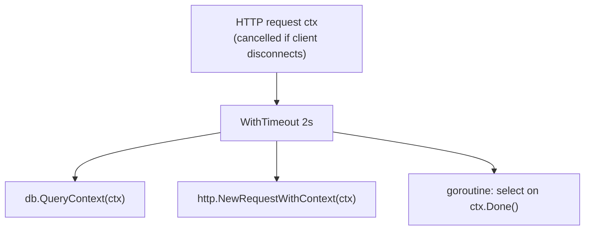

## The big idea

**Concurrency** is *dealing with* many things at once; **parallelism** is *doing* many things at once. One chef juggling five dishes is concurrent. Five chefs cooking at the same time is parallel.

Go makes concurrency cheap: a **goroutine** is like hiring a helper for 2 KB of memory. **Channels** are the **pass-through window** between kitchen stations: one cook puts a plate in, another takes it out. Go's philosophy:

> *"Don't communicate by sharing memory; share memory by communicating."*


## Goroutines

```go
func main() {
	go sendEmail("ana@example.com") // runs concurrently
	fmt.Println("main continues immediately")
	time.Sleep(time.Second)         // ❌ never "wait" like this in real code
}
```

| | Goroutine | OS thread |
| --- | --- | --- |
| Starting memory | ~2 KB stack, grows as needed | ~1–8 MB fixed |
| Created by | the Go runtime | the operating system |
| Switching cost | Cheap (user space) | Expensive (kernel) |
| How many is normal | 100,000+ | Thousands |

The **scheduler (GMP model)** runs many **G**oroutines on a few **M**achine threads, using one **P**rocessor per CPU core (`GOMAXPROCS`). When a goroutine blocks on I/O, the scheduler runs another one.

## Waiting for goroutines: WaitGroup

```go
var wg sync.WaitGroup
for _, url := range urls {
	wg.Add(1)                  // ✅ Add BEFORE starting the goroutine
	go func() {
		defer wg.Done()
		fetch(url)             // Go 1.22+: each iteration has its own `url`
	}()
}
wg.Wait()                      // block until the counter reaches zero
```

> ⚠️ Before Go 1.22 the loop variable was shared, and every goroutine could see the last `url`. On older versions, pass it as an argument: `go func(u string) { … }(url)`.

## Channels ⭐

```go
ch := make(chan int)      // unbuffered
buf := make(chan int, 3)  // buffered, capacity 3
```



| | Unbuffered | Buffered (`cap n`) |
| --- | --- | --- |
| Send blocks until | a receiver takes it | the buffer has space |
| Receive blocks until | a sender sends | the buffer has an item |
| Good for | Synchronisation, guaranteed handoff | Smoothing bursts, semaphores |

```go
func produce(out chan<- int) {   // send-only: the compiler enforces direction
	defer close(out)             // ✅ only the SENDER closes
	for i := range 5 {
		out <- i
	}
}

func main() {
	ch := make(chan int)
	go produce(ch)
	for n := range ch {          // loops until the channel is closed and empty
		fmt.Println(n)
	}
	// after close + drain: v, ok := <-ch gives the zero value and ok == false
}
```

| Operation | nil channel | open channel | closed channel |
| --- | --- | --- | --- |
| Send | blocks forever | blocks or succeeds | **panic** |
| Receive | blocks forever | blocks or succeeds | zero value, `ok=false` |
| Close | **panic** | succeeds | **panic** |

### select: wait on several channels

```go
select {
case msg := <-messages:
	handle(msg)
case err := <-errs:
	return err
case <-time.After(2 * time.Second):
	return errors.New("timeout")
case <-ctx.Done():
	return ctx.Err()
default:
	// optional: don't block at all if nothing is ready
}
```

If several cases are ready, `select` picks one **at random**, so no channel starves.

## Shared memory: Mutex, RWMutex, atomic, Once

Sometimes a lock is simpler than a channel, for example a cache or a counter.

```go
type SafeCounter struct {
	mu sync.Mutex
	m  map[string]int
}

func (c *SafeCounter) Inc(key string) {
	c.mu.Lock()
	defer c.mu.Unlock()
	c.m[key]++
}
```

| Tool | Use when |
| --- | --- |
| `sync.Mutex` | Protect a shared structure (one goroutine at a time) |
| `sync.RWMutex` | Many readers, rare writers (`RLock` for reads) |
| `sync/atomic` (`atomic.Int64`) | A single counter or flag, lock-free |
| `sync.Once` | Initialise something exactly once (lazy config, singleton) |
| Channels | Passing ownership of data, signalling, pipelines |

> 💡 **Channels or mutex?** Use channels to *transfer ownership* or coordinate stages. Use a mutex to *guard state*. Both are idiomatic.

## Patterns

### Worker pool: limit how much runs at once

```go
func process(ctx context.Context, jobs []Job, workers int) []Result {
	jobCh := make(chan Job)
	resCh := make(chan Result)

	var wg sync.WaitGroup
	for range workers {
		wg.Add(1)
		go func() {
			defer wg.Done()
			for job := range jobCh {
				resCh <- handle(ctx, job)
			}
		}()
	}

	go func() {                    // feed the jobs, then close
		defer close(jobCh)
		for _, j := range jobs {
			select {
			case jobCh <- j:
			case <-ctx.Done():
				return
			}
		}
	}()

	go func() { wg.Wait(); close(resCh) }() // close results when all workers finish

	var results []Result
	for r := range resCh {
		results = append(results, r)
	}
	return results
}
```



### Pipeline and fan-out / fan-in

A **pipeline** is a chain of stages connected by channels. **Fan-out** runs several goroutines reading from the same channel; **fan-in** merges several channels into one.

```go
func gen(ctx context.Context, nums ...int) <-chan int {
	out := make(chan int)
	go func() {
		defer close(out)
		for _, n := range nums {
			select {
			case out <- n:
			case <-ctx.Done():
				return
			}
		}
	}()
	return out
}

func square(ctx context.Context, in <-chan int) <-chan int {
	out := make(chan int)
	go func() {
		defer close(out)
		for n := range in {
			select {
			case out <- n * n:
			case <-ctx.Done():
				return
			}
		}
	}()
	return out
}

// gen → square → print
for v := range square(ctx, gen(ctx, 1, 2, 3)) { fmt.Println(v) }
```

### Semaphore with a buffered channel

```go
sem := make(chan struct{}, 10) // at most 10 at a time
for _, f := range files {
	sem <- struct{}{}           // acquire (blocks when 10 are running)
	go func() {
		defer func() { <-sem }() // release
		upload(f)
	}()
}
```

For "run these, stop on the first error", use `golang.org/x/sync/errgroup` with `g.SetLimit(n)`.

## Cancellation with context ⭐

A `context.Context` carries a **deadline**, a **cancellation signal** and request-scoped values through every function in a request.



```go
func (s *Service) GetDashboard(ctx context.Context, userID string) (*Dashboard, error) {
	ctx, cancel := context.WithTimeout(ctx, 2*time.Second)
	defer cancel() // ✅ always call cancel to release resources

	g, ctx := errgroup.WithContext(ctx)
	var orders []Order
	var profile *Profile

	g.Go(func() (err error) { orders, err = s.orders.List(ctx, userID); return })
	g.Go(func() (err error) { profile, err = s.users.Get(ctx, userID); return })

	if err := g.Wait(); err != nil { // first error cancels the other call
		return nil, err
	}
	return &Dashboard{Orders: orders, Profile: profile}, nil
}
```

**Context rules:** pass it as the **first parameter** named `ctx`; never store it in a struct; use `context.WithValue` only for request-scoped metadata (request ID, trace ID), never for optional parameters.

## Common pitfalls

| Bug | Example | Fix |
| --- | --- | --- |
| **Goroutine leak** | A goroutine blocks forever sending to a channel nobody reads | Always have an exit path: `select` with `ctx.Done()` |
| **Deadlock** | Unbuffered send in `main` with no receiver: `fatal error: all goroutines are asleep` | Receive in another goroutine or use a buffer |
| **Data race** | Two goroutines do `count++` | Mutex, atomic, or channel. Detect with `go test -race` |
| `wg.Add` inside the goroutine | `Wait` may return before `Add` runs | Call `Add` before `go` |
| Sending on a closed channel | Panic | Only the sender closes, and only once |
| Copying a mutex | Passing a struct with a `Mutex` by value | Use pointer receivers; `go vet` catches it |

```bash
go test -race ./...   # the race detector: run it in CI
```

## Key takeaways

- Goroutines are cheap; the scheduler multiplexes them onto a few OS threads.
- Unbuffered channels synchronise, buffered channels queue; only the **sender closes**; use `select` for timeouts and cancellation.
- Use channels to pass ownership, mutexes/atomics to guard state, `WaitGroup`/`errgroup` to wait.
- Worker pools and semaphores bound concurrency; pipelines chain stages.
- Pass `context.Context` everywhere, `defer cancel()`, give every goroutine an exit path, and run `-race` in CI.
