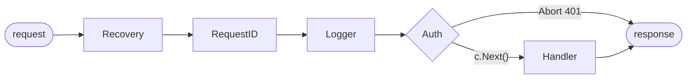

## The big idea

Go's standard library already contains a production-grade web server (`net/http`). **Gin** is a thin, fast layer on top that adds the conveniences you'd otherwise write yourself: path parameters, JSON binding and validation, route groups and middleware.

Think of `net/http` as a **professional kitchen**, and Gin as the **labelled shelves and order tickets** that make it faster to work in. The kitchen is the same.


## Plain `net/http` first

Since Go 1.22 the standard router understands methods and path parameters:

```go
func main() {
	mux := http.NewServeMux()
	mux.HandleFunc("GET /health", func(w http.ResponseWriter, r *http.Request) {
		w.Header().Set("Content-Type", "application/json")
		json.NewEncoder(w).Encode(map[string]bool{"ok": true})
	})
	mux.HandleFunc("GET /users/{id}", func(w http.ResponseWriter, r *http.Request) {
		fmt.Fprintf(w, "user %s", r.PathValue("id"))
	})
	log.Fatal(http.ListenAndServe(":8080", mux))
}
```

| Choose `net/http` when… | Choose Gin when… |
| --- | --- |
| A small service with a few routes | Many routes, groups and middleware |
| You want zero dependencies | You want binding + validation built in |
| You're writing a library | The team already knows Gin |

## Gin basics

```bash
go get github.com/gin-gonic/gin
```

```go
func main() {
	r := gin.Default() // includes Logger and Recovery middleware

	r.GET("/health", func(c *gin.Context) {
		c.JSON(http.StatusOK, gin.H{"ok": true})
	})

	r.GET("/users/:id", func(c *gin.Context) {
		id := c.Param("id")                         // path parameter
		verbose := c.DefaultQuery("verbose", "false") // ?verbose=true
		c.JSON(http.StatusOK, gin.H{"id": id, "verbose": verbose})
	})

	r.Run(":8080")
}
```

| Gin call | Reads |
| --- | --- |
| `c.Param("id")` | `/users/:id` |
| `c.Query("q")`, `c.DefaultQuery("page", "1")` | `?q=go&page=2` |
| `c.ShouldBindJSON(&dto)` | JSON body + validation |
| `c.GetHeader("Authorization")` | request header |
| `c.JSON(status, value)` | write a JSON response |
| `c.AbortWithStatusJSON(status, value)` | stop the chain and respond |

## Binding and validating JSON ⭐

Struct tags say how JSON maps to fields (`json:"…"`) and what's valid (`binding:"…"`, powered by `go-playground/validator`).

```go
type CreateTaskRequest struct {
	Title    string `json:"title"    binding:"required,min=1,max=200"`
	Priority int    `json:"priority" binding:"omitempty,oneof=1 2 3"`
	DueDate  string `json:"dueDate"  binding:"omitempty,datetime=2006-01-02"`
}

func (h *TaskHandler) Create(c *gin.Context) {
	var req CreateTaskRequest
	if err := c.ShouldBindJSON(&req); err != nil {
		c.JSON(http.StatusBadRequest, gin.H{"error": err.Error()})
		return // ✅ always return after writing an error
	}

	task, err := h.svc.Create(c.Request.Context(), req.Title, req.Priority)
	if err != nil {
		writeError(c, err)
		return
	}
	c.JSON(http.StatusCreated, task)
}
```

> 💡 Use `ShouldBind…` (you control the response) rather than `Bind…` (which writes a 400 itself and makes custom error formats harder).

## Route groups and middleware

```go
func NewRouter(h *TaskHandler, auth gin.HandlerFunc) *gin.Engine {
	r := gin.New()
	r.Use(gin.Recovery(), RequestID(), Logger())

	r.GET("/health", func(c *gin.Context) { c.Status(http.StatusNoContent) })

	api := r.Group("/api/v1")
	tasks := api.Group("/tasks", auth)   // every route in this group needs auth
	{
		tasks.GET("", h.List)
		tasks.POST("", h.Create)
		tasks.GET("/:id", h.Get)
		tasks.PATCH("/:id", h.Update)
		tasks.DELETE("/:id", h.Delete)
	}
	return r
}
```

A middleware is a `gin.HandlerFunc` that calls `c.Next()` to continue, or `c.Abort…()` to stop.

```go
func RequestID() gin.HandlerFunc {
	return func(c *gin.Context) {
		id := c.GetHeader("X-Request-ID")
		if id == "" {
			id = uuid.NewString()
		}
		c.Set("requestID", id)
		c.Header("X-Request-ID", id)
		c.Next()
	}
}

func Auth(verify func(string) (string, error)) gin.HandlerFunc {
	return func(c *gin.Context) {
		token := strings.TrimPrefix(c.GetHeader("Authorization"), "Bearer ")
		userID, err := verify(token)
		if err != nil {
			c.AbortWithStatusJSON(http.StatusUnauthorized, gin.H{"error": "unauthorized"})
			return
		}
		c.Set("userID", userID)
		c.Next()
	}
}
```



## A layered structure

```text
tasks-api/
├── cmd/api/main.go            # wiring: config → db → repo → service → handler → router
└── internal/
    ├── config/config.go       # env vars, validated at startup
    ├── task/
    │   ├── model.go           # Task struct, domain errors
    │   ├── service.go         # business rules (no Gin imports!)
    │   ├── repository.go      # interface + Postgres implementation
    │   └── handler.go         # Gin handlers: HTTP in, HTTP out
    └── platform/httpx/        # middleware, error mapping
```

```go
// service.go — plain Go, easy to unit test
var ErrNotFound = errors.New("task not found")

type Repository interface {
	Create(ctx context.Context, t *Task) error
	Get(ctx context.Context, id string) (*Task, error)
}

type Service struct{ repo Repository }

func (s *Service) Create(ctx context.Context, title string, priority int) (*Task, error) {
	if strings.TrimSpace(title) == "" {
		return nil, ErrInvalidTitle
	}
	t := &Task{ID: uuid.NewString(), Title: title, Priority: priority, CreatedAt: time.Now()}
	if err := s.repo.Create(ctx, t); err != nil {
		return nil, fmt.Errorf("create task: %w", err)
	}
	return t, nil
}

// handler side: map domain errors to HTTP status codes in ONE place
func writeError(c *gin.Context, err error) {
	switch {
	case errors.Is(err, ErrNotFound):
		c.JSON(http.StatusNotFound, gin.H{"error": "not found"})
	case errors.Is(err, ErrInvalidTitle):
		c.JSON(http.StatusUnprocessableEntity, gin.H{"error": err.Error()})
	default:
		slog.ErrorContext(c.Request.Context(), "request failed", "err", err)
		c.JSON(http.StatusInternalServerError, gin.H{"error": "internal error"})
	}
}
```

> 💡 Pass `c.Request.Context()` (not `c` itself) into services. It is cancelled when the client disconnects, and it keeps your services free of Gin.

## Testing a handler

```go
func TestHealth(t *testing.T) {
	gin.SetMode(gin.TestMode)
	r := NewRouter(&TaskHandler{svc: fakeService{}}, func(c *gin.Context) { c.Next() })

	w := httptest.NewRecorder()
	req := httptest.NewRequest(http.MethodGet, "/health", nil)
	r.ServeHTTP(w, req)

	if w.Code != http.StatusNoContent {
		t.Fatalf("status = %d, want 204", w.Code)
	}
}
```

## Graceful shutdown

```go
func main() {
	cfg := config.MustLoad()
	router := buildRouter(cfg)

	srv := &http.Server{
		Addr:              ":" + cfg.Port,
		Handler:           router,
		ReadHeaderTimeout: 5 * time.Second, // protects against slow-loris clients
		ReadTimeout:       10 * time.Second,
		WriteTimeout:      15 * time.Second,
		IdleTimeout:       60 * time.Second,
	}

	go func() {
		if err := srv.ListenAndServe(); err != nil && !errors.Is(err, http.ErrServerClosed) {
			log.Fatalf("listen: %v", err)
		}
	}()

	ctx, stop := signal.NotifyContext(context.Background(), os.Interrupt, syscall.SIGTERM)
	defer stop()
	<-ctx.Done() // wait for Ctrl+C or SIGTERM

	shutdownCtx, cancel := context.WithTimeout(context.Background(), 10*time.Second)
	defer cancel()
	if err := srv.Shutdown(shutdownCtx); err != nil { // finish in-flight requests
		log.Printf("forced shutdown: %v", err)
	}
}
```

## Production checklist

- [ ] `gin.SetMode(gin.ReleaseMode)` (or `GIN_MODE=release`)
- [ ] `http.Server` with read/write/idle timeouts, not bare `r.Run()`
- [ ] Recovery middleware, request IDs, structured logs (`log/slog`)
- [ ] Validate every body with `binding` tags; return consistent JSON errors
- [ ] CORS limited to known origins (`gin-contrib/cors`), trusted proxies set (`r.SetTrustedProxies`)
- [ ] Auth middleware on protected groups; check object ownership in the service
- [ ] Pass `ctx` to every DB and HTTP call; health endpoint for the load balancer
- [ ] Graceful shutdown on `SIGTERM`; build a small static binary in a distroless/scratch image

## Key takeaways

- `net/http` is production-ready; Gin adds routing ergonomics, binding/validation, groups and middleware.
- Use `ShouldBindJSON` with `binding` tags, and **return** right after writing an error.
- Middleware calls `c.Next()` or `c.Abort…()`; group routes to apply auth once.
- Keep Gin in the handler layer: services take `context.Context` and return domain errors, mapped to HTTP in one place.
- Configure server timeouts and shut down gracefully.
