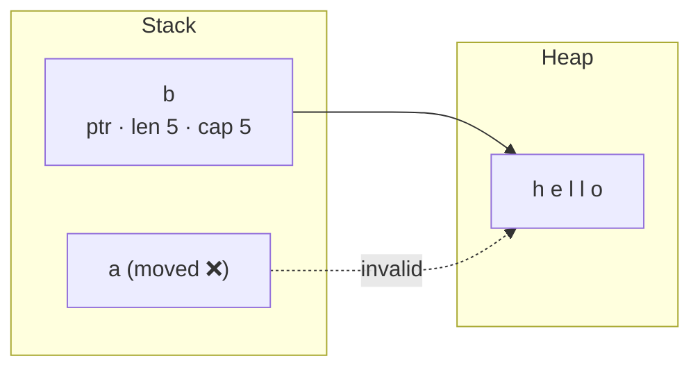

## The big idea

Most languages manage memory one of two ways: **you** free it (C, C++: fast but dangerous), or a **garbage collector** finds unused memory while the program runs (Java, Go, JS: safe but with runtime cost). Rust has a third way: the **compiler** proves at compile time when memory can be freed. No GC, no manual `free`, no use-after-free.

The rules are like a **library book**:

1. The book has exactly **one owner** (the person who checked it out).
2. You can **lend** it: to **many readers at once**, *or* to **one person who writes notes in it**, but never both at the same time.
3. When the owner is done (goes out of scope), the book is **returned** automatically.
4. Nobody may keep a borrowed book after the owner has returned it.


## Cargo: the Rust toolbox

```bash
cargo new inventory        # creates Cargo.toml + src/main.rs
cargo run                  # build and run (debug)
cargo build --release      # optimised build
cargo test                 # unit + integration tests
cargo add serde --features derive
cargo clippy               # linter with great suggestions
cargo fmt                  # format
```

```rust
fn main() {
    let name = "Rust";                 // immutable by default
    let mut count = 0;                 // `mut` to allow changes
    count += 1;
    let price: f64 = 9.99;             // explicit type
    println!("{name} {count} {price:.2}");
}
```

## Rule 1: every value has one owner

```rust
let a = String::from("hello");  // `a` owns the heap string
let b = a;                      // ownership MOVES to `b`
// println!("{a}");             // ❌ error: borrow of moved value `a`
println!("{b}");                // ✅
```



Moving copies only the small pointer/length/capacity on the stack, not the heap data, and invalidates the old name so the string can't be freed twice.

### Move vs Copy vs Clone

| | What happens | Types |
| --- | --- | --- |
| **Move** | Ownership transfers, old variable unusable | `String`, `Vec<T>`, `Box<T>`, most structs |
| **Copy** | Bits are duplicated, both usable | `i32`, `f64`, `bool`, `char`, `&T`, tuples of Copy types |
| **Clone** | Explicit deep copy with `.clone()` | Anything implementing `Clone` |

```rust
let x = 5;
let y = x;                 // Copy: both usable
let s1 = String::from("hi");
let s2 = s1.clone();       // explicit, visible cost
```

Passing a value to a function **moves** it too:

```rust
fn consume(s: String) { println!("{s}"); }   // s is dropped (freed) here

let msg = String::from("bye");
consume(msg);
// consume(msg);   // ❌ value used after move
```

## Rule 2: borrowing ⭐

Instead of moving, **lend** a reference with `&`.

```rust
fn length(s: &String) -> usize {  // borrows, doesn't own
    s.len()
}                                 // nothing is freed here

fn shout(s: &mut String) {        // mutable borrow
    s.push('!');
}

let mut greeting = String::from("hi");
let n = length(&greeting);        // shared borrow
shout(&mut greeting);             // mutable borrow
println!("{greeting} ({n})");     // hi! (2)
```

**The borrowing rule:** at any moment you can have **either** any number of `&T` **or** exactly one `&mut T`.

```rust
let mut v = vec![1, 2, 3];
let first = &v[0];        // shared borrow of v
v.push(4);                // ❌ cannot borrow `v` as mutable because it is also borrowed as immutable
println!("{first}");
```

Why is this an error? `push` might **reallocate** the vector to a bigger buffer, leaving `first` pointing at freed memory. In C++ this compiles and crashes at runtime; in Rust it doesn't compile. The same rule also makes **data races impossible**.

A borrow lasts only until its **last use** (non-lexical lifetimes), so this is fine:

```rust
let mut v = vec![1, 2, 3];
let first = v[0];         // copies the i32, no borrow kept
v.push(4);                // ✅
```

## `String` vs `&str`, `Vec<T>` vs `&[T]`

| Owned (can grow, you free it) | Borrowed view (read-only window) |
| --- | --- |
| `String` | `&str` (string slice) |
| `Vec<T>` | `&[T]` (slice) |
| `PathBuf` | `&Path` |

```rust
fn first_word(s: &str) -> &str {           // accepts String (via &) and literals
    s.split_whitespace().next().unwrap_or("")
}

let owned = String::from("hello world");
first_word(&owned);          // &String converts to &str automatically
first_word("literal");       // string literals are &'static str

fn average(xs: &[f64]) -> f64 {            // works for Vec, arrays, and slices of them
    xs.iter().sum::<f64>() / xs.len() as f64
}
```

> 💡 In function parameters, prefer `&str` over `&String` and `&[T]` over `&Vec<T>`. They accept more kinds of input.

## Lifetimes: proving references don't dangle

A **lifetime** is the region of code where a reference is valid. The compiler usually infers them. You write them only when a function returns a reference and the compiler can't tell *which input* it came from.

```rust
// ❌ Which input does the result borrow from? The compiler can't know.
// fn longest(a: &str, b: &str) -> &str

// ✅ 'a says: "the result lives as long as BOTH inputs"
fn longest<'a>(a: &'a str, b: &'a str) -> &'a str {
    if a.len() >= b.len() { a } else { b }
}
```

```rust
let result;
{
    let short_lived = String::from("temporary");
    result = longest("static text", &short_lived);
}                             // short_lived dropped here
// println!("{result}");     // ❌ `short_lived` does not live long enough
```

Structs holding references need a lifetime too:

```rust
struct Excerpt<'a> {
    text: &'a str,  // an Excerpt can't outlive the string it points into
}
```

> 💡 Lifetime annotations **don't change** how long anything lives. They describe relationships so the compiler can check them. If lifetimes get painful, owning the data (`String` instead of `&str`) is often the simpler design.

## Drop: automatic cleanup (RAII)

When an owner goes out of scope, Rust calls `drop` automatically. This frees memory **and** closes files, sockets and locks.

```rust
{
    let file = File::create("log.txt")?;
    let guard = mutex.lock().unwrap();
    // use them…
}   // guard released, then file closed — in reverse order, deterministically
```

## Reading the borrow checker

| Error | Meaning | Usual fix |
| --- | --- | --- |
| `use of moved value` | You used a variable after giving it away | Borrow (`&x`) instead, or `.clone()` if you really need two |
| `cannot borrow as mutable because it is also borrowed as immutable` | A `&` is still in use while you try `&mut` | Finish using the `&` first, or copy the value out |
| `cannot borrow as mutable more than once` | Two `&mut` at the same time | Restructure, split the borrow, or use indices |
| `does not live long enough` | A reference outlives its owner | Return an owned value, or keep the owner alive longer |
| `cannot move out of borrowed content` | Taking ownership through a reference | `.clone()`, `std::mem::take`, or borrow instead |

## Quick check

<details>
<summary>Does this compile? <code>let s = String::from("a"); let t = &s; let u = s; println!("{t}");</code></summary>

No. `let u = s` **moves** `s` while `t` still borrows it, and `t` is used afterwards. Move `println!` before `let u = s`, or write `let u = s.clone()`.
</details>

<details>
<summary>Why can a function take <code>&amp;str</code> but return <code>String</code>?</summary>

Taking `&str` borrows the caller's data (cheap, flexible). Returning `String` hands a newly created value to the caller as its new owner, so no lifetime relationship is needed.
</details>

## Key takeaways

- Each value has **one owner**; assignment and passing by value **move** it; the value is dropped when the owner leaves scope.
- `Copy` types are duplicated implicitly; everything else needs an explicit `.clone()`.
- Borrow with `&T` (many readers) **or** `&mut T` (one writer), never both. This prevents dangling pointers and data races at compile time.
- Take `&str` / `&[T]` in parameters; own `String` / `Vec<T>` in structs unless you need a borrowed view.
- Lifetimes describe how long references are valid; when they fight you, consider owning the data.
