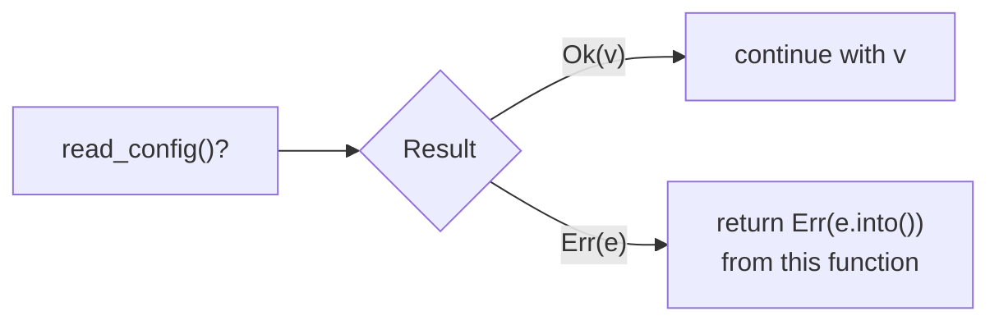

## The big idea

Rust's type system is a **building inspector who checks the plans before construction starts**. It's strict, and the first few inspections are frustrating. But once the plans pass, whole categories of problems (null pointer crashes, forgotten error cases, data races) simply can't happen in the finished building.

Three tools do most of the work:

- **Enums + `match`**: the compiler makes sure every case is handled.
- **`Option` and `Result`**: no `null`, no hidden exceptions. Absence and failure are values you must deal with.
- **Traits**: shared behaviour, checked at compile time, with zero runtime cost.


## Structs, enums and pattern matching

```rust
#[derive(Debug, Clone, PartialEq)]
struct Order {
    id: u64,
    items: Vec<Item>,
    status: Status,
}

#[derive(Debug, Clone, PartialEq)]
enum Status {
    Pending,
    Paid { amount_cents: u64 },
    Shipped { tracking: String },
    Cancelled(String),              // reason
}

impl Order {
    fn new(id: u64) -> Self {       // associated function (constructor by convention)
        Self { id, items: Vec::new(), status: Status::Pending }
    }

    fn describe(&self) -> String {
        match &self.status {
            Status::Pending => "waiting for payment".into(),
            Status::Paid { amount_cents } => format!("paid ${:.2}", *amount_cents as f64 / 100.0),
            Status::Shipped { tracking } => format!("on its way ({tracking})"),
            Status::Cancelled(reason) => format!("cancelled: {reason}"),
        } // forget a variant and this won't compile
    }
}
```

```rust
// Other pattern tools
if let Status::Shipped { tracking } = &order.status {
    notify(tracking);
}

let Some(user) = find_user(id) else {        // let-else: early return
    return Err(AppError::NotFound);
};

match age {
    0..=12 => "child",
    13..=19 => "teen",
    n if n >= 65 => "senior",               // match guard
    _ => "adult",
};
```

## Option and Result: no null, no exceptions ⭐

```rust
enum Option<T> { Some(T), None }        // a value that may be absent
enum Result<T, E> { Ok(T), Err(E) }     // success or a typed error
```

```rust
use std::num::ParseIntError;

fn parse_port(s: &str) -> Result<u16, ParseIntError> {
    let port = s.trim().parse::<u16>()?;   // `?`: return the error early, or unwrap Ok
    Ok(port)
}

let port = parse_port("8080").unwrap_or(3000);
let email = user.email.as_deref().unwrap_or("no email");
let name_len = user.nickname.map(|n| n.len()).unwrap_or(0);
```



| Method | Use when |
| --- | --- |
| `?` | Propagate the error to the caller (most of the time) |
| `match` / `if let` | Handle each case differently |
| `unwrap_or`, `unwrap_or_default`, `unwrap_or_else` | A sensible fallback exists |
| `map`, `and_then`, `ok_or` | Transform without unpacking |
| `expect("reason")` | A failure is a **bug** (the message explains why it can't happen) |
| `unwrap()` | Prototypes and tests only |

### Custom errors

```rust
use thiserror::Error;

#[derive(Debug, Error)]
pub enum AppError {
    #[error("user {0} not found")]
    NotFound(u64),
    #[error("invalid input: {0}")]
    Invalid(String),
    #[error("database error")]
    Db(#[from] sqlx::Error),         // `?` converts sqlx::Error into AppError automatically
}

fn load_user(pool: &PgPool, id: u64) -> Result<User, AppError> { … }
```

> 💡 Libraries: define error enums with **thiserror** so callers can match on them. Applications: **anyhow** (`anyhow::Result`, `.context("loading config")`) for convenient error chains.

## Traits and generics

A **trait** is a set of methods a type promises to have, like an interface.

```rust
trait Shape {
    fn area(&self) -> f64;
    fn describe(&self) -> String {                   // default method
        format!("shape with area {:.1}", self.area())
    }
}

struct Circle { r: f64 }
struct Rect { w: f64, h: f64 }

impl Shape for Circle { fn area(&self) -> f64 { std::f64::consts::PI * self.r * self.r } }
impl Shape for Rect   { fn area(&self) -> f64 { self.w * self.h } }
```

Two ways to use a trait:

```rust
// Static dispatch: a copy of the function per type, zero runtime cost
fn total_area<T: Shape>(shapes: &[T]) -> f64 { shapes.iter().map(|s| s.area()).sum() }

// Dynamic dispatch: mixed types in one Vec, decided at runtime via a vtable
fn total_area_dyn(shapes: &[Box<dyn Shape>]) -> f64 { shapes.iter().map(|s| s.area()).sum() }

let mixed: Vec<Box<dyn Shape>> = vec![Box::new(Circle { r: 1.0 }), Box::new(Rect { w: 2.0, h: 3.0 })];
```

| | Generics `T: Trait` / `impl Trait` | Trait objects `dyn Trait` |
| --- | --- | --- |
| Decided | Compile time | Runtime |
| Speed | Fastest (inlined) | One pointer indirection |
| Mixed types in one collection | ❌ | ✅ |
| Binary size | Larger | Smaller |

Traits you'll derive or implement constantly: `Debug`, `Clone`, `PartialEq`, `Default`, `Display`, `From`/`Into`, `Iterator`, and `serde::Serialize`/`Deserialize`.

## Iterators and closures

Iterator chains are **lazy** and compile down to loops as fast as hand-written ones.

```rust
let revenue: u64 = orders
    .iter()
    .filter(|o| matches!(o.status, Status::Paid { .. }))
    .flat_map(|o| o.items.iter())
    .map(|item| item.price_cents * item.qty as u64)
    .sum();

let names: Vec<String> = users.iter().map(|u| u.name.to_uppercase()).collect();
let by_id: HashMap<u64, &User> = users.iter().map(|u| (u.id, u)).collect();
```

Closures capture their environment by reference, by mutable reference or (with `move`) by value. `move` is required when the closure outlives the current scope, for example in a thread.

## Smart pointers

| Type | What it gives you | Typical use |
| --- | --- | --- |
| `Box<T>` | Heap allocation, single owner | Recursive types, `Box<dyn Trait>` |
| `Rc<T>` | Shared ownership (reference counted), single thread | Graph/tree nodes with several parents |
| `Arc<T>` | Atomic `Rc`, safe across threads | Shared config or state in a server |
| `RefCell<T>` | Borrow rules checked at **runtime** | Mutation behind `Rc` (single thread) |
| `Mutex<T>` / `RwLock<T>` | Locked mutation across threads | `Arc<Mutex<T>>` shared state |

```rust
enum List { Cons(i32, Box<List>), Nil }   // Box gives the recursive type a known size
```

## Fearless concurrency

The ownership rules apply across threads, so the compiler rejects code that could race. Two marker traits do the work: **`Send`** (can be moved to another thread) and **`Sync`** (can be shared by reference between threads).

```rust
use std::sync::{mpsc, Arc, Mutex};
use std::thread;

// Shared state: Arc for shared ownership, Mutex for safe mutation
let counter = Arc::new(Mutex::new(0));
let handles: Vec<_> = (0..8)
    .map(|_| {
        let counter = Arc::clone(&counter);
        thread::spawn(move || {
            *counter.lock().unwrap() += 1;
        })
    })
    .collect();
for h in handles { h.join().unwrap(); }
println!("{}", *counter.lock().unwrap()); // 8

// Message passing: many producers, one consumer
let (tx, rx) = mpsc::channel();
for id in 0..3 {
    let tx = tx.clone();
    thread::spawn(move || tx.send(format!("worker {id} done")).unwrap());
}
drop(tx);                  // close the original sender so the loop ends
for msg in rx { println!("{msg}"); }
```

Try using `Rc` instead of `Arc` above and you get a compile error: `Rc<…> cannot be sent between threads safely`. That's the compiler catching a race before it exists.

## Async with Tokio

For thousands of concurrent network connections, use `async`/`await` on a runtime such as **Tokio**. Futures are lazy: nothing runs until they're `.await`ed or spawned.

```rust
#[tokio::main]
async fn main() -> anyhow::Result<()> {
    let client = reqwest::Client::new();
    let (a, b) = tokio::join!(                       // run concurrently
        client.get("https://example.com/a").send(),
        client.get("https://example.com/b").send(),
    );
    println!("{} {}", a?.status(), b?.status());

    let res = tokio::time::timeout(Duration::from_secs(2), slow_call()).await; // timeout
    Ok(())
}
```

> ⚠️ Never block inside `async` code (`std::thread::sleep`, heavy CPU loops, blocking file I/O). Use `tokio::time::sleep`, `tokio::fs`, or `tokio::task::spawn_blocking`.

## A small API with Axum

```rust
use axum::{extract::{Path, State}, http::StatusCode, routing::get, Json, Router};
use serde::Serialize;
use std::{collections::HashMap, sync::Arc};
use tokio::sync::RwLock;

#[derive(Clone, Serialize)]
struct User { id: u64, name: String }

type Db = Arc<RwLock<HashMap<u64, User>>>;

async fn get_user(State(db): State<Db>, Path(id): Path<u64>) -> Result<Json<User>, StatusCode> {
    db.read().await.get(&id).cloned().map(Json).ok_or(StatusCode::NOT_FOUND)
}

#[tokio::main]
async fn main() {
    let db: Db = Arc::new(RwLock::new(HashMap::from([(1, User { id: 1, name: "Ana".into() })])));
    let app = Router::new().route("/users/{id}", get(get_user)).with_state(db);
    let listener = tokio::net::TcpListener::bind("0.0.0.0:3000").await.unwrap();
    axum::serve(listener, app).await.unwrap();
}
```

## Testing

```rust
#[cfg(test)]
mod tests {
    use super::*;

    #[test]
    fn parses_valid_port() {
        assert_eq!(parse_port(" 8080 ").unwrap(), 8080);
    }

    #[test]
    fn rejects_out_of_range_port() {
        assert!(parse_port("70000").is_err());
    }
}
```

## Key takeaways

- Model data with **structs and enums**; `match` forces you to handle every case.
- `Option` replaces null, `Result` replaces exceptions; use `?` to propagate, `thiserror`/`anyhow` for good errors, `unwrap` only in tests.
- **Traits** define shared behaviour: generics for speed, `dyn Trait` for mixed collections.
- Smart pointers: `Box` (heap), `Rc`/`Arc` (shared ownership), `RefCell`/`Mutex` (interior mutability).
- `Send`/`Sync` make data races compile errors; use `Arc<Mutex<T>>` or channels for threads and Tokio for async I/O.
