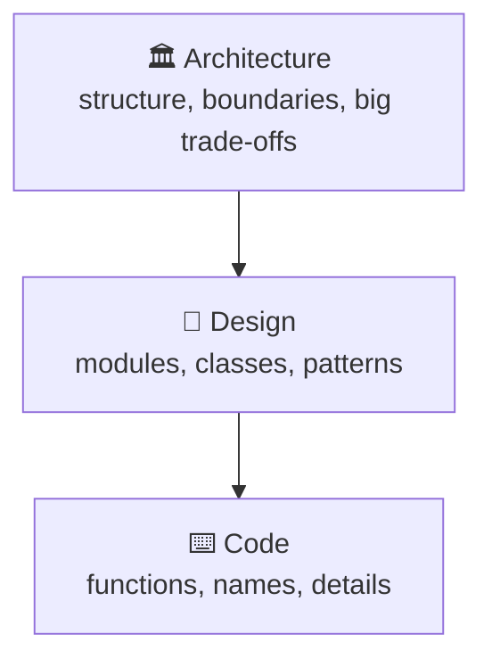
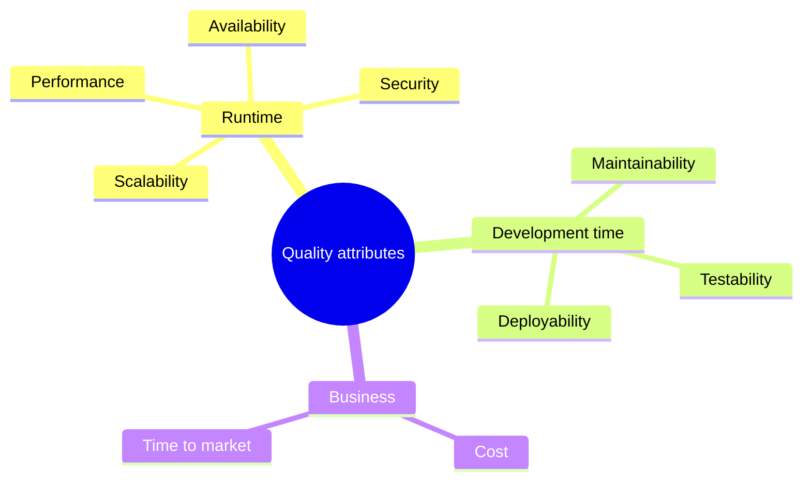
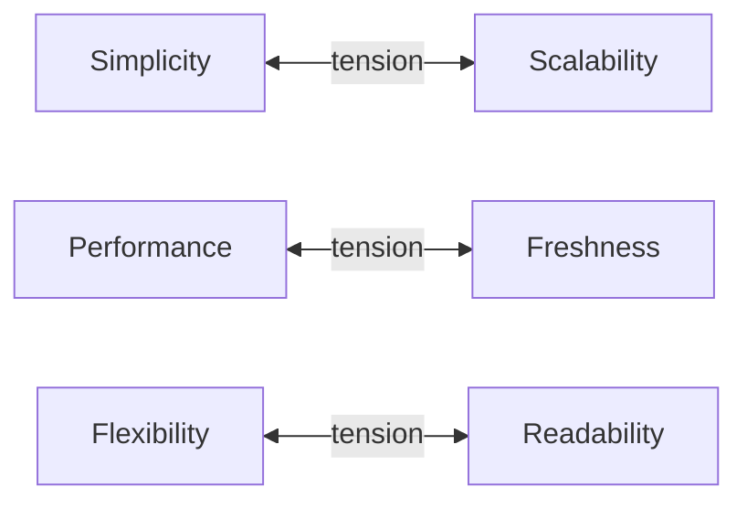
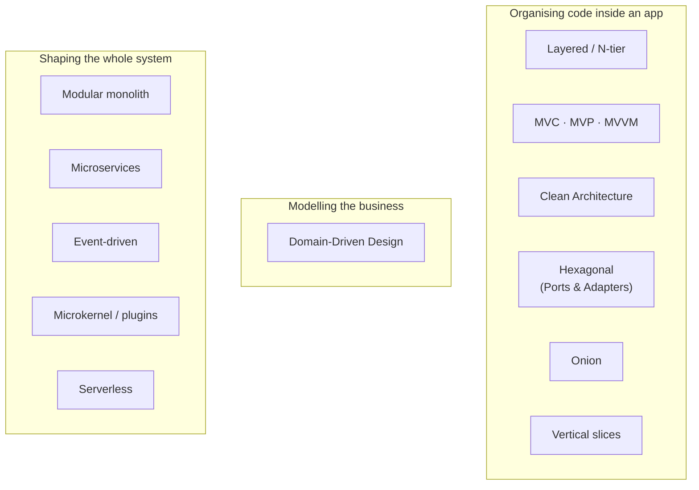
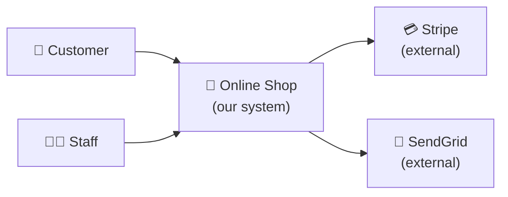

## The big idea

Building a house, you can repaint a room in an afternoon. Moving the **staircase**, the **plumbing** or the **foundations** is a different story: it's slow, expensive and risky.

**Software architecture** is about the "staircase and foundations" decisions of a system: the ones that are **hard to change later**.

> 📘 *"Architecture is about the important stuff. Whatever that is."* (Ralph Johnson)
>
> 📘 *"Architecture represents the significant design decisions that shape a system, where significant is measured by cost of change."* (Grady Booch)


## Architecture vs design vs code

| Level | Question | Examples | Cost to change |
| --- | --- | --- | --- |
| **Architecture** | How is the whole system shaped? | Monolith or microservices, layers, sync vs async, which database, where the business logic lives | 🔴 High |
| **Design** | How is one part organised? | Classes, patterns (Strategy, Repository), module APIs | 🟡 Medium |
| **Code** | How is one thing implemented? | Loops, names, functions | 🟢 Low |



The lines are blurry, and that's fine. What matters is noticing **when a decision will be expensive to reverse**, and giving it more thought.

## Quality attributes: the "-ilities"

Features describe *what* a system does. **Quality attributes** describe *how well* it does it. Architecture is mostly driven by these.

| Attribute | Question | Example requirement |
| --- | --- | --- |
| **Performance** | How fast? | p95 page load under 300 ms |
| **Scalability** | Can it grow? | Handle 10× traffic on Black Friday |
| **Availability** | Is it up? | 99.9% uptime |
| **Maintainability** | Is it easy to change? | New payment method in under a week |
| **Testability** | Can we verify it quickly? | Business rules testable without a database |
| **Security** | Is it protected? | No customer can read another customer's orders |
| **Deployability** | Can we ship safely and often? | Deploy many times per day with no downtime |
| **Cost** | Can we afford it? | Infrastructure under $2,000/month |



## Everything is a trade-off

> 🎯 *"Everything in software architecture is a trade-off."* (Neal Ford & Mark Richards, *Fundamentals of Software Architecture*)

Improving one attribute usually costs another:

| You gain… | You often pay with… |
| --- | --- |
| Scalability (microservices) | Simplicity, consistency, operating cost |
| Performance (caching) | Freshness of data, complexity |
| Flexibility (many abstraction layers) | Readability, speed of development |
| Consistency (one big transaction) | Availability and scaling |
| Time to market (quick monolith) | Future flexibility |



A good architect doesn't look for the "best" architecture. They look for the **least bad set of trade-offs** for *this* product, *this* team and *this* stage.

## The main architecture styles (this course)



| Group | Styles | Answers |
| --- | --- | --- |
| **Application architecture** | Layered, MVC/MVVM, Clean, Hexagonal, Onion, Vertical Slice | How is the code *inside* one application organised? |
| **Domain modelling** | Domain-Driven Design | How do we model the business, and where are the boundaries? |
| **System architecture** | Monolith, modular monolith, microservices, event-driven, microkernel, serverless | How is the whole system split and deployed? How do parts communicate? |

These combine. A common, healthy combination: a **modular monolith**, split along **DDD bounded contexts**, where each module uses **Hexagonal/Clean** architecture inside, and modules talk through **events**.

## Recording decisions: ADRs

Six months from now, someone will ask *"Why on earth did we pick MongoDB?"* An **Architecture Decision Record (ADR)** answers that. It's a short document, one per decision, kept in the repo.

```markdown
# ADR-007: Use PostgreSQL for the orders service

## Status
Accepted (2026-09-28)

## Context
Orders need multi-row transactions (order + lines + stock reservation).
The team knows SQL well. Expected volume: 50k orders/day.

## Decision
Use PostgreSQL 17 (managed, Amazon RDS).

## Consequences
+ ACID transactions, mature tooling, team familiarity
+ JSONB covers the few flexible fields
- Horizontal write scaling needs work later (partitioning / Citus)

## Alternatives considered
- MongoDB: flexible schema, but weaker multi-document transactions for our use case
- DynamoDB: great scale, but complex queries and more vendor lock-in
```

```text
docs/adr/
├── 0001-record-architecture-decisions.md
├── 0006-modular-monolith-first.md
└── 0007-postgresql-for-orders.md
```

> 💡 Never edit an old ADR to change the decision. Write a new one that **supersedes** it. The history of *why* is the valuable part.

## Architecture diagrams: the C4 model

The **C4 model** (Simon Brown) draws architecture at four zoom levels, like a map app:

| Level | Shows | Audience |
| --- | --- | --- |
| 1. **Context** | The system, its users and external systems | Everyone |
| 2. **Container** | Apps, databases, queues inside the system | Developers, ops |
| 3. **Component** | Main modules inside one container | Developers |
| 4. **Code** | Classes (usually generated or skipped) | Rarely needed |



*A C4 level-1 context diagram: the system as one box, with its people and neighbours.*

## Key takeaways

- Architecture = the significant decisions that are **expensive to change**.
- It's driven by **quality attributes** (scalability, maintainability, testability…), not just features.
- Every choice is a **trade-off**; aim for the least bad set for your context.
- Styles work at different levels: inside an app (Layered, Clean, Hexagonal, Onion), the domain (DDD), and the whole system (microservices, event-driven, serverless).
- Record decisions in **ADRs** and draw them with the **C4 model**.
