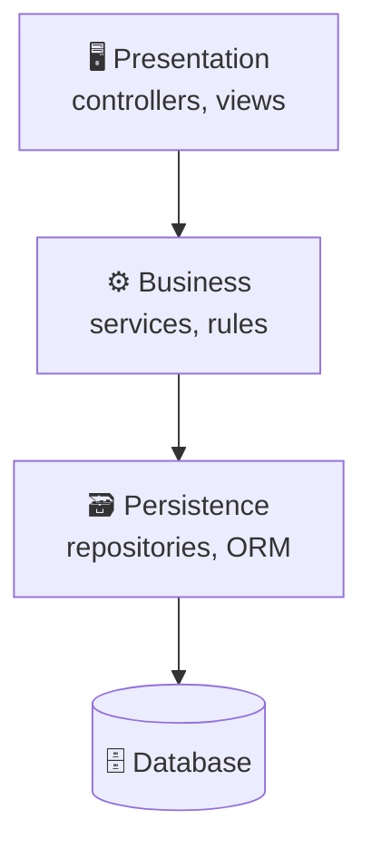
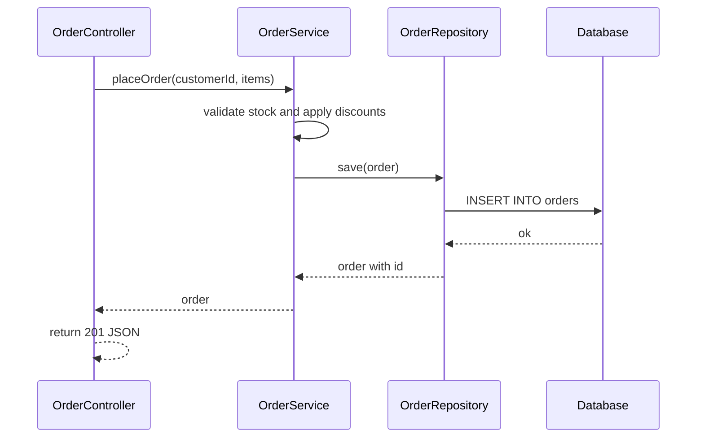
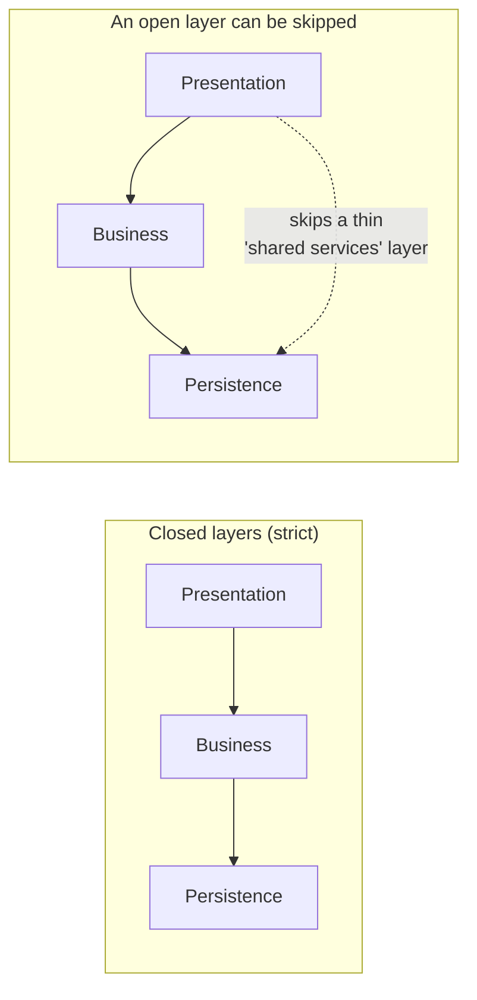
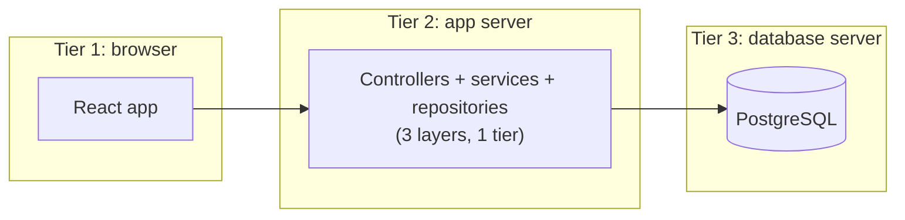
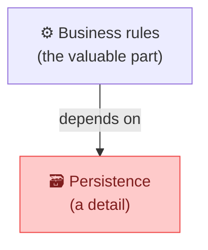
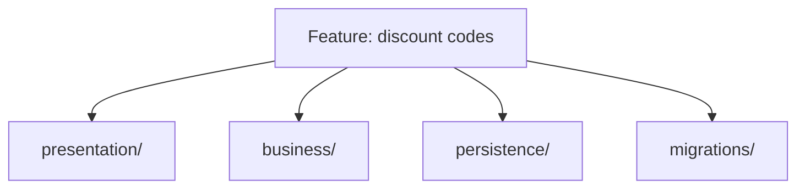

## The big idea

A restaurant has clear **layers**: the **waiters** talk to customers, the **kitchen** cooks, and the **storeroom** holds ingredients. A customer never walks into the storeroom, and the storeroom never talks to customers. Each layer only talks to the layer next to it.

**Layered architecture** organises an application the same way: each layer has one job and only talks to the layer directly below it.


## The classic layers

| Layer | Job | Examples |
| --- | --- | --- |
| **Presentation** | Talk to the user or client | React pages, REST controllers, CLI |
| **Business (service / application)** | Business rules and workflows | `OrderService.placeOrder()` |
| **Persistence (data access)** | Read and write data | Repositories, ORM models, SQL |
| **Database** | Store data | PostgreSQL, MongoDB |



## A request through the layers



```ts
// presentation/OrderController.ts
export class OrderController {
  constructor(private orders: OrderService) {}

  async create(req: Request, res: Response) {
    const order = await this.orders.placeOrder(req.body.customerId, req.body.items);
    res.status(201).json(order);
  }
}

// business/OrderService.ts
export class OrderService {
  constructor(private repo: OrderRepository) {}

  async placeOrder(customerId: string, items: OrderItem[]) {
    if (items.length === 0) throw new ValidationError("Order is empty");
    const total = items.reduce((sum, i) => sum + i.priceCents * i.qty, 0);
    return this.repo.save({ customerId, items, totalCents: total, status: "PENDING" });
  }
}

// persistence/OrderRepository.ts
export class OrderRepository {
  constructor(private db: Pool) {}

  async save(order: NewOrder) {
    const { rows } = await this.db.query(
      "INSERT INTO orders (customer_id, total_cents, status) VALUES ($1, $2, $3) RETURNING *",
      [order.customerId, order.totalCents, order.status],
    );
    return rows[0];
  }
}
```

## The rules

1. **Separation of concerns:** each layer has one responsibility. No SQL in controllers; no HTTP in services.
2. **Dependencies point down:** a layer may use the layer below it, never the one above.
3. **Closed vs open layers:**



A **closed** layer must be passed through; an **open** layer may be skipped. Keep most layers closed, or the separation quickly erodes.

## Layers vs tiers

- **Layers** are a *logical* split of code.
- **Tiers** are a *physical* split onto different machines.



The classic **3-tier** web app has three layers of code spread over three tiers.

## The weak spots

### 1. The database sits at the bottom

In a classic layered design, the business layer **depends on the persistence layer**. So business rules end up shaped by database tables, and testing a service needs a real (or heavily mocked) database.



This is exactly the problem **Clean**, **Hexagonal** and **Onion** architectures fix by *inverting* that dependency (see the next lessons).

### 2. The architecture sinkhole

Requests pass through every layer without anything useful happening:

```ts
// Controller → Service → Repository, and the service adds nothing
class ProductService {
  getProduct(id: string) {
    return this.repo.findById(id); // just a pass-through
  }
}
```

A few pass-throughs are normal. If **most** requests are like this (the rule of thumb is more than ~20%), the layers are ceremony, not value.

### 3. Changes cut across every layer

"Add a discount code field" touches the controller, the DTO, the service, the repository and the migration: five folders for one feature.



**Vertical slice architecture** (a later lesson) groups code by feature instead, to fix this.

## Folder structure

```text
src/
├── presentation/      # controllers, routes, DTOs, views
├── business/          # services, business rules
├── persistence/       # repositories, ORM entities
└── shared/            # config, logging, errors
```

## When is layered a good choice?

| ✅ Good fit | ❌ Poor fit |
| --- | --- |
| Small to medium apps, CRUD-heavy | Rich, complex business domains |
| Teams new to architecture: easy to understand | Parts that need to scale or deploy separately |
| Fast start, low ceremony | When business logic must be tested without infrastructure |

> 💡 Layered is the **default mental model** most developers start with, and many successful apps use it. Evolve toward Clean/Hexagonal when business logic grows and database coupling starts to hurt.

## Key takeaways

- Layered architecture splits an app into presentation, business and persistence layers.
- Each layer only uses the layer below; keep layers closed.
- Layers are logical; tiers are physical.
- Weak spots: business logic depends on the database, pass-through "sinkholes", and features spread across all layers.
- A good simple default that Clean, Hexagonal, Onion and vertical slices improve on.
