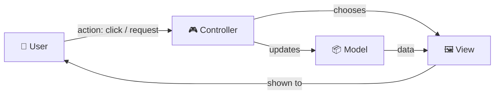
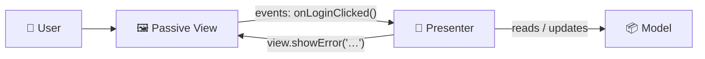
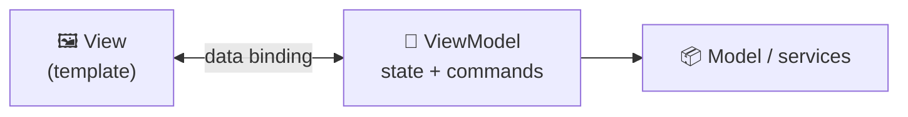
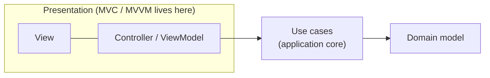

## The big idea

A **TV news studio**:

- The **newsroom** holds the facts (the **Model**).
- The **TV screen** shows them to viewers (the **View**).
- The **producer** decides what to show and reacts to phone-ins from viewers (the **Controller / Presenter / ViewModel**).

Keeping these three apart means you can redesign the screen without rewriting the news, and test the producer's logic without a TV.


All three patterns share one goal: **separate the UI (View) from data and business logic (Model)**. They differ in the "middle piece" and in how data flows.

## MVC: Model–View–Controller

Invented at Xerox PARC in 1979 for Smalltalk. The most famous of the three.



| Part | Job |
| --- | --- |
| **Model** | Data and business rules (`Product`, `Order.total()`) |
| **View** | Displays the model (HTML template, page) |
| **Controller** | Receives input, updates the model, picks a view |

### Server-side MVC (Rails, Laravel, Django, ASP.NET MVC, Express)

```js
// Controller: routes/products.js (Express)
router.get("/products/:id", async (req, res) => {
  const product = await Product.findById(req.params.id); // Model
  if (!product) return res.status(404).render("404");
  res.render("products/show", { product });              // View
});
```

```html
<!-- View: views/products/show.ejs -->
<h1><%= product.name %></h1>
<p><%= product.formattedPrice() %></p>
```

> ⚠️ **Fat controller, anaemic model:** a common trap is putting all logic in controllers. Keep controllers thin; move business rules into models or services.

## MVP: Model–View–Presenter

The **View is passive** ("dumb"): it just displays what it's told and forwards user events. The **Presenter** holds all the presentation logic and talks to the View through an interface, which makes it easy to unit-test.



```ts
interface LoginView {
  showError(message: string): void;
  goToDashboard(): void;
}

class LoginPresenter {
  constructor(private view: LoginView, private auth: AuthService) {}

  async onLoginClicked(email: string, password: string) {
    if (!email.includes("@")) return this.view.showError("Please enter a valid email");
    const ok = await this.auth.login(email, password);
    ok ? this.view.goToDashboard() : this.view.showError("Wrong email or password");
  }
}

// Test with a fake view: no UI framework needed
const fakeView = { showError: vi.fn(), goToDashboard: vi.fn() };
await new LoginPresenter(fakeView, fakeAuth).onLoginClicked("bad", "x");
expect(fakeView.showError).toHaveBeenCalledWith("Please enter a valid email");
```

Popular in Android (before Jetpack) and Windows Forms apps.

## MVVM: Model–View–ViewModel

The **ViewModel** exposes **observable state and commands**. The View **binds** to them, so when the ViewModel's data changes, the View updates automatically, and user input flows back through the binding. No manual "update the view" calls.



```vue
<!-- Vue: the <script setup> part acts as the ViewModel -->
<script setup>
import { ref, computed } from "vue";

const email = ref("");
const password = ref("");
const canSubmit = computed(() => email.value.includes("@") && password.value.length >= 8);
async function login() { await auth.login(email.value, password.value); }
</script>

<template>
  <input v-model="email" />                     <!-- two-way binding -->
  <input v-model="password" type="password" />
  <button :disabled="!canSubmit" @click="login">Log in</button>
</template>
```

Where you'll find MVVM: **Angular**, **Vue**, **Knockout**, WPF and .NET MAUI, **SwiftUI**, and **Jetpack Compose** with ViewModels on Android.

## Where does React fit?

React is "just the V", with one-way data flow. In practice, React apps often follow an MVVM-like split using **custom hooks** as ViewModels:

```tsx
// ViewModel: all the state and logic, no JSX
function useLoginViewModel() {
  const [email, setEmail] = useState("");
  const [password, setPassword] = useState("");
  const [error, setError] = useState<string | null>(null);
  const canSubmit = email.includes("@") && password.length >= 8;

  async function submit() {
    try { await auth.login(email, password); }
    catch { setError("Wrong email or password"); }
  }
  return { email, setEmail, password, setPassword, error, canSubmit, submit };
}

// View: only rendering
function LoginForm() {
  const vm = useLoginViewModel();
  return (
    <form onSubmit={(e) => { e.preventDefault(); vm.submit(); }}>
      <input value={vm.email} onChange={(e) => vm.setEmail(e.target.value)} />
      <input type="password" value={vm.password} onChange={(e) => vm.setPassword(e.target.value)} />
      {vm.error && <p role="alert">{vm.error}</p>}
      <button disabled={!vm.canSubmit}>Log in</button>
    </form>
  );
}
```

The hook can be tested with `renderHook`; the component stays simple. (This is also the "container / presentational" split.)

## Comparison

| | MVC | MVP | MVVM |
| --- | --- | --- | --- |
| Middle piece | Controller | Presenter | ViewModel |
| View knows… | The model (reads it) | Nothing but the presenter interface | The ViewModel (binds to it) |
| How the View updates | Controller picks/renders a view | Presenter calls `view.show…()` | Automatic, via data binding |
| Testability of UI logic | Medium | ✅ High | ✅ High |
| Typical home | Server-rendered web apps | Android (classic), WinForms | Angular, Vue, SwiftUI, WPF |

## These are UI patterns, not whole-app architectures

MVC/MVP/MVVM organise the **presentation** part of an app. They don't say where business rules or database access live. In a bigger app, they sit in the **outer layer** of Clean or Hexagonal architecture:



## Key takeaways

- All three separate **View** (what users see) from **Model** (data and rules).
- **MVC:** a controller handles input and picks views. Classic in server-side frameworks.
- **MVP:** a passive view plus a presenter behind an interface. Very testable.
- **MVVM:** the view binds to observable state in a ViewModel. The model behind Angular, Vue, SwiftUI.
- In React, custom hooks often play the ViewModel role.
- They're presentation patterns; combine them with Clean/Hexagonal for the rest of the app.
