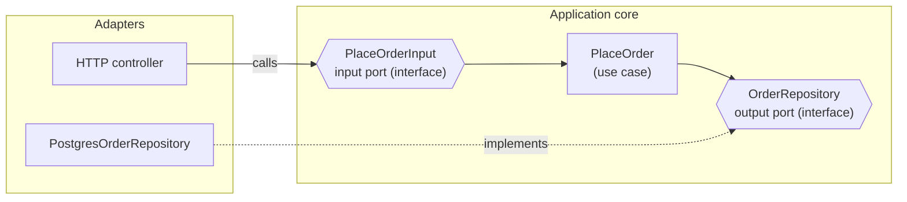
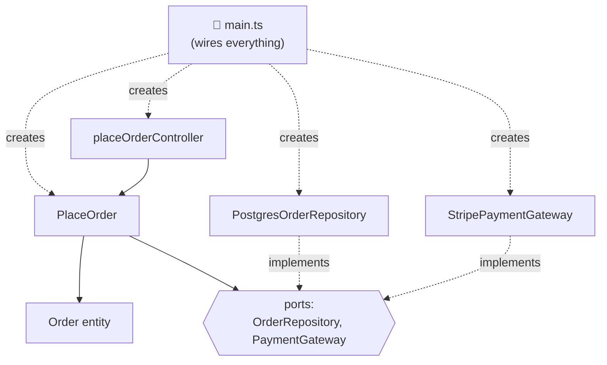
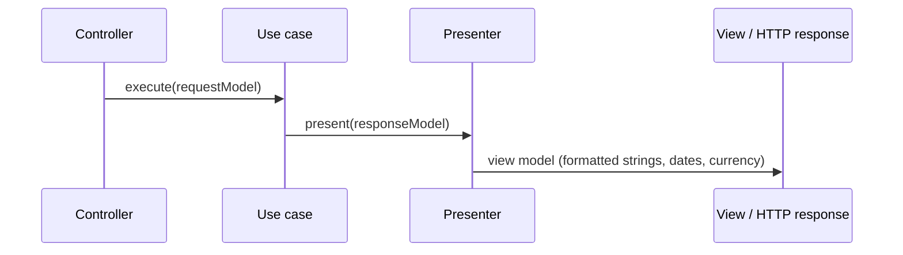
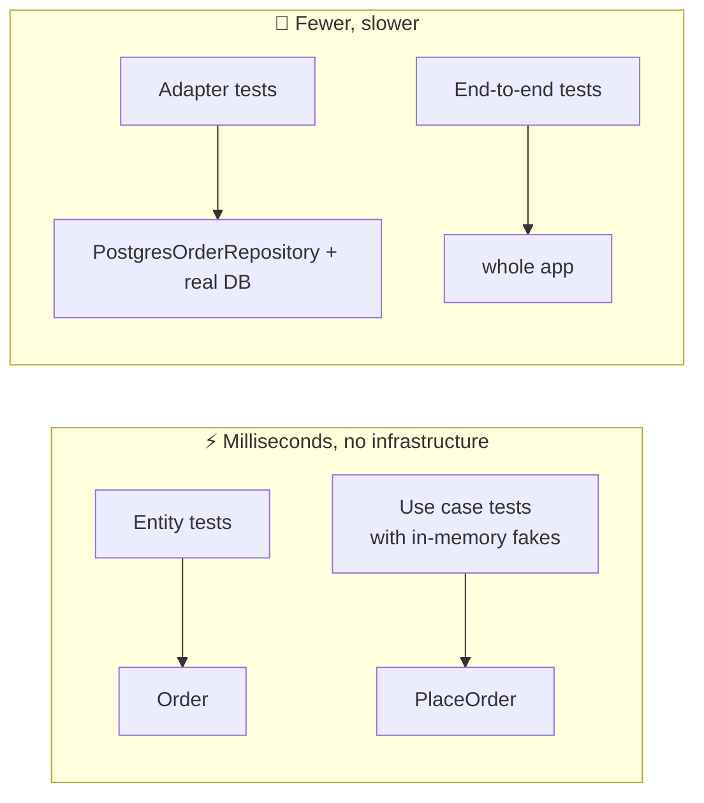

## The big idea

A **ship's engine room** is built so the engine doesn't care whether the ship carries tourists or cargo, which harbour it docks in, or who's steering. You can refit the cabins, change the crew and repaint the hull, and the engine keeps running untouched.

In **Clean Architecture** (Robert C. Martin, 2012), your **business rules are the engine**. Web frameworks, databases, UIs and third-party APIs are the cabins and paint: **details** that plug in from outside and can be replaced.


> 📘 **The Dependency Rule:** *source code dependencies must point only inward, toward higher-level policies.* Nothing in an inner circle can know anything about something in an outer circle, not even its name.

> 💡 The Clean Code topic has a short introduction to this idea. This lesson goes deeper into ports, presenters, boundaries and mistakes.

## The four circles

| Circle | Contains | Changes when… | Knows about |
| --- | --- | --- | --- |
| 🟡 **Entities** | Enterprise-wide business rules and objects | The *business* changes | Nothing else |
| 🟢 **Use cases** | Application-specific rules: one class per user action | The *application's behaviour* changes | Entities + port interfaces |
| 🔵 **Interface adapters** | Controllers, presenters, gateways, repositories: convert data between formats | APIs, UI or storage formats change | Use cases (and their ports) |
| 🟣 **Frameworks & drivers** | Express, React, Postgres drivers, Stripe SDK | You change a tool | Adapters |

**"Entities"** here means *business objects with behaviour*, not ORM entities. An `Order` that knows its total and refuses invalid changes is an entity; a database row class is a detail.

## Crossing the boundary: ports

How can a use case save an order without knowing about Postgres? It depends on an **interface it owns** (an *output port*), and the database adapter **implements** it. That's Dependency Inversion (the **D** in SOLID) at architecture scale.



- **Input port (driving side):** the interface the outside world calls to *use* the application: `PlaceOrderInput.execute(...)`.
- **Output port (driven side):** the interface the application calls to *reach* the outside world: `OrderRepository`, `PaymentGateway`, `Clock`.

The control flow goes **outward** (use case → database), but the source-code dependency points **inward** (the Postgres adapter imports the port). That's the "inversion".

## A full example: placing an order

### 1. Entity: pure business rules

```ts
// src/domain/Order.ts — no imports from frameworks, databases or HTTP
export type OrderLine = { sku: string; quantity: number; unitPriceCents: number };

export class Order {
  private constructor(
    readonly id: string,
    readonly customerId: string,
    private lines: OrderLine[],
    private status: "PENDING" | "PAID" | "CANCELLED",
  ) {}

  static create(id: string, customerId: string, lines: OrderLine[]): Order {
    if (lines.length === 0) throw new DomainError("An order needs at least one line");
    if (lines.some((l) => l.quantity <= 0)) throw new DomainError("Quantities must be positive");
    return new Order(id, customerId, lines, "PENDING");
  }

  get totalCents(): number {
    return this.lines.reduce((sum, l) => sum + l.quantity * l.unitPriceCents, 0);
  }

  markPaid(): void {
    if (this.status !== "PENDING") throw new DomainError(`Cannot pay a ${this.status} order`);
    this.status = "PAID";
  }
}
```

### 2. Use case with its ports

```ts
// src/application/ports.ts — interfaces OWNED by the application
export interface OrderRepository { save(order: Order): Promise<void>; }
export interface PaymentGateway { charge(customerId: string, amountCents: number): Promise<{ paymentId: string }>; }
export interface IdGenerator { next(): string; }

// src/application/PlaceOrder.ts
export type PlaceOrderRequest = { customerId: string; lines: OrderLine[] };   // input DTO
export type PlaceOrderResponse = { orderId: string; totalCents: number };     // output DTO

export class PlaceOrder {
  constructor(
    private readonly orders: OrderRepository,
    private readonly payments: PaymentGateway,
    private readonly ids: IdGenerator,
  ) {}

  async execute(request: PlaceOrderRequest): Promise<PlaceOrderResponse> {
    const order = Order.create(this.ids.next(), request.customerId, request.lines);
    await this.payments.charge(order.customerId, order.totalCents);
    order.markPaid();
    await this.orders.save(order);
    return { orderId: order.id, totalCents: order.totalCents };
  }
}
```

Notice what's **not** here: no `req`, no `res`, no SQL, no Stripe SDK, no JSON. Just the story of placing an order.

### 3. Adapters: translate between the world and the core

```ts
// src/adapters/http/placeOrderController.ts — HTTP → use case → HTTP
export const placeOrderController = (placeOrder: PlaceOrder) => async (req: Request, res: Response) => {
  const body = PlaceOrderSchema.parse(req.body);             // validate the external input
  const result = await placeOrder.execute(body);             // plain DTO in, plain DTO out
  res.status(201).json(result);
};

// src/adapters/persistence/PostgresOrderRepository.ts — core ↔ SQL
export class PostgresOrderRepository implements OrderRepository {
  constructor(private readonly pool: Pool) {}
  async save(order: Order): Promise<void> {
    await this.pool.query(
      "INSERT INTO orders (id, customer_id, total_cents, status) VALUES ($1, $2, $3, $4)",
      [order.id, order.customerId, order.totalCents, "PAID"],
    );
  }
}

// src/adapters/payments/StripePaymentGateway.ts — core ↔ Stripe
export class StripePaymentGateway implements PaymentGateway {
  constructor(private readonly stripe: Stripe) {}
  async charge(customerId: string, amountCents: number) {
    const intent = await this.stripe.paymentIntents.create({ customer: customerId, amount: amountCents, currency: "eur", confirm: true });
    return { paymentId: intent.id };
  }
}
```

### 4. Main: the composition root

```ts
// src/main.ts — the ONLY file that knows every concrete class
const placeOrder = new PlaceOrder(
  new PostgresOrderRepository(pool),
  new StripePaymentGateway(new Stripe(process.env.STRIPE_KEY!)),
  { next: () => crypto.randomUUID() },
);
app.post("/orders", placeOrderController(placeOrder));
```



## Presenters: shaping the output

In the "pure" version, the use case doesn't *return* data. It calls an **output boundary** (a presenter), which formats the result for a specific delivery mechanism (JSON, HTML, CLI).



In many web apps, returning a response DTO from the use case (as above) and formatting in the controller is simpler and perfectly fine. Use presenters when **several** UIs need the same use case formatted differently.

## "Screaming architecture"

> 📘 *"Your architecture should scream the intent of the system, not the framework you used."* (Uncle Bob)

Look at the top-level folders. Do they say **"Express app"** or **"online shop"**?

```text
❌ Screams the framework         ✅ Screams the business
src/                            src/
├── controllers/                ├── ordering/
├── models/                     │   ├── domain/        (Order, OrderLine)
├── services/                   │   ├── application/   (PlaceOrder, CancelOrder, ports)
├── repositories/               │   └── adapters/      (http, postgres, stripe)
└── routes/                     ├── catalog/
                                ├── billing/
                                └── main.ts
```

## Testing: the big payoff



```ts
test("charges the customer the order total", async () => {
  const charges: number[] = [];
  const placeOrder = new PlaceOrder(
    { save: async () => {} },                                           // fake repository
    { charge: async (_c, amount) => { charges.push(amount); return { paymentId: "p1" }; } },
    { next: () => "order-1" },
  );

  const result = await placeOrder.execute({ customerId: "c1", lines: [{ sku: "KB", quantity: 2, unitPriceCents: 1500 }] });

  expect(result).toEqual({ orderId: "order-1", totalCents: 3000 });
  expect(charges).toEqual([3000]);
});
```

## Common mistakes

| Mistake | Why it hurts | Fix |
| --- | --- | --- |
| ORM decorators (`@Entity`, `@Column`) on domain entities | The domain now depends on the ORM | Separate persistence models, map in the adapter |
| Use cases receiving `req`/`res` | The core depends on HTTP | Pass plain request DTOs |
| One giant `OrderService` with 30 methods | Use cases lose their meaning | One class (or function) per use case |
| Anaemic entities (only getters/setters) | Rules leak into use cases and controllers | Put invariants and behaviour in entities |
| Interfaces for everything, even with one implementation that will never change | Ceremony without value | Add ports at real boundaries: I/O, external services, time, randomness |
| Every CRUD screen goes through 6 layers | Slow development | Keep simple reads simple (see CQRS and vertical slices) |

## When to use it

✅ Rich business rules, a long-lived product, several delivery mechanisms (API + CLI + jobs), a need for fast, reliable tests, likely infrastructure changes.

❌ Prototypes, small CRUD apps, short-lived scripts. There, a simple layered structure is kinder (**KISS**).

## Key takeaways

- Four circles: **entities**, **use cases**, **interface adapters**, **frameworks & drivers**.
- **The Dependency Rule:** source dependencies point inward only.
- Use cases talk to the outside through **ports** (interfaces they own); adapters implement them.
- Cross boundaries with plain **DTOs**; wire everything in one **composition root**.
- Make the folder structure **scream the business**, not the framework.
- The payoff: business logic that is testable in milliseconds and independent of tools.
