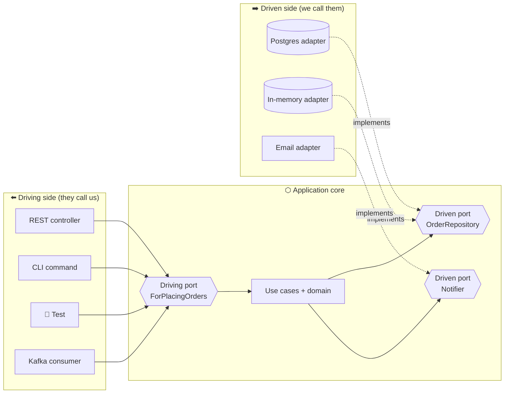
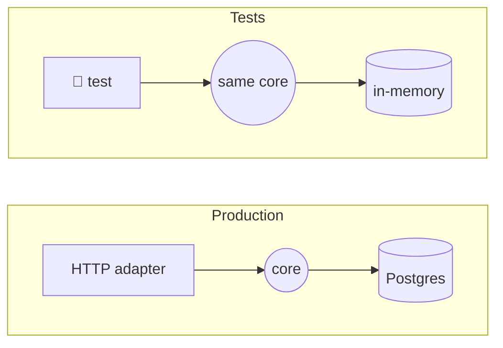
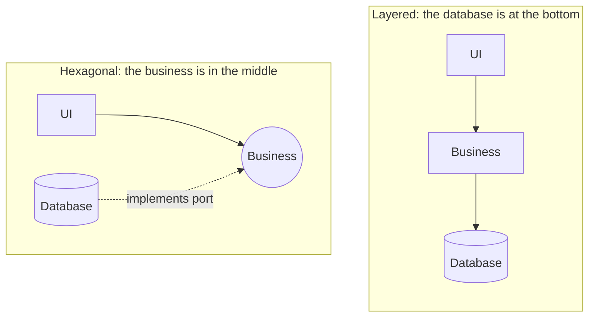

## The big idea

A **games console** has **ports**: HDMI for a screen, USB for controllers, a network port. The console doesn't care whether you plug in a 4K TV or an old monitor, a wired or wireless controller. Each device just needs an **adapter** (a cable or dongle) that fits the port.

**Hexagonal Architecture**, also called **Ports & Adapters** (Alistair Cockburn, 2005), treats your application the same way. The **application core** sits in the middle; everything else (web UI, REST API, tests, database, email, message queues) plugs in through **ports**, using **adapters**.


> 💡 **Why a hexagon?** No magic in the number six. Cockburn drew a hexagon to escape the "top-to-bottom layers" picture, and to show there are *many* sides where things can plug in, all equally "outside".

## Core vocabulary

| Term | Meaning | Example |
| --- | --- | --- |
| **Application core** | Business logic: domain model + use cases. No I/O, no frameworks | `Order`, `PlaceOrder` |
| **Port** | An interface defined **by the core**, in its own language | `ForPlacingOrders`, `OrderRepository` |
| **Adapter** | Code that connects a real technology to a port | Express controller, Postgres repository |
| **Driving (primary) side** | Actors that **call** the application | Web UI, REST API, CLI, tests, a message consumer |
| **Driven (secondary) side** | Things the application **calls** | Database, payment provider, email, event bus, clock |



**Direction of dependencies:** adapters depend on ports; the core depends on **nothing** outside itself. Exactly the same rule as Clean Architecture, drawn differently.

## A complete example: a library loan system

### 1. The core: domain + ports + use case

```ts
// core/domain/Loan.ts
export class Loan {
  constructor(readonly bookId: string, readonly memberId: string, readonly dueDate: Date) {}
  isOverdue(today: Date) { return today > this.dueDate; }
}

// core/ports/driven.ts — what the core NEEDS from the outside world
export interface BookCatalog { isAvailable(bookId: string): Promise<boolean>; markBorrowed(bookId: string): Promise<void>; }
export interface LoanRepository { save(loan: Loan): Promise<void>; countActiveFor(memberId: string): Promise<number>; }
export interface Notifier { loanConfirmed(memberId: string, loan: Loan): Promise<void>; }
export interface Clock { now(): Date; }

// core/ports/driving.ts — what the core OFFERS to the outside world
export interface ForBorrowingBooks {
  borrow(memberId: string, bookId: string): Promise<Loan>;
}

// core/BorrowBook.ts — implements the driving port using the driven ports
const MAX_ACTIVE_LOANS = 3;
const LOAN_DAYS = 14;

export class BorrowBook implements ForBorrowingBooks {
  constructor(
    private readonly catalog: BookCatalog,
    private readonly loans: LoanRepository,
    private readonly notifier: Notifier,
    private readonly clock: Clock,
  ) {}

  async borrow(memberId: string, bookId: string): Promise<Loan> {
    if (!(await this.catalog.isAvailable(bookId))) throw new DomainError("Book is not available");
    if ((await this.loans.countActiveFor(memberId)) >= MAX_ACTIVE_LOANS) {
      throw new DomainError(`Members can borrow at most ${MAX_ACTIVE_LOANS} books`);
    }

    const due = new Date(this.clock.now().getTime() + LOAN_DAYS * 24 * 60 * 60 * 1000);
    const loan = new Loan(bookId, memberId, due);

    await this.catalog.markBorrowed(bookId);
    await this.loans.save(loan);
    await this.notifier.loanConfirmed(memberId, loan);
    return loan;
  }
}
```

> 💡 Even **time** is behind a port (`Clock`). "What's today's date?" is input from the outside world, and faking it makes tests deterministic.

### 2. Driving adapters: the ways in

```ts
// adapters/driving/http.ts — REST
export function loanRoutes(app: Express, borrowing: ForBorrowingBooks) {
  app.post("/members/:memberId/loans", async (req, res) => {
    const loan = await borrowing.borrow(req.params.memberId, req.body.bookId);
    res.status(201).json({ bookId: loan.bookId, dueDate: loan.dueDate.toISOString() });
  });
}

// adapters/driving/cli.ts — the same use case from a terminal
export async function borrowFromCli(borrowing: ForBorrowingBooks, [memberId, bookId]: string[]) {
  const loan = await borrowing.borrow(memberId, bookId);
  console.log(`✅ Borrowed ${bookId}, due ${loan.dueDate.toDateString()}`);
}
```

### 3. Driven adapters: the ways out

```ts
// adapters/driven/PostgresLoanRepository.ts
export class PostgresLoanRepository implements LoanRepository {
  constructor(private readonly db: Pool) {}
  async save(loan: Loan) {
    await this.db.query("INSERT INTO loans (book_id, member_id, due_date) VALUES ($1, $2, $3)", [loan.bookId, loan.memberId, loan.dueDate]);
  }
  async countActiveFor(memberId: string) {
    const { rows } = await this.db.query("SELECT count(*)::int AS n FROM loans WHERE member_id = $1 AND returned_at IS NULL", [memberId]);
    return rows[0].n;
  }
}

// adapters/driven/InMemoryLoanRepository.ts — for tests and local demos
export class InMemoryLoanRepository implements LoanRepository {
  loans: Loan[] = [];
  async save(loan: Loan) { this.loans.push(loan); }
  async countActiveFor(memberId: string) { return this.loans.filter((l) => l.memberId === memberId).length; }
}

// adapters/driven/EmailNotifier.ts
export class EmailNotifier implements Notifier {
  constructor(private readonly mailer: Mailer) {}
  loanConfirmed(memberId: string, loan: Loan) {
    return this.mailer.send(memberId, `Your loan is due on ${loan.dueDate.toDateString()}`);
  }
}
```

### 4. Configurator: plug it all together

```ts
// main.ts
const borrowing = new BorrowBook(
  new HttpBookCatalog(process.env.CATALOG_URL!),
  new PostgresLoanRepository(pool),
  new EmailNotifier(sendgrid),
  { now: () => new Date() },
);
loanRoutes(app, borrowing);
```

## Testing: swap the adapters

The test is just another **driving adapter**, and it plugs in **fake driven adapters**:

```ts
test("refuses a 4th loan", async () => {
  const loans = new InMemoryLoanRepository();
  loans.loans = [1, 2, 3].map((n) => new Loan(`book-${n}`, "ana", new Date("2026-10-10")));
  const borrowing = new BorrowBook(
    { isAvailable: async () => true, markBorrowed: async () => {} },
    loans,
    { loanConfirmed: async () => {} },
    { now: () => new Date("2026-09-28") },
  );

  await expect(borrowing.borrow("ana", "book-4")).rejects.toThrow("at most 3 books");
});
```



The core is tested **exactly as it runs in production**, in milliseconds, with no database or network.

## Folder structure

```text
src/
├── core/
│   ├── domain/            # Loan, Book, rules
│   ├── ports/
│   │   ├── driving.ts     # ForBorrowingBooks, ForReturningBooks
│   │   └── driven.ts      # LoanRepository, BookCatalog, Notifier, Clock
│   └── BorrowBook.ts      # use cases implementing driving ports
├── adapters/
│   ├── driving/           # http.ts, cli.ts, kafka-consumer.ts
│   └── driven/            # postgres/, in-memory/, email/, http-catalog/
└── main.ts                # configurator: wires adapters to ports
```

## Naming ports well

Cockburn suggests naming ports after their **purpose**, as "For…ing":

| Side | Port name | Adapters |
| --- | --- | --- |
| Driving | `ForBorrowingBooks` | REST controller, CLI, GraphQL resolver, test |
| Driving | `ForManagingCatalog` | Admin UI, import job |
| Driven | `ForStoringLoans` (`LoanRepository`) | Postgres, DynamoDB, in-memory |
| Driven | `ForNotifyingMembers` (`Notifier`) | Email, SMS, push, console log |

Ports speak the **language of the domain** ("loanConfirmed"), never the language of the technology ("sendSmtpMessage").

## Hexagonal vs layered, in one picture



In a layered app, business code *depends on* the data layer. In hexagonal, the data layer is just another adapter that *depends on* the business.

## When to use it

✅ Business logic that must be tested thoroughly, multiple entry points (API + CLI + queue consumers), external services you might swap (payment providers, email, storage), long-lived systems.

❌ Thin CRUD apps with almost no logic: ports around every table add ceremony without benefit.

## Key takeaways

- The **application core** is in the middle; everything else plugs in through **ports** using **adapters**.
- **Driving** adapters call the core (HTTP, CLI, tests, consumers); **driven** adapters are called by it (DB, email, payments, clock).
- Ports are interfaces **owned by the core**, named in domain language.
- Tests are just another driving adapter using fake driven adapters: fast and realistic.
- Same Dependency Rule as Clean Architecture: nothing in the core imports an adapter.
