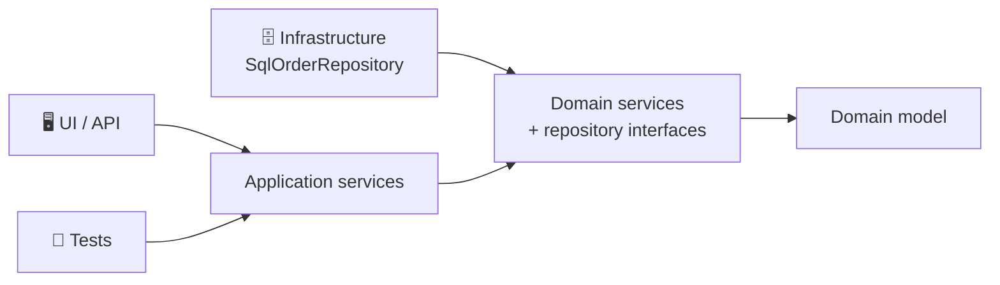
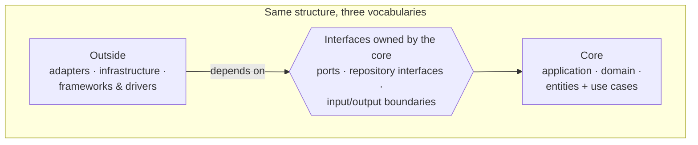
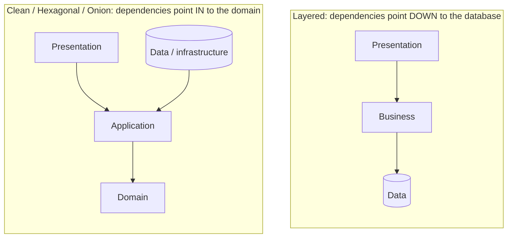

## The big idea

Peel an **onion**: the outer skin can be thrown away and replaced, but the heart in the middle is what the whole onion grows around.

**Onion Architecture** (Jeffrey Palermo, 2008) organises an application as rings around the **domain model**. Outer rings depend on inner rings, never the other way round. Infrastructure (databases, UI, frameworks) is the **outer skin**.


## The rings

| Ring (inside → out) | Contains | Example |
| --- | --- | --- |
| 🟡 **Domain model** | Entities, value objects, business rules | `Order`, `Money`, `Email` |
| 🟠 **Domain services** | Business logic that doesn't belong to one entity; **repository interfaces** | `PricingService`, `IOrderRepository` |
| 🔵 **Application services** | Use cases / workflows orchestrating the domain | `CheckoutService.placeOrder()` |
| 🟣 **Outer ring: infrastructure, UI, tests** | Implementations of the interfaces, web framework, DB, external APIs | `SqlOrderRepository`, controllers, EF Core / Prisma |



### The key move: interfaces live in the inside

Just like the other two styles, the **repository interface** is declared in an **inner ring** (domain services), and **implemented** in the outer ring. Palermo's own summary of the principles:

1. The application is built around an **independent object model**.
2. **Inner layers define interfaces; outer layers implement them.**
3. The direction of coupling is **toward the centre**.
4. All application core code can be **compiled and run separately from infrastructure**.

```csharp
// Onion Architecture grew up in the .NET world, so here's the classic C# flavour
namespace Shop.Domain.Services   { public interface IOrderRepository { Task Save(Order order); } }
namespace Shop.Application        { public class CheckoutService(IOrderRepository orders) { /* … */ } }
namespace Shop.Infrastructure.Sql { public class SqlOrderRepository : IOrderRepository { /* EF Core */ } }
```

```text
Shop.sln
├── Shop.Domain            (no project references)
├── Shop.Application       → references Domain
├── Shop.Infrastructure    → references Application, Domain
└── Shop.Api               → references everything (composition root)
```

> 💡 Separate projects/packages per ring let the **compiler enforce** the dependency rule: `Shop.Domain` literally cannot import Entity Framework. In TypeScript you can get the same with separate packages, or with lint rules like `eslint-plugin-boundaries` / `dependency-cruiser`.

---

## Clean vs Hexagonal vs Onion ⭐

### The honest answer: they're the same core idea

All three were created to fix the same problem with classic layered architecture: **business logic depending on the database and frameworks**. All three share the same rule:

> 🎯 **The business logic is at the centre and depends on nothing. Infrastructure is at the edge and depends on the centre, through interfaces owned by the centre.**


### What each one emphasises

| | Hexagonal (2005) | Onion (2008) | Clean (2012) |
| --- | --- | --- | --- |
| **Author** | Alistair Cockburn | Jeffrey Palermo | Robert C. Martin |
| **Main picture** | Hexagon with ports on its sides | Concentric rings | Concentric circles |
| **Main emphasis** | Symmetry of **inputs and outputs**: every outside actor (UI, test, DB) is just an adapter on a port | **Layers inside the core**: domain model → domain services → application services | **The Dependency Rule** + named layers, use cases as first-class objects, crossing boundaries with DTOs |
| **Inside the core** | Not prescribed ("the application") | Domain model, domain services, application services | Entities, use cases |
| **Key vocabulary** | Ports, adapters, driving, driven | Domain model, rings, infrastructure | Entities, use cases, interface adapters, presenters |
| **Testing story** | Tests are just another driving adapter | Core runs without infrastructure | Use cases testable without UI, DB, web |

### Mapping the terms

| Concept | Hexagonal | Onion | Clean |
| --- | --- | --- | --- |
| Business objects and rules | (inside the app) | Domain model | Entities |
| Application workflows | (inside the app) | Application services | Use cases (interactors) |
| Interface the core needs | Driven (secondary) port | Repository / service interface in domain services | Output port / gateway interface |
| Interface the core offers | Driving (primary) port | Application service interface | Input port / boundary |
| Web controller | Driving adapter | Outer ring (UI) | Interface adapter (controller) |
| Database code | Driven adapter | Outer ring (infrastructure) | Interface adapter (gateway) + frameworks & drivers |



### Which should I pick?

It matters much less than people think. Pick the **vocabulary your team understands**, and enforce the **one rule** they share. In practice, most teams blend them:

- **Hexagonal's** names for the boundary: *ports and adapters, driving and driven*.
- **Onion's / DDD's** layering inside the core: *domain model, domain services, application services*.
- **Clean's** one-class-per-*use case* and the "screaming" folder structure.

```text
src/ordering/
├── domain/          # entities, value objects, domain services   (Onion / DDD / Clean entities)
├── application/     # use cases + ports                          (Clean use cases, Hexagonal ports)
└── adapters/        # driving: http, cli · driven: postgres, stripe  (Hexagonal adapters)
```

## How these relate to Layered architecture



The single difference is **where the database sits**: at the bottom that everything depends on, or at the edge where it depends on the domain.

## Key takeaways

- **Onion:** rings around the domain model (domain services, then application services, then infrastructure/UI); inner rings define interfaces, outer rings implement them.
- **Hexagonal, Onion and Clean share one rule:** business logic in the centre, depending on nothing; infrastructure at the edge, implementing interfaces owned by the centre.
- They differ in emphasis and vocabulary: Hexagonal → ports/adapters and input/output symmetry; Onion → layers inside the core; Clean → the Dependency Rule, use cases and boundaries.
- Blend them freely; enforce the dependency direction with project structure or lint rules.
