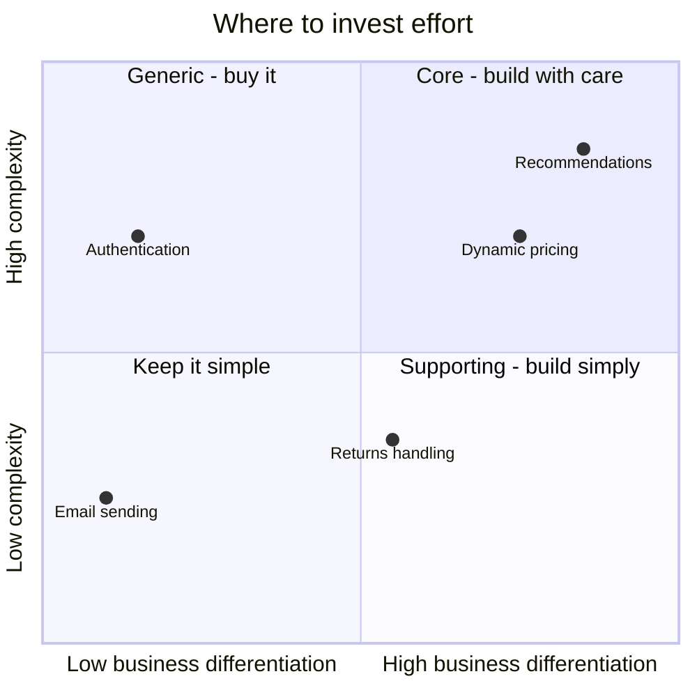
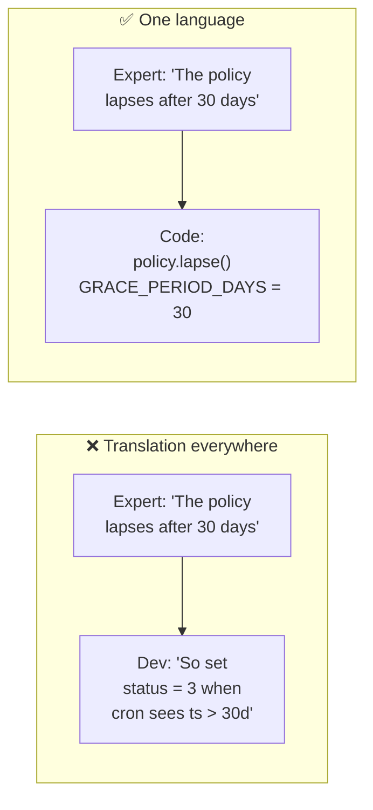
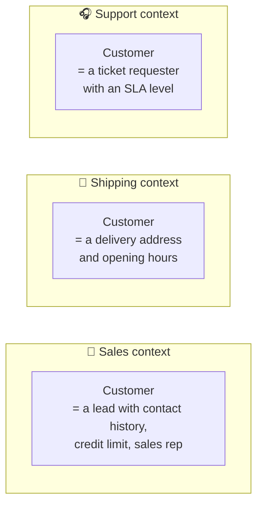
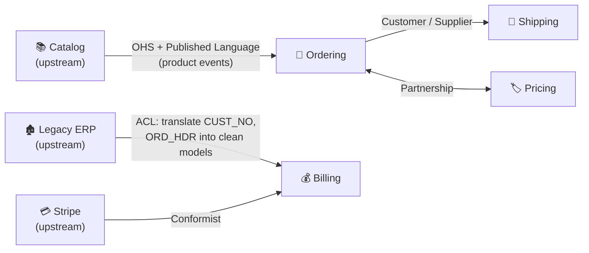
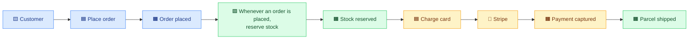
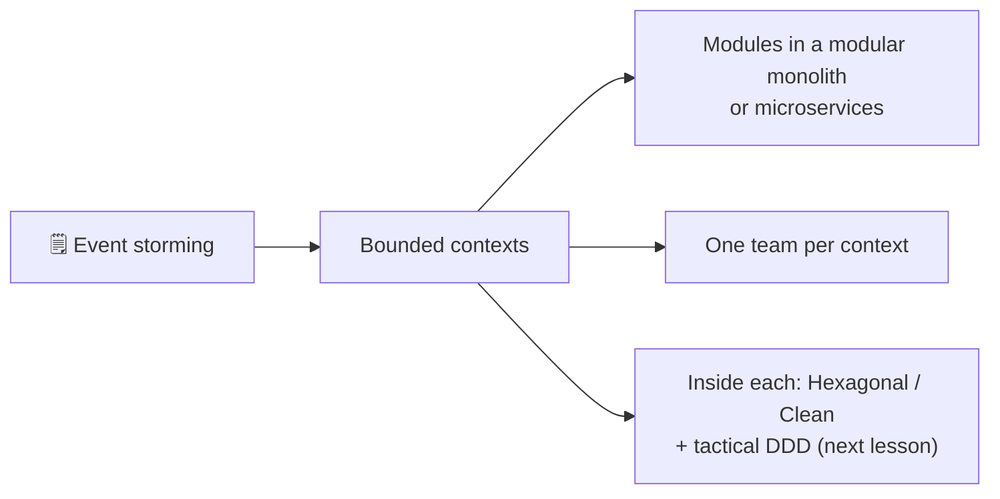

## The big idea

Software fails most often not because of bad code, but because developers **misunderstand the business**. Ask a warehouse worker and a salesperson what a "customer" is, and you'll get two different answers, both correct in their own world.

**Domain-Driven Design** (Eric Evans, 2003) says: put the **business domain** at the centre of software design, build a **shared language** with domain experts, and draw **explicit boundaries** where that language changes.

DDD has two halves:

| | **Strategic design** (this lesson) | **Tactical design** (next lesson) |
| --- | --- | --- |
| Zoom level | The whole business and system | Code inside one boundary |
| Tools | Subdomains, ubiquitous language, bounded contexts, context maps | Entities, value objects, aggregates, repositories, domain events |
| Answers | *Where* do we draw boundaries? What deserves the most care? | *How* do we model the rules in code? |


## 1. Domain and subdomains (the problem space)

The **domain** is the business area the software serves: online retail, insurance, logistics. It splits into **subdomains**, and not all of them are equally important.

| Type | What it is | Strategy | Example (online shop) |
| --- | --- | --- | --- |
| ⭐ **Core** | What makes you **different** and wins customers | Build in-house, best people, richest model | Personalised recommendations, dynamic pricing |
| 🧰 **Supporting** | Necessary and specific to you, but not a differentiator | Build simply, or outsource | Returns handling, supplier onboarding |
| 📦 **Generic** | Every business needs it, and it's solved already | **Buy** or use SaaS/open source | Auth, payments, email, accounting |



> 💡 Spending your best engineers on building your own login system (generic) while the recommendation engine (core) is a mess is a classic strategic mistake.

## 2. Ubiquitous language

A **ubiquitous language** is a shared vocabulary that developers and domain experts use **everywhere**: in conversations, documents, tests and **the code itself**.



```ts
// ❌ Technical language nobody in the business uses
if (rec.st === 3 && Date.now() - rec.ts > 2592000000) rec.st = 7;

// ✅ The business's own words
if (policy.isInGracePeriod(today) === false && policy.hasUnpaidPremium()) {
  policy.lapse();
}
```

**Build a glossary** and keep it next to the code:

| Term | Meaning in the *Insurance* context |
| --- | --- |
| **Policy** | A contract covering a customer against defined risks |
| **Premium** | The amount the customer pays for a period of cover |
| **Grace period** | 30 days after a missed premium during which cover continues |
| **Lapse** | The policy ends because the premium wasn't paid within the grace period |

When the code uses a different word than the business, that's a smell. Rename the code.

## 3. Bounded contexts ⭐

A **bounded context** is an explicit boundary inside which **one model and one language** apply consistently. Outside it, the same word may mean something else, and that's OK.



Trying to build **one** `Customer` class that serves all three creates a bloated model that every team fights over. Instead, each context has **its own small model**, sharing only an identity (the customer ID).

**Subdomain vs bounded context:** a subdomain is part of the **business** (problem space); a bounded context is part of the **software** (solution space). Ideally they line up one-to-one, but not always, especially in legacy systems.

**Bounded contexts are the best starting point for module boundaries** in a modular monolith, and for **service boundaries** in microservices. One team should own each context.

## 4. Context mapping: how contexts relate

A **context map** shows the bounded contexts and the **relationships** between them, which are as much about teams and politics as about code.

| Pattern | Relationship | Use when |
| --- | --- | --- |
| **Partnership** | Two teams succeed or fail together; they plan jointly | Tightly linked features, good collaboration |
| **Shared kernel** | A small model shared and co-owned by two contexts | Truly shared concepts; keep it tiny |
| **Customer / Supplier** | Upstream (supplier) plans around downstream (customer) needs | Downstream has influence over the upstream API |
| **Conformist** | Downstream simply adopts the upstream model as it is | Upstream won't change (a big vendor), and its model is acceptable |
| **Anti-Corruption Layer (ACL)** | Downstream **translates** the upstream model into its own | Upstream model is messy or legacy; protect your model |
| **Open Host Service (OHS)** | Upstream offers a well-defined public API for everyone | Many consumers |
| **Published Language** | A documented shared format (schemas, events) | Paired with OHS: e.g. JSON Schemas, Avro events |
| **Separate Ways** | No integration at all; duplicate if needed | Integration costs more than it's worth |



### Anti-corruption layer in code

```ts
// Legacy ERP gives us this…
type ErpCustomerRecord = { CUST_NO: string; NM1: string; NM2: string; STAT_CD: "A" | "I" | "B" };

// …our Billing context wants this.
type BillingCustomer = { id: string; fullName: string; canBeInvoiced: boolean };

// The ACL is an Adapter that keeps legacy concepts OUT of our model
export class ErpCustomerTranslator {
  toBillingCustomer(record: ErpCustomerRecord): BillingCustomer {
    return {
      id: record.CUST_NO,
      fullName: `${record.NM1} ${record.NM2}`.trim(),
      canBeInvoiced: record.STAT_CD === "A",   // "B" = blocked, "I" = inactive
    };
  }
}
```

## 5. Event storming: discovering the contexts

**Event storming** (Alberto Brandolini) is a workshop: domain experts and developers put **orange sticky notes** on a long wall, one for every **domain event** (something that happened, in the past tense), in time order. Then add commands, actors, policies and hot spots.

| Sticky note | Colour | Example |
| --- | --- | --- |
| Domain event | 🟧 Orange | *Order Placed*, *Payment Failed* |
| Command | 🟦 Blue | *Place Order* |
| Actor | 🟨 Small yellow | *Customer*, *Warehouse clerk* |
| Policy ("whenever… then…") | 🟪 Lilac | *Whenever payment fails, then notify the customer* |
| External system | 🩷 Pink | *Stripe* |
| Hot spot / question | 🟥 Red | *What if stock runs out after payment?* |



Where the language changes and events cluster together, you've found the edges of **bounded contexts** (here: Ordering, Billing, Fulfilment).

## Strategic design → architecture



## Key takeaways

- DDD puts the **business domain** at the centre, built together with domain experts.
- Classify subdomains: invest in the **core**, keep **supporting** simple, **buy generic**.
- Speak a **ubiquitous language**, in conversation and in code.
- A **bounded context** is a boundary with one consistent model; the same word can mean different things in different contexts.
- **Context maps** describe how contexts integrate: ACL, OHS, customer/supplier, conformist, shared kernel…
- **Event storming** is a fast, visual way to discover the boundaries.
