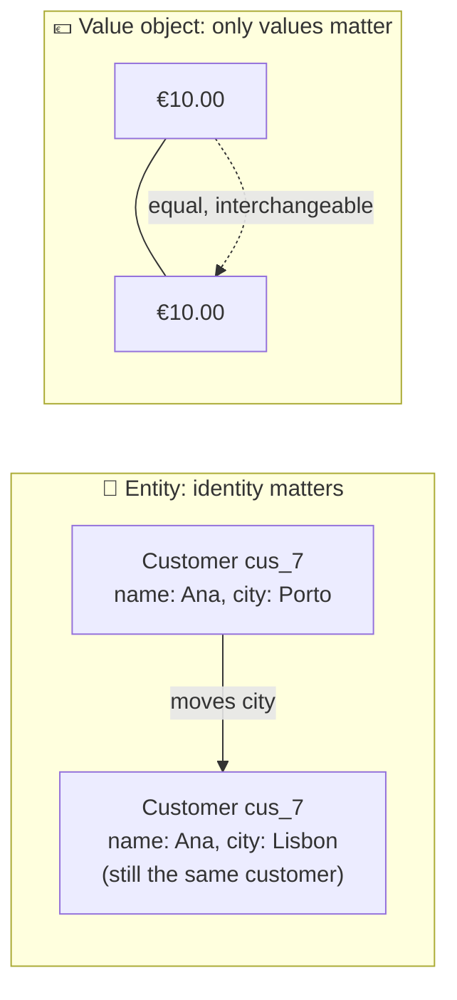
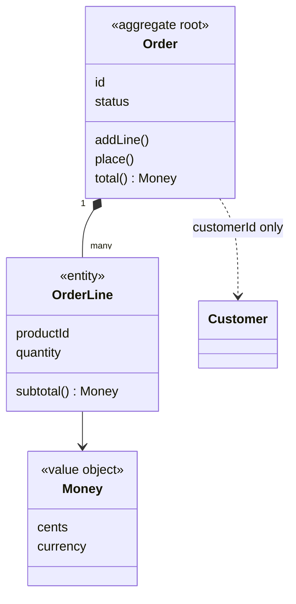
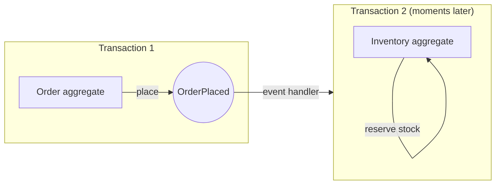
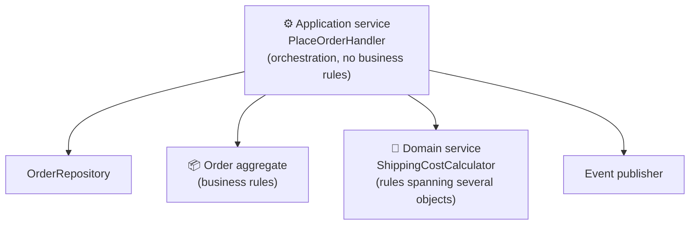

## The big idea

Strategic DDD draws the boundaries. **Tactical DDD** gives you a toolbox for writing the model **inside** one bounded context, so the code expresses business rules clearly and **can't be put into an invalid state**.


| Building block | One-line meaning | Example |
| --- | --- | --- |
| **Entity** | Has an identity that stays the same while its data changes | `Order #42`, `Customer cus_7` |
| **Value object** | Defined only by its values, immutable, no identity | `Money(€10)`, `Email`, `Address` |
| **Aggregate** | A cluster of objects changed together as one consistency unit, with a root | `Order` + its `OrderLine`s |
| **Repository** | Collection-like access to aggregates | `OrderRepository.get(id)` / `save(order)` |
| **Domain service** | Business logic that doesn't fit one entity | `ShippingCostCalculator` |
| **Application service** | Orchestrates a use case: load → call domain → save → publish | `PlaceOrderHandler` |
| **Domain event** | Something that happened in the domain | `OrderPlaced`, `OrderShipped` |
| **Factory** | Encapsulates complex creation | `Order.create(...)`, `QuoteFactory` |

## Entities vs value objects



**Ask:** *"If all its attributes are equal, is it the same thing?"* Two €10 notes: yes, it's a value. Two customers both named "Ana Silva": no, they're different people, so it's an entity.

### Value objects: small, immutable, self-validating ⭐

Value objects are the easiest tactical pattern to adopt, and remove a huge class of bugs (see *primitive obsession* in the Code Smells lesson).

```ts
export class Money {
  private constructor(readonly cents: number, readonly currency: "EUR" | "USD") {
    if (!Number.isInteger(cents)) throw new DomainError("Money must be whole cents");
  }
  static of(cents: number, currency: "EUR" | "USD") { return new Money(cents, currency); }

  add(other: Money): Money {
    if (other.currency !== this.currency) throw new DomainError("Cannot add different currencies");
    return new Money(this.cents + other.cents, this.currency);   // returns a NEW object
  }
  multiply(factor: number): Money { return new Money(Math.round(this.cents * factor), this.currency); }
  equals(other: Money) { return this.cents === other.cents && this.currency === other.currency; }
}

export class Email {
  private constructor(readonly value: string) {}
  static parse(raw: string): Email {
    const value = raw.trim().toLowerCase();
    if (!/^[^@\s]+@[^@\s]+\.[^@\s]+$/.test(value)) throw new DomainError(`Invalid email: ${raw}`);
    return new Email(value);
  }
}
```

Once you hold an `Email`, it's **guaranteed valid**. No more re-validating strings all over the code.

## Aggregates: the consistency boundary ⭐

An **aggregate** is a group of entities and value objects that must stay consistent **together**. Outside code may only hold a reference to the **aggregate root** and must change the aggregate **through it**.

```ts
export class Order {                                      // aggregate root
  private lines: OrderLine[] = [];
  private status: "DRAFT" | "PLACED" | "CANCELLED" = "DRAFT";
  private events: DomainEvent[] = [];

  private constructor(readonly id: OrderId, readonly customerId: CustomerId) {}

  static start(id: OrderId, customerId: CustomerId) { return new Order(id, customerId); }

  addLine(productId: ProductId, quantity: number, unitPrice: Money) {
    this.assertDraft();
    if (quantity <= 0) throw new DomainError("Quantity must be positive");
    const existing = this.lines.find((l) => l.productId === productId);
    existing ? existing.increase(quantity) : this.lines.push(new OrderLine(productId, quantity, unitPrice));
  }

  place() {
    this.assertDraft();
    if (this.lines.length === 0) throw new DomainError("Cannot place an empty order");
    if (this.total().cents > 1_000_000) throw new DomainError("Orders over €10,000 need manual approval");
    this.status = "PLACED";
    this.events.push({ type: "OrderPlaced", orderId: this.id, total: this.total(), occurredAt: new Date() });
  }

  total(): Money {
    return this.lines.reduce((sum, l) => sum.add(l.subtotal()), Money.of(0, "EUR"));
  }

  pullEvents(): DomainEvent[] { const e = this.events; this.events = []; return e; }

  private assertDraft() {
    if (this.status !== "DRAFT") throw new DomainError(`Order is already ${this.status}`);
  }
}
```



### The four rules of aggregate design (Vaughn Vernon)

| Rule | Why |
| --- | --- |
| 1. **Protect invariants inside the boundary** | Rules like "total ≤ €10,000" are always enforced in one place |
| 2. **Design small aggregates** | Big aggregates cause lock contention and slow loading |
| 3. **Reference other aggregates by ID only** | `customerId`, not a `Customer` object: keeps boundaries clear |
| 4. **Use eventual consistency between aggregates** | One transaction changes **one** aggregate; others react to domain events |



## Repositories: a collection of aggregates

A repository makes persistence look like an **in-memory collection of aggregates**. There is one repository **per aggregate root**, not per table.

```ts
// Defined in the domain (a port), implemented in infrastructure (an adapter)
export interface OrderRepository {
  get(id: OrderId): Promise<Order>;          // loads the WHOLE aggregate
  save(order: Order): Promise<void>;         // saves the WHOLE aggregate atomically
  nextId(): OrderId;
}
```

> ⚠️ No repository for `OrderLine`. Lines are only reachable through their `Order` root; otherwise someone will change a line and bypass the order's rules.

## Domain services vs application services



```ts
// Domain service: a business rule that doesn't naturally belong to one entity
export class ShippingCostCalculator {
  calculate(order: Order, destination: Address): Money {
    const base = destination.country === "PT" ? Money.of(399, "EUR") : Money.of(999, "EUR");
    return order.total().cents >= 5000 ? Money.of(0, "EUR") : base;
  }
}

// Application service (a use case): load, act, save, publish; thin, no if-statements about business
export class PlaceOrderHandler {
  constructor(private orders: OrderRepository, private events: EventPublisher) {}

  async handle(cmd: { orderId: string }) {
    const order = await this.orders.get(cmd.orderId);
    order.place();                                   // the rules live in the aggregate
    await this.orders.save(order);
    await this.events.publish(order.pullEvents());   // better still: via an outbox
  }
}
```

| | Domain service | Application service |
| --- | --- | --- |
| Contains business rules? | ✅ Yes | ❌ No, only orchestration |
| Knows about transactions, repositories, events? | ❌ | ✅ |
| Named in… | Domain language (`ShippingCostCalculator`) | Use-case language (`PlaceOrderHandler`) |
| Lives in | Domain layer | Application layer |

## Domain events

A **domain event** records something meaningful that happened, named in the **past tense** in the ubiquitous language.

```ts
type OrderPlaced = {
  type: "OrderPlaced";
  orderId: string;
  total: Money;
  occurredAt: Date;
};
```

They let aggregates stay small and decoupled (rule 4), feed other bounded contexts (through an outbox and a broker), and can even become the source of truth (**event sourcing**, see the Microservices lessons).

## Factories

When creating an aggregate is complex (many rules, several sources of data), put the creation logic in a **factory**: a static method like `Order.start()`, or a separate class.

```ts
export class QuoteFactory {
  constructor(private pricing: PricingPolicy) {}
  fromCart(cart: Cart, customer: CustomerProfile): Quote {
    const lines = cart.items.map((item) => QuoteLine.from(item, this.pricing.priceFor(item, customer)));
    return Quote.create(QuoteId.new(), customer.id, lines, this.pricing.validityFor(customer));
  }
}
```

## Anaemic vs rich domain model

```ts
// ❌ Anaemic: a bag of data; the rules live somewhere else (and get duplicated)
class Order { status!: string; lines!: OrderLine[]; }
if (order.status === "DRAFT" && order.lines.length > 0) order.status = "PLACED"; // in 3 services…

// ✅ Rich: data and the rules that protect it live together
order.place(); // throws if not allowed
```

Martin Fowler calls the anaemic domain model an **anti-pattern** for complex domains. For simple CRUD, though, it's perfectly fine, and so is skipping tactical DDD entirely.

## Where it all lives (with Hexagonal / Clean)

```text
src/ordering/                      # one bounded context
├── domain/
│   ├── Order.ts  OrderLine.ts     # aggregate + entities
│   ├── Money.ts  Email.ts         # value objects
│   ├── events.ts                  # domain events
│   ├── ShippingCostCalculator.ts  # domain service
│   └── OrderRepository.ts         # repository interface (port)
├── application/
│   └── PlaceOrderHandler.ts       # application services / use cases
└── infrastructure/
    └── PostgresOrderRepository.ts # repository implementation (adapter)
```

## Key takeaways

- **Entities** have identity; **value objects** are immutable values that validate themselves. Use value objects generously.
- **Aggregates** are consistency boundaries: small, changed through the root, referenced by ID, one per transaction.
- **Repositories** load and save whole aggregates, one per aggregate root.
- **Domain services** hold rules that span objects; **application services** only orchestrate.
- **Domain events** decouple aggregates and contexts.
- Use tactical DDD where the domain is complex; plain CRUD doesn't need it.
