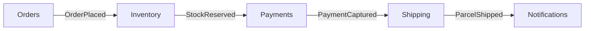
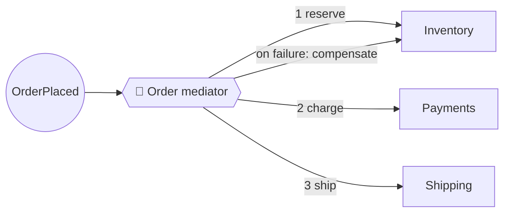
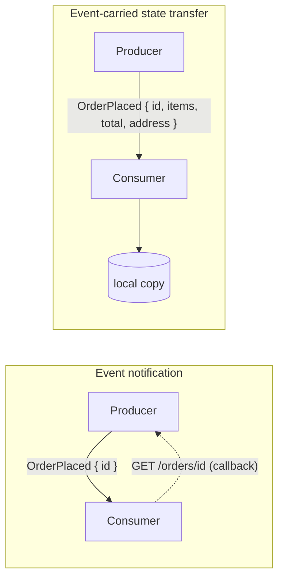

## The big idea

At a **wedding**, the photographer doesn't phone the caterer, the band and the florist when the couple arrives. Someone announces **"The couple has arrived!"**, and everyone who cares reacts in their own way: the band starts playing, the caterer serves drinks, the photographer takes pictures.

In an **event-driven architecture (EDA)**, components **announce facts** ("OrderPlaced") instead of **calling each other** ("please reserve stock, then charge the card, then email the customer"). Whoever is interested reacts.


## Request-driven vs event-driven

```mermaid
flowchart TB
    subgraph Req["📞 Request-driven: Orders knows everyone"]
      O1[Orders] -->|reserve| I1[Inventory]
      O1 -->|charge| P1[Payments]
      O1 -->|email| E1[Email]
      O1 -->|track| A1[Analytics]
    end
    subgraph Ev["📣 Event-driven: Orders knows nobody"]
      O2[Orders] -->|OrderPlaced| B{{Event broker}}
      B --> I2[Inventory]
      B --> P2[Payments]
      B --> E2[Email]
      B --> A2[Analytics]
      B -.-> N2["🆕 Loyalty points<br/>(added later, zero changes to Orders)"]
    end
```



| | Request-driven | Event-driven |
| --- | --- | --- |
| Coupling | Caller knows every callee | Producer knows no consumers |
| Adding a new reaction | Change the caller | Add a subscriber |
| If a consumer is down | The call fails | Events wait in the broker |
| Flow visibility | ✅ Easy to follow in code | ❌ Spread across services |
| Consistency | Immediate | Eventual |

## Anatomy

| Part | Role | Examples |
| --- | --- | --- |
| **Event producer** | Detects something happened and publishes it | Orders service |
| **Event** | An immutable fact, past tense | `OrderPlaced { orderId, total, at }` |
| **Event channel / broker** | Delivers events to consumers | Kafka, RabbitMQ, SNS/SQS, EventBridge, NATS |
| **Event consumer** | Reacts to events it's interested in | Inventory, Email, Analytics |

## Two topologies

### Broker topology (choreography)

No central brain. Each service reacts to events and publishes its own.



✅ Highly decoupled and scalable. ❌ Hard to see or change the overall flow; error handling is spread out.

### Mediator topology (orchestration)

A **mediator** (orchestrator) receives the initial event and directs the steps.



✅ The flow and error handling are in one place. ❌ The mediator is extra coupling and a potential bottleneck.

## The four event patterns (Martin Fowler)

"Event-driven" means several different things. Knowing which one you mean avoids confusion:

| Pattern | What the event carries | Example | Trade-off |
| --- | --- | --- | --- |
| **1. Event notification** | Just "something happened" + an ID | `{ type: "OrderPlaced", orderId: "o42" }`; consumers call back for details | Tiny events, but consumers call the producer back (coupling returns) |
| **2. Event-carried state transfer** | The data consumers need | `{ type: "CustomerMoved", customerId, newAddress }` | Consumers keep a local copy and never call back; data is duplicated |
| **3. Event sourcing** | Events *are* the source of truth | The account's state is the sum of `Deposited` / `Withdrawn` events | Full history and replay; more complex |
| **4. CQRS** | Events keep separate read models up to date | Write model publishes; read model projects | Fast, tailored reads; eventual consistency |



## Designing good events

```json
{
  "eventId": "0b8c4f0e-6a57-4f7e-9b3d-2f1d1c9a7e11",
  "type": "shop.ordering.OrderPlaced",
  "version": 2,
  "occurredAt": "2026-09-28T10:15:00Z",
  "source": "ordering-service",
  "correlationId": "req-7f3c",
  "data": {
    "orderId": "o42",
    "customerId": "c7",
    "totalCents": 8997,
    "currency": "EUR",
    "lines": [{ "sku": "KB-1", "quantity": 1 }]
  }
}
```

| Guideline | Why |
| --- | --- |
| **Past tense, business language** (`OrderPlaced`, not `CreateOrderRow`) | Events are facts, in the ubiquitous language |
| **Unique `eventId`** | Consumers deduplicate (idempotency) |
| **`version` + a schema** | Evolve safely; old consumers keep working |
| **`correlationId`** | Trace one business flow across services |
| **Include what consumers need**, but not your whole database row | Avoid callbacks without leaking internals |
| **Standard envelope** | e.g. **CloudEvents**, a CNCF standard format |

## The hard parts (be honest)

| Challenge | Mitigation |
| --- | --- |
| **Eventual consistency** (the UI may show old data briefly) | Design the UX for it: "Order received, confirming…" |
| **Duplicate events** (at-least-once delivery) | Idempotent consumers: store processed event IDs |
| **Ordering** | Partition by entity key (Kafka); include versions/timestamps |
| **Lost events** when saving + publishing | Transactional **outbox** pattern |
| **Hard to debug "what happened?"** | Correlation IDs, distributed tracing, an event catalog |
| **Schema changes break consumers** | Schema registry, versioning, backward-compatible changes |
| **Hidden coupling via event contents** | Treat event schemas as public APIs; document them (AsyncAPI) |

(The Kafka and Microservices topics cover delivery guarantees, the outbox, sagas and CQRS in depth.)

## EDA inside a single application

Event-driven isn't only for microservices. Inside a **modular monolith**, modules can communicate with **in-process domain events**, keeping modules decoupled without any broker:

```ts
// A tiny in-process event bus
type Handler<E> = (event: E) => Promise<void>;
class EventBus {
  private handlers = new Map<string, Handler<any>[]>();
  on<E extends { type: string }>(type: E["type"], handler: Handler<E>) {
    this.handlers.set(type, [...(this.handlers.get(type) ?? []), handler]);
  }
  async publish(event: { type: string }) {
    await Promise.all((this.handlers.get(event.type) ?? []).map((h) => h(event)));
  }
}

bus.on("OrderPlaced", (e) => loyalty.awardPoints(e.customerId, e.totalCents)); // loyalty module
bus.on("OrderPlaced", (e) => email.sendConfirmation(e.orderId));               // notifications module
```

Later, if a module becomes a separate service, swap the in-process bus for Kafka or RabbitMQ; the handlers barely change.

## When to use it

✅ Many independent reactions to the same business facts, spiky traffic that needs buffering, integrating many systems, real-time processing, audit trails.

❌ Simple request/response flows where the user needs an immediate answer, small systems where the added complexity isn't earned, and workflows needing strict, immediate consistency.

## Key takeaways

- Components **publish facts** and **react to facts** instead of calling each other directly.
- **Broker topology** (choreography) maximises decoupling; **mediator topology** (orchestration) makes flows explicit.
- Know which pattern you mean: notification, event-carried state transfer, event sourcing, or CQRS.
- Design events as versioned public contracts with IDs and correlation IDs.
- Plan for eventual consistency, duplicates, ordering and debugging from day one.
