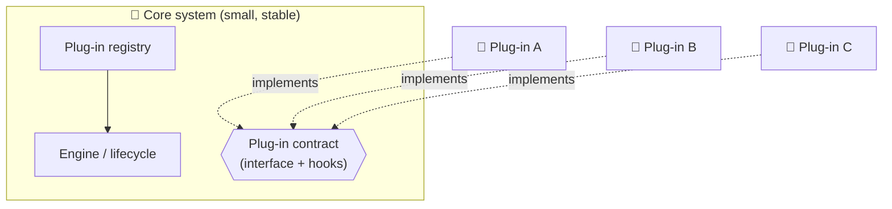
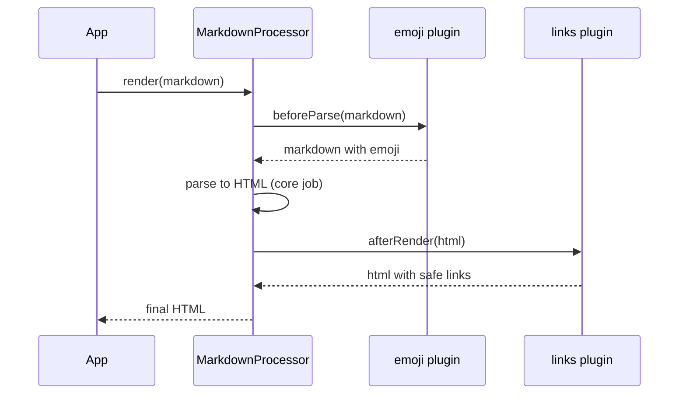

## The big idea

A **smartphone** ships with a small, stable operating system. Everything else (maps, games, banking, a flashlight) comes from **apps** you install. The phone maker doesn't rebuild the OS for each new app; apps plug in through a published **contract** (the app store rules and APIs).

**Microkernel architecture** (also called **plug-in architecture**) works the same way: a minimal **core system** plus independent **plug-in modules** that extend it.


## Where you've already seen it

| Product | Core | Plug-ins |
| --- | --- | --- |
| **VS Code** | Editor, extension host, APIs | Language support, themes, Git tools, linters |
| **Web browsers** | Rendering engine, tabs, networking | Extensions (ad blockers, password managers) |
| **Webpack / Vite / Rollup** | Module graph + build pipeline | Loaders and plugins (TypeScript, CSS, images) |
| **ESLint / Babel / PostCSS** | Parser + traversal engine | Rules and transforms |
| **WordPress** | CMS core | 50,000+ plugins |
| **Insurance / tax software** | Claims or tax engine | One plug-in per country or state's rules |

## The parts



| Part | Responsibility |
| --- | --- |
| **Core system** | The minimal functionality everyone needs, plus the machinery to find, load and run plug-ins |
| **Plug-in contract** | The interface and extension points (hooks) plug-ins can use: the only thing plug-ins may depend on |
| **Registry** | Knows which plug-ins exist, their versions, and how to reach them |
| **Plug-ins** | Independent modules adding features; ideally unaware of each other |

## Building one: a tiny Markdown processor

### 1. Define the contract

```ts
// core/contract.ts: the ONLY thing plug-ins import from the core
export interface MarkdownPlugin {
  name: string;
  version: string;
  /** Transform raw markdown before parsing (optional hook) */
  beforeParse?(markdown: string): string;
  /** Transform the rendered HTML (optional hook) */
  afterRender?(html: string): string;
}
```

### 2. The core: registry + lifecycle

```ts
// core/processor.ts
export class MarkdownProcessor {
  private plugins: MarkdownPlugin[] = [];

  use(plugin: MarkdownPlugin): this {
    if (this.plugins.some((p) => p.name === plugin.name)) throw new Error(`Plugin ${plugin.name} already registered`);
    this.plugins.push(plugin);
    return this;
  }

  render(markdown: string): string {
    const source = this.plugins.reduce((text, p) => p.beforeParse?.(text) ?? text, markdown);
    const html = basicMarkdownToHtml(source);                     // the core's own small job
    return this.plugins.reduce((out, p) => p.afterRender?.(out) ?? out, html);
  }
}
```

### 3. Plug-ins: independent features

```ts
// plugins/emoji.ts
export const emojiPlugin: MarkdownPlugin = {
  name: "emoji",
  version: "1.0.0",
  beforeParse: (md) => md.replaceAll(":rocket:", "🚀").replaceAll(":tada:", "🎉"),
};

// plugins/external-links.ts
export const externalLinksPlugin: MarkdownPlugin = {
  name: "external-links",
  version: "1.2.0",
  afterRender: (html) => html.replace(/<a href="http/g, '<a target="_blank" rel="noreferrer" href="http'),
};

// app.ts
const processor = new MarkdownProcessor().use(emojiPlugin).use(externalLinksPlugin);
processor.render("Launch day :rocket: [docs](https://example.com)");
```



The **Open/Closed Principle** at architecture scale: the core is closed for modification, open for extension.

## Designing the contract well

| Guideline | Why |
| --- | --- |
| **Keep the contract small and stable** | Every change can break every plug-in in the ecosystem |
| **Version it** (semver) and check compatibility on load | Old plug-ins fail loudly instead of mysteriously |
| **Plug-ins depend only on the contract**, not on core internals or each other | Plug-ins stay independent and replaceable |
| **Clear, ordered hooks** (`beforeParse`, `afterRender`) | Predictable behaviour when many plug-ins run |
| **Isolate failures**: catch plug-in errors, timeouts | One bad plug-in shouldn't crash the host |
| **Isolate security** where plug-ins are third-party | Sandboxing (VS Code's extension host process, browser permission models) |

```ts
// Defensive loading: a broken plug-in is disabled, not fatal
for (const plugin of discovered) {
  try {
    assertCompatible(plugin.version, CONTRACT_VERSION);
    processor.use(plugin);
  } catch (error) {
    logger.warn({ plugin: plugin.name, error }, "Plugin disabled");
  }
}
```

## Plug-in discovery

| Style | How | Example |
| --- | --- | --- |
| **Explicit registration** | The app lists plug-ins in code or config | `vite.config.ts` → `plugins: [react()]` |
| **Convention** | Load everything matching a naming pattern or folder | `eslint-plugin-*`, a `plugins/` folder |
| **Manifest + marketplace** | Each plug-in ships metadata; a registry installs it | VS Code extensions (`package.json` contributes) |
| **Remote plug-ins** | Plug-ins are services called over HTTP/gRPC | Webhooks, Shopify apps |

## Trade-offs

| ✅ Strengths | ❌ Weaknesses |
| --- | --- |
| Extensible without touching the core | Designing a good contract up front is hard |
| Features can be added, removed or sold separately | Changing the contract is painful for the ecosystem |
| Plug-ins are small, focused and testable in isolation | Plug-in interactions can be hard to debug |
| Customisation per customer/region without forks | Performance overhead of indirection and isolation |

## When to use it

✅ Products that need **customisation** or **third-party extensions** (IDEs, CMSs, build tools), rules that vary by **customer, country or product line**, and features that should be switched on and off independently.

❌ Apps without a clear, stable core or without real variation. A plug-in system nobody plugs into is **YAGNI**.

## Key takeaways

- Microkernel = a **small, stable core** plus **independent plug-ins** connected through a **contract**.
- VS Code, browsers, Webpack, ESLint and WordPress are all built this way.
- Keep the contract small, versioned and stable; plug-ins depend only on it.
- Isolate plug-in failures (and, for third parties, security).
- Use it when extensibility and variation are real requirements.
