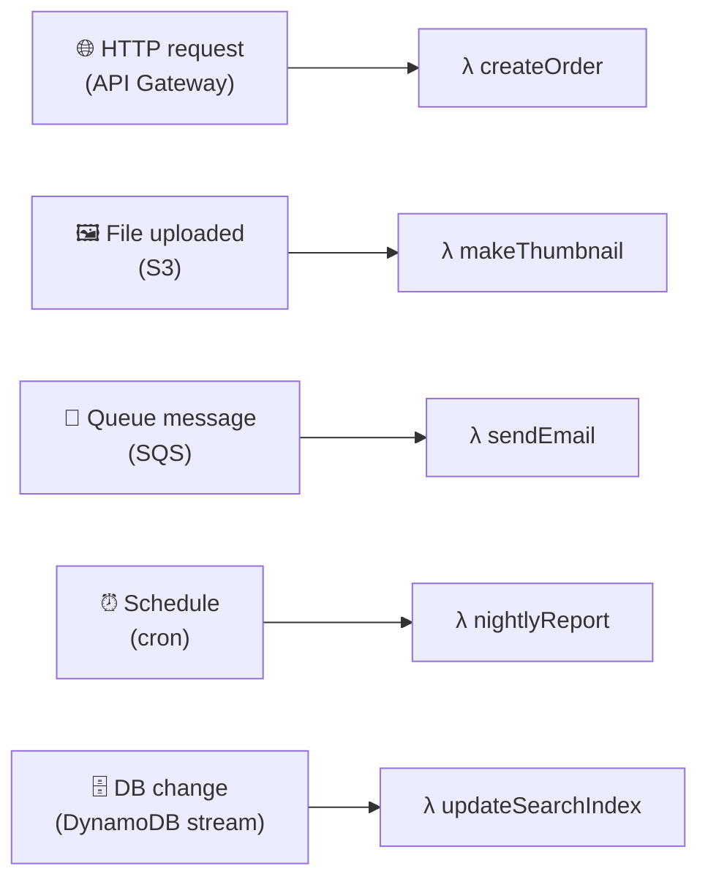
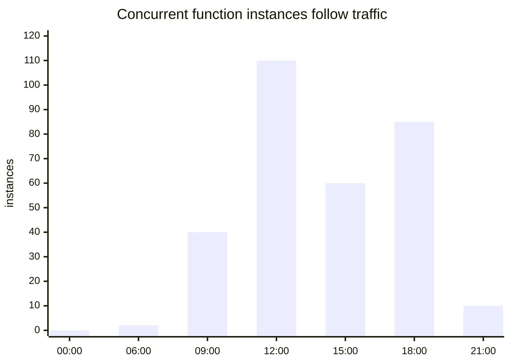
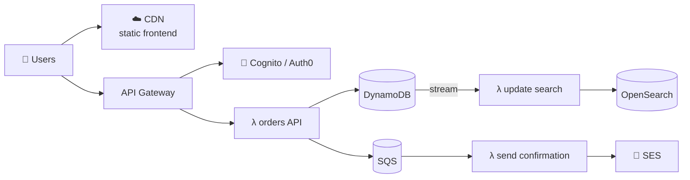

## The big idea

Owning a car means paying for it 24/7, parking it, servicing it, insuring it, even though it sits idle 95% of the time. Taking a **taxi** means you pay **only for the trips you take**, and someone else handles the car.

**Serverless** is the taxi model for computing: you write functions, the cloud runs them **when an event happens**, scales them automatically (even to zero), and bills you **per request and per millisecond**. There are still servers; you just never see or manage them.


## Two halves of serverless

| | What it is | Examples |
| --- | --- | --- |
| **FaaS** (Functions as a Service) | Your code, as small functions triggered by events | AWS Lambda, Google Cloud Functions, Azure Functions, Cloudflare Workers, Vercel Functions |
| **BaaS** (Backend as a Service) | Managed building blocks you use instead of running your own | DynamoDB, S3, Firebase, Supabase, Auth0/Cognito, SQS, EventBridge |

A "serverless architecture" usually **glues managed services together with small functions**.

## Event triggers



```ts
// AWS Lambda handler: create an order from an HTTP request
import { DynamoDBClient } from "@aws-sdk/client-dynamodb";
import { DynamoDBDocumentClient, PutCommand } from "@aws-sdk/lib-dynamodb";

const db = DynamoDBDocumentClient.from(new DynamoDBClient({})); // created ONCE per container, reused

export const handler = async (event: { body: string }) => {
  const input = JSON.parse(event.body);
  const order = { id: crypto.randomUUID(), ...input, status: "PENDING", createdAt: new Date().toISOString() };
  await db.send(new PutCommand({ TableName: process.env.ORDERS_TABLE, Item: order }));
  return { statusCode: 201, body: JSON.stringify({ id: order.id }) };
};
```

```ts
// Triggered by an S3 upload: create a thumbnail
export const handler = async (event: S3Event) => {
  for (const record of event.Records) {
    const image = await s3.getObject(record.s3.bucket.name, record.s3.object.key);
    const thumbnail = await sharp(image).resize(200).webp().toBuffer();
    await s3.putObject("thumbnails-bucket", record.s3.object.key + ".webp", thumbnail);
  }
};
```

## How it scales and bills



| | Always-on server | Serverless |
| --- | --- | --- |
| Idle cost | 💰 Pay 24/7 | ✅ ~$0 when nobody uses it |
| Traffic spikes | Plan capacity ahead | ✅ Scales automatically |
| Ops work | Patching, scaling, monitoring hosts | ✅ The provider handles it |
| Cost at constant high load | ✅ Often cheaper | 💰 Can get expensive |

## Cold starts

When no warm instance exists, the platform must start a new one: download code, start the runtime, run your initialisation. That first request is slower: a **cold start**.

```mermaid
gantt
    title Cold vs warm invocation
    dateFormat x
    axisFormat %L
    section Cold start
    start container + runtime   :crit, c1, 0, 300
    your init code             :crit, c2, 300, 450
    handler                    :c3, 450, 500
    section Warm
    handler                    :w1, 0, 50
```



**Reduce cold starts:** keep bundles small, initialise clients **outside** the handler (so warm calls reuse them), choose fast-starting runtimes (Node, Go, Rust), use provisioned concurrency for latency-critical paths, or edge runtimes (Cloudflare Workers, Vercel Edge) with near-zero cold starts.

## Designing for serverless

| Principle | Why |
| --- | --- |
| **Stateless functions** | Any instance can handle any request; instances disappear anytime |
| **Small, single-purpose functions** | Faster cold starts, independent scaling and permissions |
| **Idempotent handlers** | Event sources retry; the same event may arrive twice |
| **Push work to queues** | Smooth spikes, retry failures, add dead-letter queues |
| **Watch connection limits** | 1,000 concurrent functions × 1 DB connection each can overwhelm Postgres; use RDS Proxy, Data API, or serverless-friendly DBs |
| **Least-privilege IAM per function** | Each function gets only the permissions it needs |

### A typical serverless web backend



## Limits and trade-offs

| Limitation | Typical value / impact |
| --- | --- |
| **Max execution time** | ~15 minutes on AWS Lambda, so long jobs need Step Functions, containers or batching |
| **Cold starts** | 100 ms to several seconds, depending on runtime and bundle |
| **Vendor lock-in** | Triggers, IAM and managed services are provider-specific |
| **Local testing and debugging** | Harder; use emulators (SAM, LocalStack) and good tracing |
| **Observability** | Many small pieces: invest in structured logs, tracing (X-Ray / OpenTelemetry) |
| **Cost at sustained high load** | Containers or VMs can be much cheaper |

> 💡 **Keep your business logic portable.** Put it in plain modules (Hexagonal style) and keep the Lambda handler as a thin **driving adapter**. Moving to containers later then means writing a new adapter, not rewriting the logic.

```ts
// handler.ts: thin adapter
export const handler = async (event: APIGatewayProxyEvent) => {
  const result = await placeOrder.execute(JSON.parse(event.body ?? "{}")); // plain use case
  return { statusCode: 201, body: JSON.stringify(result) };
};
```

## When to use it

✅ Spiky or unpredictable traffic, event processing (uploads, queues, webhooks), scheduled jobs, MVPs and small teams that want zero ops, glue between managed services.

❌ Constant high-throughput workloads, long-running or stateful processes (game servers, WebSocket-heavy apps), ultra-low-latency paths where cold starts hurt, and strict portability requirements.

## Key takeaways

- Serverless = **FaaS** (functions triggered by events) + **BaaS** (managed services); no servers to manage.
- It scales automatically (to zero) and bills per use: great for spiky workloads.
- Design functions to be stateless, small, idempotent and least-privileged; use queues for resilience.
- Watch for cold starts, execution time limits, DB connection limits, lock-in and cost at scale.
- Keep business logic in plain modules and handlers as thin adapters.
